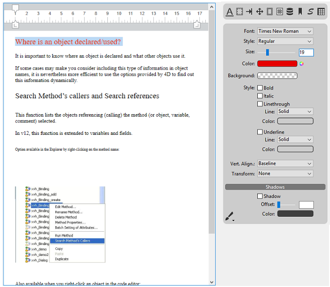

4D Write Proは、4Dユーザーに対して、4Dデータベースに完全に統合した進化したワードプロセスツールを提供します。4D Write Proを使用すれば、プリフォーマットされたEメールや文章に画像、スキャン済みの署名、フォーマット済みのテキストやダイナミック変数用のプレースホルダーなどを含めることができます。また請求書やレポートを動的に作成し、フォーマット済みのテキストや画像を含めることができます。

この製品の主な機能は以下の通りです:

* ワードプロセス: フォームに埋め込まれた4D Write Proオブジェクトは、テキストとスタイルの操作、画像の挿入、読み込みと書き出しなどを含めた様々な標準のワープロ機能を持ち合わせます。
* データベースとの統合:  
   * 4D Write Pro オブジェクトはデータベースからのデータや、4Dが計算をしたデータなどを表示する変数部分を表示することができます。  
   * 4D Write Pro ドキュメントはデータベースフィールド内や、ディスク上に保存することもできます。

4D Write Pro comes with:

- a **form object** that you can install in your forms. You can load, handle, and save **4D Write Pro documents** in this area. This object is configurable through the Property list and includes a comprehensive developer pop up menu at runtime.
- **language commands**, added to the 4D Language and allowing you to deeply customize the area.
- **standard actions**, to help building a fully customized interface. 
- **4D Write Pro Interface**, an extension that offers a set of predefined palettes for end users.
- 
## インストールとアクティベート 

4D Write Pro はプラグインではなく、4D自身に完全に統合されており、配布と管理がより簡単になっています。追加のインストールは何も必要なく、フォーム内に4D Write Proエリアを追加するだけで、4Dアプリケーション内において4D Write Pro変数を直接管理することができます。

ただし、この機能を有効にするには、アプリケーションに4D Write Proライセンスがインストールされている必要があります。

## Creating a 4D Write Pro area

### Using the 4D Write Pro area object

4Dでは、4D Write Proドキュメントは**Write Pro**という4D フォームオブジェクト内にて手動で表示・編集することができます。このオブジェクトは[オブジェクトバー](../../FormEditor/formEditor.md#object-bar) の最終ツールの一部として提供されています:

4D Write Proフォームエリアはプロパティリスト内の標準のプロパティを通して設定することができます。すなわち、**オブジェクト名** そして **変数名、** **座標、入力、** **表示**、**外見、** **イベント**です。

**変数名**のプロパティはランゲージにおいて4D Write Proエリアの参照として使用します。変数はobject 型でなければならないという点に注意して下さい(詳細については[Object](../../Concepts/dt_object.md) コマンドを参照して下さい)。

"入力" プロパティはテキスト入力の基本的な機能を管理します:

* **入力可能**: エリアをロック・アンロックすることによって編集を許可または許可しないことを選択できます。
* **自動スペルチェック**: 4D Write Pro において利用可能です。
* **コンテキストメニュー**: フォームがランタイムにおいて実行された時のコンテキストメニューを有効化・無効化します([*4D Write Pro エリアを使用する*](./using-a-4d-write-pro-area.md) の章を参照して下さい)。
* **選択を常に表示**: 標準のテキストエリアにおいてテキストの選択を管理します。

### Using 4D Write Pro Interface

[オブジェクトライブラリ](../../FormEditor/objectLibrary.md)ー内("入力エリア"テーマ内)にある**4D Write Pro** オブジェクトを仕様することで設定済みの4D Write Proエリアを作成することができます:

このエリアには、エリアの全ての属性(フォント、カラー、スタイル等)を管理するための、コントロールパネルまたはツールバーが付属します:

より詳細な情報については、[*4D Write Pro エリア*](../writeprointerface.md)の章を参照してください。
