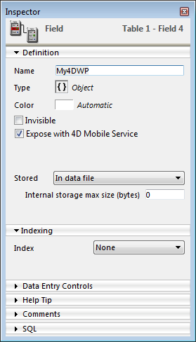
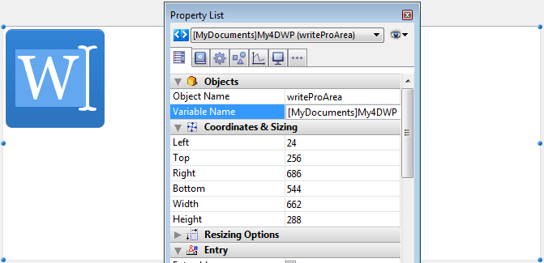
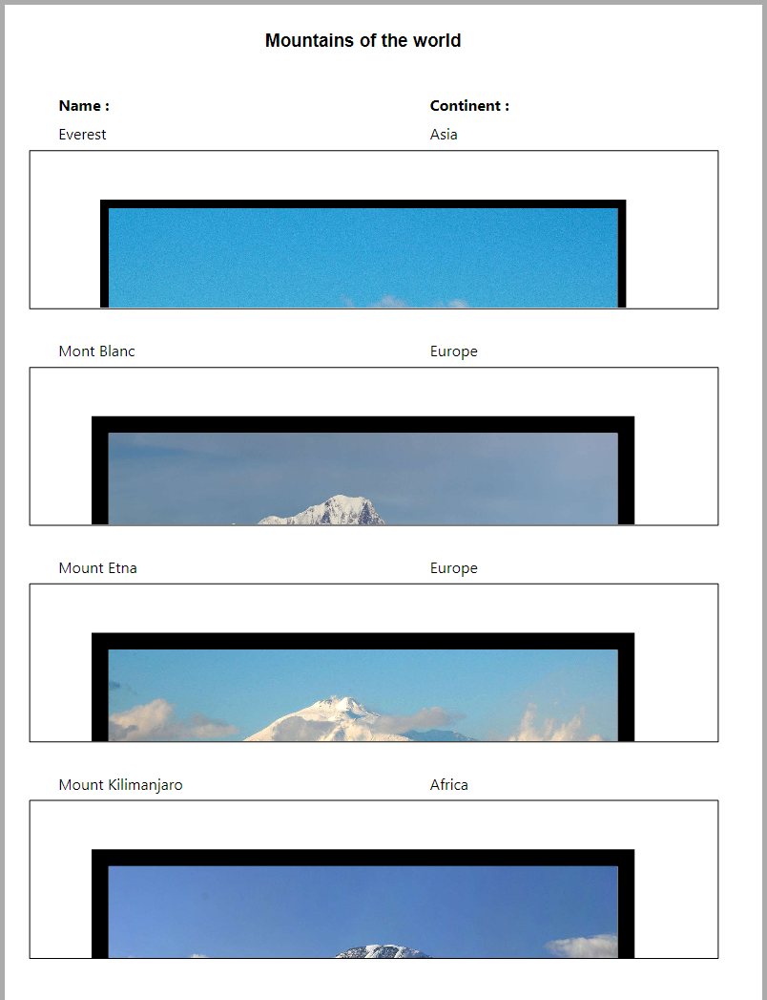

## .4wp ドキュメントフォーマット 

**.4wp** を使用する事によって 4D Write Proドキュメントをロスなくディスク上に保存したりディスクから開いたりすることができます。

**.4wp** フォーマットはドキュメント名と同じ名前を持つ ZIPフォルダーと、その中に格納された HTMLテキストと画像から構成されます:

* HTMLテキストは、通常の HTML と (計算されていない) 4D式に加え、4D特有のタグを組み合わせます。
* 画像は、HTMLファイルの隣にある、ドキュメント名と同じ名前を持つフォルダー内に保存されています。

.4wp ドキュメントは HTML に基づいているので、HTMLをサポートしているものであればどんな外部アプリケーションでもそれを読み込んだり開いたりすることができます。

4D Write Pro の内部ドキュメントは HTML に 4D独自の拡張を加えたもので、HTML5/XHTML5 に準拠していながら、独自の HTML/CSS属性のサブセットとタグもサポートしています。したがってデータ損失のリスクなく 4D Write Pro で開けるのは、4D Write Pro で書き出された HTMLドキュメントに限られます。外部で作成された HTMLドキュメントの読み込みはエラーを生成する可能性があります。

より詳細な情報については、[**4D Write Pro 属性およびCSSスタイルとしての関連した定義、および4D Write Pro XHTML で使用できるXHTMLタグの一覧**](https://download.4d.com/Documents/Products%5FDocumentation/LastVersions/Line%5F19/4DWP-attributes-and-xhtml.pdf) をダウンロードしてください。

### 後方互換性 

.4wp ドキュメントはいつでも以前のバージョンの4D Write Pro で開くことができます。開いたバージョンより後のバージョンで追加された属性が含まれていた場合、それらの属性は単に無視されるだけです。ただし、その状態でドキュメントを保存した場合、それらの属性はドキュメントから削除され失われてしまいます。

## Storing 4D Write Pro documents in 4D Object fields 

4D Write Proドキュメントを自動的に4Dデータファイルに保存できるようになりました。フォーム内に4D Write Proエリアを作成し、そのエリアの中身を保存するオブジェクトフィールドを作成すれば、エリア内に入力したテキストはレコードが評価されるごとにそれぞれのレコードへと自動的に保存されます。その後[QUERY BY ATTRIBUTE](../../commands/query-by-attribute)コマンドを使用して内部属性の値に基づいてレコードを選択する事ができます。また独自の属性を4D Write Proエリアに追加しクエリすることができます。

この章では以下の機能について説明しています:

* フォーム内の4D Write Proエリアを4D オブジェクトフィールドへと結びつける
* 標準のオブジェクトコマンド[OB SET](../../commands/ob-set)、[OB Get](../../commands/ob-get)および[QUERY BY ATTRIBUTE](../../commands/query-by-attribute)を使用して、保存されている4D Write Proドキュメントのカスタムの属性を設定、取得、そしてクエリする

### 4D オブジェクトフィールドを4D Write Proエリアへと割り当てる 

4D Write Proエリアを4Dオブジェクトフィールドに割り当てるためには、エリアの変数名プロパティにフィールド名を入力するだけです。

### ストラクチャー内にオブジェクトフィールドを作成 

データベースのストラクチャー内において、4Dオブジェクトフィールドであればどれでも4D Write Proドキュメントを保存するのに使用する事ができます。他のオブジェクトフィールドと同様、必要に応じて以下のフィールドの標準のプロパティを定義する必要があります:

* フィールド名
* "REST resourceに公開"などの属性とインデックス
* 保存オプション.



### オブジェクトフィールドを4D Write Proエリアに割り当て 

4D Write Proドキュメントを保存するオブジェクトフィールドを決めたら、あとはそのエリアを含んでいるフォーム内で参照するだけです。どのようなテーブルフォームもプロジェクトフォームも使用する事ができます。フォームエディター内において、4D Write Proエリアのプロパティリスト内の、**変数名**の欄に標準の"\[Table\]Field"表記を使用してフィールド名を入力して下さい:



これで4D Write Proエリアはフィールドと関連付けがなされ、エリアの中身はレコード毎に自動的に保存されるようになりました。4D自動アクションボタンを使用しない場合、4Dコマンドを使用してエリアを手動で保存しなければならない点に注意して下さい。

### カスタムの属性を使用 

4D Write Proエリアがオブジェクトフィールド内に保存されているとき、4D Write Proドキュメントにはカスタムの属性を保存または読み出しすることができます。例えば作者名、ドキュメントのカテゴリーなど、どんな追加情報でも有用だと思えるものは使用する事ができます。そしてカスタムの属性をクエリし、条件に合致したレコードを選択することができます

カスタムの属性は [WP EXPORT DOCUMENT](../commands/wp-export-document) または [WP EXPORT VARIABLE](../commands/wp-export-variable) コマンドで書き出されます。カスタムの属性は[JSON Stringify](../../commands/json-stringify)コマンドを使用して4D Write Pro オブジェクトフィールドをJSONに変換する際にも書き出されます(同時に4D Write Pro のメインドキュメント属性も書き出されます)。

カスタムの属性を設定または取得するためには、オブジェクト記法を使用するか、[OB Get](../../commands/ob-get) と [OB SET](../../commands/ob-set)コマンドを使用するだけです。

たとえばフォームメソッドにおいて、以下のように書くことがでカスタムの属性を設定できます:

```4d
 If(Form event code=On Validate)
    [MyDocuments]My4DWP["myatt_Last edition by"]:=Current user
    [MyDocuments]My4DWP.myatt_Category:="Memo"
    [MyDocuments]My4DWP:=[MyDocuments]My4DWP //編集を記録
 End if
```

あるいは:

```4d
 If(Form event code=On Validate)
    OB SET([MyDocuments]My4DWP;"myatt_Last edition by";Current user)
    OB SET([MyDocuments]My4DWP;"myatt_Category";"Memo")
 End if
```

また、以下のように書いて、ドキュメントのカスタムの属性を読み出すことができます:

```4d
 vAttrib:=[MyDocuments]My4DWP.myatt_Category
```

あるいは:

```4d
 vAttrib:=OB Get([MyDocuments]My4DWP;"myatt_Last edition by")
```

カスタムの4D Write Pro属性をデータファイルに保存していた場合、これらの属性をクエリして適切な属性の値を含むレコードのセレクションを作成することができます。以下の例では、レコードを選択するためにオブジェクトフィールドを含んでいるテーブルをクエリします:

```4d
 QUERY BY ATTRIBUTE([MyDocuments];[MyDocuments]My4DWP;"myatt_Category";=;"Memo")
  //MyDocuments内の、(4D Write Proエリアに割り当てられている)My4DWPオブジェクトフィールド内で
  //"myatt_Category"というカスタム属性が"Memo"という値を含んでいるレコードを全て選択します
```

:::warning カスタム属性の名前についての注意

カスタム属性は4D Write Pro内部属性と同じ名前空間を共有するため、内部属性とカスタム属性との衝突を避けるために、独自の属性を定義するときには必ず接頭辞をつけた名前を定義する事が強く推奨されます。接頭辞がついていない名前は4D Write Proの内部属性のために予約されているからです。接頭辞であればどのような独自の接頭辞であっても使用する事ができます(上記の例では"myatt\_" を接頭辞として使用しました)。

:::

**注意:** カスタム属性は[WP SET ATTRIBUTES](../commands/wp-set-attributes)、[WP GET ATTRIBUTES](../commands/wp-get-attributes) および [WP RESET ATTRIBUTES](../commands/wp-reset-attributes) コマンドで管理することはできません(これらのコマンドは4D Write Pro の内部属性のみをサポートします)。

## Opening and exporting documents

4D アプリケーションでは、4D Write Proテーマ内にある特定のコマンドを使用することによって、4D Write Proドキュメントを作成、読み込み、書き出しすることができます ([WP EXPORT DOCUMENT](../commands/wp-export-document), [WP EXPORT VARIABLE](../commands/wp-export-variable), [WP Import document](../commands/wp-import-document), [WP New](../commands/wp-new)))。

[4D Write Proエリアをデータベースの内のオブジェクトフィールドと関連づけることができます](../user-legacy/defining-a-4d-write-pro-area.md#storing-4d-write-pro-documents-in-4d-object-fields)。これにより、各 4D Write Proドキュメントはレコードとともに自動的に保存され、データベースのデータ内に保存されます。

## Printing 4D Write Pro documents 

4D Write Pro ドキュメントの印刷には次の方法があります:

* 4D フォームの一部として
* 独立したドキュメントとして

### 4D フォーム内ドキュメントの印刷 

[PRINT SELECTION](../../commands/print-selection) や [PRINT RECORD](../../commands/print-record) などの標準の 4D印刷コマンドを使用して、どのような 4Dフォームでも (プロジェクトフォーム、テーブルフォーム、入力フォーム、出力フォーム)、その中に埋め込まれた 4D Write Pro オブジェクトを印刷することができます。

標準の *印刷時可変* オプションは 4D Write Pro エリアでもサポートされている (\*) ため、印刷時にサイズを操作することができます。このオプションがチェックされているとき、マージン (内側・外側) と上マージンは先頭のページにのみ適用されます。マージン (内側・外側) と下マージンは最終ページにのみ適用されます。ドキュメントのページ付けプロパティは無視されます。ウィドウ・オーファンコントロールは無効化され、改ページは適用されません (これらのプロパティはスクリーン上でのページレンダリングとドキュメントのスタンドアロン印刷においてのみ使用されます)。**印刷時可変**オプションが選択されていた場合、フォームエリアより上に位置しているオブジェクトのみが印刷されます。このオプションについてのより詳細な情報については、デザインリファレンスマニュアルの "*印刷時可変*" を参照してください。

(\*) [Print object](../../commands/print-object) と [Print form](../../commands/print-form) コマンドは、このオプションと併用できません。

#### 印刷とビューモード 

4D Write Pro エリアに設定した**ビューモード** (*ビュープロパティの設定* 参照) にかかわらず、[Print form](../../commands/print-form) などの 4D 印刷コマンドをしようすると、常に **埋め込み** モードで印刷されます。つまり、4D Write Pro フォームオブジェクトの次のアピアランス設定が無視されます: ページビューモード (常に **埋め込み**)、 ヘッダーを表示、フッターを表示、ページ枠を表示 (常に "No")、非表示の文字を表示 (常に "No")。

#### 例題 

以下の例は、デフォルト出力フォームに埋め込まれた4D Write Proエリアにおける**印刷時可変**オプションの効果を示したものです。ここでは以下のコードが実行されています:

```4d
 ALL RECORDS([Movies])
 ORDER BY([Movies]Title)
 PRINT SELECTION([Movies])
```

* 以下は印刷時可変のオプションがチェック**されていない** (off) 場合の結果です:  

* 以下は印刷時可変のオプションがチェック**されている** (on) 場合の結果です:  
  
*(Sample text source: Wikipedia)*

### 独立したドキュメントの印刷 

4D v15 R5以降、4D Write Pro に含まれる新機能によって、独立した 4D Write Pro ドキュメントを印刷できるようになったのに加え、フォーマット、ページの向き、ページ番号と言った標準の印刷オプションの操作が可能になりました。

#### 4D Write Pro コマンド 

4D Write Proの印刷機能は、主に次の二つのコマンドによって管理されます。**WP PRINT** と **WP USE PAGE SETUP**です。

* [WP PRINT](../commands/wp-print) は 4D Write Pro ドキュメントの印刷ジョブをローンチするか、ドキュメントをカレントの印刷ジョブに追加します。
* [WP USE PAGE SETUP](../commands/wp-use-page-setup) はカレントプリンターのページ設定を、4D Write Proドキュメント属性のページサイズとページの向きに変更します。

**注**: Windows 7 あるいは Windows Server 2008 R2のマシン上では、*Platform Update for Windows 7* がインストールされており、印刷機能がサポートされていることを確認してください。

#### 標準の 4D コマンド 

以下の 4Dコマンドは 4D Write Pro 印刷機能をサポートします:

* [SET PRINT OPTION](../../commands/set-print-option) と [GET PRINT OPTION](../../commands/get-print-option): すべてのオプションが、[WP PRINT](../commands/wp-print) によって印刷される 4D Write Proドキュメントに対してサポートされています。Paper option と Orientation optionに関しては、[WP USE PAGE SETUP](../commands/wp-use-page-setup) を呼び出してページサイズと向きの属性を 4D Write Pro ドキュメントの設定と同期させる方が効率的な場合もあります。Page range option (15) を使って、印刷するページ範囲を指定することができます。
* [PRINT SETTINGS](../../commands/print-settings): カレントのプリンターに対して印刷設定を設定します。[WP PRINT](../commands/wp-print) がこの後に呼び出された場合、プリンター設定が PRINT SETTINGS ダイアログで変更されていれば、その設定を使用します (ただし余白ページ設定だけは常に4D Write Proドキュメントの設定を使用します)
* [OPEN PRINTING JOB](../../commands/open-printing-job) と [CLOSE PRINTING JOB](../../commands/close-printing-job): これらのコマンドの間に [WP PRINT](../commands/wp-print) を呼び出すことによって、一つ以上の4D Write Proドキュメントを一件の印刷ジョブに挿入することができます。