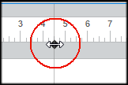
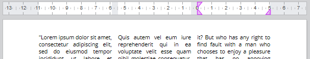

## 基本概念

ドキュメントが[ページビューモード](./defining-a-4d-write-pro-area.md#selecting-the-view-mode)のとき、以下のドキュメントプロパティがユーザーに表示されます:

* 印刷範囲を示すページのアウトライン
* ページ幅とページの高さ (デフォルトは21x29.7 cm)
* ページの向き (デフォルト: 縦向き)
* ページの余白 (デフォルト: 2.5cm)

また、**改ページを挿入/カラムを挿入/セクションブレークを挿入**、**文書.../ページサイズ**、**文書.../ページの向き**、といったページ関連の追加のコマンドを使用する事もできます。

**注:** ドキュメントが **埋め込み**モードまたは**下書き**モードのときにページプロパティを変更しても見た目上は変化ありませんが、それでも設定は可能です。以下の段落プロパティは、**下書き**モードでも見た目上の変化があります:

* ページの高さ制限 (線が引かれます)
* カラム
* 内側での改ページを避けるプロパティ
* ウィドウ&オーファンコントロール

## 段落ブレーク 

ページモードまたは下書きモードで表示された時(あるいはドキュメント印刷のコンテキストにおいて)、4D Write Pro の段落は、以下のようなときにブレークを行うことがあります:

* 段落の高さが利用可能なページの高さより高いときには自動的に段落ブレークが挿入されます。
* プログラミングによって、またはユーザーによって設定されていた場合、段落ブレークが挿入されます。

ブレークはプログラミングによって、またはユーザーの操作で追加することが可能です。利用可能なアクションとしては以下のようなものが含まれます:

* [WP INSERT BREAK](../commands/wp-insert-break) コマンド
* *insertPageBreak* 標準アクション
* デフォルトのコンテキストメニューの、**段落ブレーク挿入**オプション

### 自動ブレークを管理する

以下の機能を使用することで、段落内の自動ブレークを管理することができます: 

* **ウィドウ&オーファンコントロール**: このオプションが段落に対して設定されているとき、4D Write Pro はドキュメント内にてウィドウ (段落の最終行がページ上部に取り残される状態) とオーファン (段落の先頭行がページ下部に取り残される状態) を許可しません。前者の場合には、最終行の一つ前の行を加えた 2行がページ上部に表示されます。後者の場合には、単一の先頭行は次ページへと送られます。
* **段落内の改ページを避ける**: このオプションが段落に対してチェックされている場合、4D Write Pro はその段落が 2枚以上のページに分割されないようにします。
* **次の段落につなげる:** このオプションが段落に対して設定されている場合、その段落は、その後に続く段落と自動ブレークでは分割されなくなります。詳細に関しては`wk keep with next` とそれに対応する[標準アクション](./defining-a-4d-write-pro-area.md#standard-actions)を参照して下さい*keepWithNext*.

これらのオプションはコンテキストメニューを使用するか、あるいは[属性](../commands-legacy/4d-write-pro-attributes.md)(`wk avoid widows and orphans`、`wk page break inside paragraph`、または[標準アクション](./defining-a-4d-write-pro-area.md#standard-actions)(*widowAndOrphanControlEnabled*、 *avoidPageBreakInside*。

## 背景 

4D Write Pro ドキュメントの背景とドキュメント要素(表、段落、セクション、ヘッダー/フッター等)には、以下のエフェクトを設定することができます:

* カラー
* 境界線
* 画像
* 原点、水平および垂直位置
* 塗りエリア
* 繰り返し

これらの[属性](../commands-legacy/4d-write-pro-attributes.md)は、[WP SET ATTRIBUTES](../commands/wp-set-attributes) コマンドあるいは[標準アクション](./defining-a-4d-write-pro-area.md#standard-actions)によってによって、プログラムによってページ上のそれぞれの要素に対して、あるいはドキュメントの背景全体に対して定義することが可能です。

ユーザーは以下のように、コンテキストメニューを通じて背景属性を変更することが可能です:


背景画像にフルサイズの画像を追加する例については、*[How Do I (HDI) 例題 4DWrite Pro: フチなし全面の背景画像](https://github.com/4D-JP/HDI/releases/download/16r5/HDI%5F4DWP%5FBackImagePaperBox.zip)* にて紹介しています。

## ヘッダー、フッター、セクション

4D Write Pro ドキュメントはヘッダーとフッターをサポートします。ヘッダーとフッターはセクションと関連しています。

セクションとは、ページレンジによって定義されたドキュメントの一部分で、ページングと属性の設定を独自に持つことができます。ドキュメントには複数のセクションを含めることができます (1から合計のページ数まで)。それぞれのページには、継続したセクションブレークを持つページを除き(以下参照)、1ページにつき1セクションのみ含めることができます, except pages with continuous section breaks (see below). 

4D Write Pro documents can contain:

- one or more sections (one section by default)
- for each section, up to three subsections:
   - first page subsection
   - left page(s) subsection
   - right page(s) subsection

各セクションに対して、ヘッダーとフッターのセットを定義することができます。

### セクションの定義 

セクションとは4D Write Proドキュメント内の継続したページのサブセットです。ドキュメントは1つ以上のセクションを含むことができます。ひとつのセクションには何ページでも (単一のページからドキュメント内の総ページ数まで) 含めることができます。また、ひとつのセクションにはカラムを1個から最大20個まで含めることができます。

デフォルトで、ドキュメントは**セクション1**と名付けられたひとつのセクションを持ちます。ドキュメント内のどこをクリックしても、4D Write Proコンテキストメニューにそのセクション番号を表示します:


テキストの中にセクションブレークを追加することで新しいセクションを作成することができます:


セクションブレークが追加されたとき、コンテキストメニューはそれぞれのセクションに対しインクリメントされた数字を表示します。セクション名は任意に改名することも可能です:


入力した名前はそのセクションの名前として、ドキュメント全体で使用されます:

 

セクションに対し、異なる最初のページ、異なる左/右ページを定義していた場合、そのページタイプもまたメニューに表示されるというに点に注意して下さい (後述参照)。

### 継続したセクションブレークの挿入 

継続したセクションブレークは、同一ページ内に新しいセクションを作成します。これを使用することで、異なる数のカラムのセクションを持つページを作成することができます(*複数カラムと単一カラムのセクションを持ったページの作成* 参照)。

継続したセクションブレークで作成されたセクションはドキュメント内でカウントされます(セクション番号を持ちます)。ただし通常のセクションブレークで作成されたセクションとは異なり、ヘッダー、フッター、アンカーされた画像などは実際の改ページが発生したときにのみ考慮されます。

**注:** 継続したセクションブレークを挿入したあとに新しいセクションに対してページの方向を変更した場合には、そのセクションブレークは通常のセクションブレークへと変換されます。

### セクション属性 

セクションはドキュメント属性を継承しますが、ヘッダーとフッターを含むドキュメント属性は、セクションごとに個別に編集することも可能です。コンテキストポップアップメニューは、セクションレベルで利用可能なプロパティと属性を表示します:


* **ページの向き**: セクションごとに特定のページの向き (横向き/縦向き)を設定することができます。
* **最初のページを個別に設定**: セクションの最初のページに対して異なる属性を設定することができます。この機能は例えば、余白を作成するのに使用することができます。この属性がチェックされている場合、セクションの最初のページはセクションのサブセクションとして管理され、独自の属性を持つことができます。  
    

* **左右のページを個別に設定**: セクションの左ページと右ページで異なる属性を設定することができます。この属性がチェックされていると、セクションの左ページ/右ページはサブセクションとして管理され、それぞれ独自の属性を持つことができます。  
    

* **カラム**コマンド: セクションに対してカラムの数とプロパティを定義することができます。これらのオプションは以下に詳細な説明があります。
* **ヘッダー** と **フッター** コマンド: これらのオプションを使用すると個別のヘッダーとフッターを定義することができます。これらのオプションは以下に詳細な説明があります。
* **マージン** / **パッディング** / **境界線** / **背景**: これらの属性は各セクションに対して個別に設定が可能です。これらの属性のより詳細な情報については、*4D Write Pro属性*の記事を参照してください。

### ヘッダーとフッターの挿入 

それぞれのセクションには固有のヘッダーとフッターをつけることができます。ヘッダーとフッターはページビューモードが**ページ**のときのみ表示されます。

有効化されたオプションによって、ひとつのセクションにつき最大3つまでヘッダーとフッターを定義することが可能です:

* 最初のページ
* 左ページ
* 右ページ

ヘッダーまたはフッターを作成する手順は以下の通りです:

1. まずドキュメントが**ページ**ビューモードであることを確認してください。
2. 目的のセクションのヘッダーまたはフッターエリアをダブルクリックして、編集モードに入ります。  
   * ヘッダーエリアはページの上部にあります:  
     
   * フッターエリアはページの下部にあります:  
   

スタティックなコンテンツが入力すると、その入力した内容は各ページのセクションにて自動的に繰り返されます (ただし最初のページが別設定の場合には、そこには反映されません)。


[ST INSERT EXPRESSION](../../commands/st-insert-expression) コマンドを使用することで、ページ番号やページ数などの動的なコンテンツを挿入することができます (より詳細な情報については、*式の挿入*の段落を参照してください)。

**注:** [WP Get header](../commands/wp-get-header) と [WP Get footer](../commands/wp-get-footer) といった特定のコマンドを使用することで、フッターやヘッダーのをプログラミングによって管理することができます。

セクションのヘッダーとフッターが定義できたら、コンテキストメニューを使用してそれらの属性を設定することができます:


**マージン**、**パッディング**、**境界線**、そして**背景**属性についてのより詳細な情報については、*4D Write Pro属性*の章を参照してください。

コンテキストメニューの**ヘッダーを削除**あるいは**フッターを削除**コマンドを選択すると、ヘッダーまたはフッターの定義全体 (コンテンツと属性) を削除することができます。

### 互換性 

4D Write Proは、4D Writeプラグインから変換されたドキュメントのヘッダーとフッターも(固定長の高さで)扱うことができます。

4D Writeプラグインのヘッダーとフッターから引き続きサポートされ変換される式とプロパティは、以下の通りです:

* ページ番号とページ数変数
* 個別の最初のページ
* 個別の左/右ページ

## ルーラー 

水平ルーラーは、4D Write Proの全てのビューモードで利用可能で、以下のような特徴を持ちます:

* メモリはcm、mm、inch、あるいはptのうち、4D Write Proドキュメント内で定義されているカレントのレイアウト単位に応じたものになります。単位は、コンテキストメニュー、あるいは wk layout unit 属性を使用して変更することができます。
* 最初の行のインデント記号
* 左の段落マージン記号
* 右の段落マージン記号
* タブはルーラーの下の端に表示
* 左と右のページマージンを表す視覚的なカラーコントラスト

垂直ルーラーはページモードでのみ利用可能で、以下のような特徴を持ちます:

* メモリはcm、mm、inch、あるいはptのうち、4D Write Proドキュメント内で定義されているカレントのレイアウト単位に応じたものになります。単位は、コンテキストメニュー、あるいは wk layout unit 属性を使用して変更することができます。
* 上と下のページマージンを表す視覚的なカラーコントラスト

ルーラーの表示状態は、標準アクション(*4D Write Pro標準アクションの使用* 参照)か、あるいは4D Write Proエリアのコンテキストメニュー内の**水平ルーラーを表示**あるいは**垂直ルーラーを表示**をチェックする/チェックを外すことで変更可能です:


**注:** 特定の4D Write Pro エリアプロパティを使用することで、ルーラーのデフォルトの表示状態を定義することができます(*ビュープロパティの設定* の章を参照してください)。

### テキストのマージンとインデントを調整する 

マージン、インデント、そしてタブの位置は、それぞれに対応する記号をクリックしてドラッグすることで変更することができます:


これらの記号の上にマウスをホバーさせたとき、カーソルは変わってそれが移動できることを表します。ドラッグ中は垂直のガイドラインが表示されます:



複数の段落が選択されているとき、マージンあるいはインデント記号をドラッグした場合にはそのマージンとインデントは選択されている全ての段落に適用されます。これらの記号をShiftキーを押しながらドラッグした場合には、選択された段落内でのインデント間・マージン間の現在の間隔を維持します。

#### 水平ルーラー 

水平ルーラーの、対応する記号をクリックしたりドラッグしたりすることで、左右のマージン、インデント、タブ位置などを変更することができます:


これらの記号の上をマウスでホバーすると、カーソルは形を変えてそれが移動可能であることを示し、またドラッグ中は水平なガイドラインが表示されます:


複数の段落が選択されている時、マージンあるいはインデントの記号をドラッグすると、そのマージンあるいはインデントは選択された段落全体に対して適用されます。**Shift** キーを押しながら記号をドラッグすると、選択されている段落でのインデントとマージンの間の既存の距離が維持されます。

#### 垂直ルーラー 

垂直ルーラーを使用すると、上と下のマージンを変更することができます。マウスをマージンの端にホバーすると、カーソルは形を変えてそれが移動可能であることを示し、またドラッグ中は垂直なガイドラインが表示されます:


このアクションを使用すると、ページの上と下の余白、またはドキュメントの本文とヘッダーとフッターの間の間隔を変更することができます。

### タブの管理 

水平ルーラーのコンテキストメニューを使用して、タブの作成、変更、削除をすることができます:


タブを作成するには、水平ルーラーを右クリックしてそのタイプをコンテキストメニューから選択してください。単一の左クリックは自動的にデフォルトの左タブを作成します。既存のタブを右クリックすることで、コンテキストメニューを使用してそのタブのタイプを変えることもできます。

**タブを削除**は既存のタブを右クリックした場合にのみ使用可能です。また、タブを水平ルーラーエリアの外へとドラッグすることで削除することもできます。

:::note 注

* タブは、[WP SET ATTRIBUTES](../commands/wp-set-attributes)、[WP GET ATTRIBUTES](../commands/wp-get-attributes)、あるいは[WP RESET ATTRIBUTES](../commands/wp-reset-attributes) コマンドとwk tab default および wk tabs セレクターを使用することでプログラムで定義することも可能です。
* 小数点揃えに関しては、4D Write Pro は右からみて最初のドットまたはカンマ文字を小数点区切りとして認識します。このデフォルトの設定はwk tab decimal separator セレクターを使用して変更することができます。

:::

#### タブリーダー文字を定義する 

タブの前にくる文字(リーダー文字)は、既定の5つの文字から選択するか、使用する特定の文字を指定することで定義する事ができます。既定の文字とは以下のとおりです:

* なし (何も文字が表示されない - *デフォルト*)
* .... (点)
* \--- (破線)
* \_\_ (アンダースコア)
* \*\*\* (アスタリスク)

リーダー文字は必ずタブの前に表示され、テキストの方向(左から右、あるいは右から左)に従います。[WP SET ATTRIBUTES](../commands/wp-set-attributes) 、[WP GET ATTRIBUTES](../commands/wp-get-attributes) 、および[WP RESET ATTRIBUTES](../commands/wp-reset-attributes) コマンドと`wk leading` と `wk tab default` または `wk tabs` セレクターを使用することでプログラミングによる定義も可能ですし、水平ルーラーのコンテキストメニューからユーザーインターフェース経由で定義することも可能です(以下参照)。


**その他...**が選択された場合、カスタムのリーダー文字を定義可能なダイアログが表示されます。

### マルチカラムルーラー 

ドキュメントあるいはセクションに対して二つ以上のカラムが定義されている時、水平ルーラーは各カラムに対するそれぞれの特定のエリアを表示します:



**注:** マルチカラム機能は、**埋め込み**ビューモードでは利用できません。

### On After Edit イベント 

どの種類のタブやマージンコントロールでも、それらが(ドラッグあるいはコンテキストメニューを使用して)移動、追加、削除されたときには、4D Write Proエリアフォームオブジェクトに対して[`On After Edit`](../../Events/onAfterEdit.md) フォームイベントがトリガーされます。

## カラム

4D Write Pro ではドキュメント内にカラムを管理することができます。カラムは最も左のカラムから最も右のカラムへと順番につながっています。言い換えると、テキストを入力していくとき、テキストは左にあるカラムを埋めていき、そのあとすぐ右にあるカラムへと続き、それがページの終わりに達するまで続いていきます。ページの終わりまで達すると、テキストは次のページへと続いていきます。ページ設定のバランスをとるために、4D Write Pro ではかカラムブレークを挿入することができます。


カラムはドキュメントレベル(ドキュメント全体に表示される)、あるいはセクションレベル(各セクションはそれぞれ独自のカラム設定を持つことができる)において定義することができます。

**注:** カラムは**ページビュー**モードと**下書きビュー**モードにおいてのみサポートされます(**埋め込み**ビューモードでは表示されません)。また[WP EXPORT DOCUMENT](../commands/wp-export-document) コマンドを使用して.docx フォーマットへと書き出すことができますが、HTML またはMIME HTML フォーマット(wk web page complete フォーマット)への書き出しはできません。

カラムは以下の方法を用いて設定することも可能です:

* 4D Write Pro エリアコンテキストメニューの**カラム**サブメニュー
* 4D Write Pro [属性](../commands-legacy/4d-write-pro-attributes.md)
* 4D Write Pro [標準アクション](./using-4d-write-pro-standard-actions.md)

カラムに対しては、以下のプロパティを設定/取得することができます:

| **プロパティ**      | **詳細**                                                                                                                                                                 | *ドキュメント* **属性**                                                         | **標準アクション**                                           |
| -------------- | ---------------------------------------------------------------------------------------------------------------------------------------------------------------------- | ----------------------------------------------------------------------- | ----------------------------------------------------- |
| カラム数           | ドキュメント/セクションに対して最大20個までカラムを定義可能です                                                                                                                                      | wk column count                                                         | *columnCount*                                         |
| カラム間隔          | カラム間の間隔をpt、インチ、cm単位で指定。全てのカラムに同じ間隔が適用されることに注意してください。各カラムの幅は、カラム数、ページ幅、そしてカラム間隔に応じて、4D Write Proによって自動的に算出されます。                                                         | wk column spacing                                                       | *columnSpacing*                                       |
| カラム幅           | (読込のみ属性) 各カラムのカレントの(自動算出された)幅。                                                                                                                                         | wk column width                                                         | \-                                                    |
| 区切り線スタイル、カラー、幅 | カラムの間には垂直のセパレーター(区切り線)を追加することができます。これらのオプションを使用すると、その区切り線のスタイル、カラー、幅をデザインすることができます。区切り線を削除するためには、スタイルから**なし**を選んでください。 | wk column rule style、wk column rule color、wk column rule width          | *columnRuleStyle*、*columnRuleColor*、*columnRuleWidth* |
| ブレークを挿入        | カラムブレークを挿入                                                                                                                                                             | wk column break、[WP INSERT BREAK](../commands/wp-insert-break)も参照してください | *insertColumnBreak*                                   |
| カラムメニュー        | カラムのサブメニューを作成します                                                                                                                                                       | \-                                                                      | *columns*                                             |

### 複数カラムと単一カラムのセクションを持ったページの作成 

ドキュメント内で*継続したセクションブレークの挿入* を使用することで、同じページ上に複数カラムのセクションと単一カラムのセクションを載せることができます。

例えば以下のようなドキュメントがある場合:


継続したセクションブレークを挿入し、最初のセクションに対してカラムの数を2つに変更することができます:


## ブックマーク

4D Write Pro ではブックマークと呼ばれる、ドキュメントの一部において動的な参照を作成、使用することができます。ブックマークは、4D Write Pro ドキュメント内の本文の特定の[レンジ](./ranges.md)に名前付きで関連付けられる参照です。

ブックマークは動的なものであり、ユーザーにより範囲が移動、追加、または削除されると、ブックマークは自動的に更新され、ドキュメント内の同じ内容を継続して参照することができます。たとえば：

- ドキュメント内のページ20にある "Hello world" を参照する"MyBM" という名前のブックマークを作成します。
- 次に、ドキュメントの先頭に50ページを挿入します。
- "MyBM" ブックマークを使用すると、今度はドキュメント内の70ページにある "Hello world" に自動的にアクセスできます。

ドキュメント内には無制限のブックマークを含むことができます。複数のブックマークが同じ範囲を参照することができ、ブックマークの範囲は重なり合うことがあります。ただし、ドキュメント内の各ブックマーク名は一意である必要があります。ブックマークは、[WP INSERER DOCUMENT](../commands/wp-insert-document-body) コマンドが使用されるとインポートされません（移行先のドキュメント内のブックマークは上書きされません）。

一度作成されたブックマークはドキュメント内に保存されます。ブックマークはドキュメントと共に保存され、複数のコマンドで操作することができます。

また、テンプレートドキュメントの一部としてブックマークを使用することができます。これらのパーツは、データベース内のデータを使用して自動的に組み立てられ、請求書やカタログなどの最終的なドキュメントを生成するのに役立ちます。

複数のコマンドを使用して、ブックマークを作成、削除、使用することができます：

- [WP NEW BOOKMARK](../commands-legacy/wp-new-bookmark.md) はレンジから新しいブックマークを作成します。
- [WP GET BOOKMARKS](../commands-legacy/wp-get-bookmarks.md) はドキュメント内で定義されている全てのブックマークを取得します。
- [WP Bookmark range](../commands-legacy/wp-bookmark-range.md) は既存のブックマークからレンジを取得します。
- [WP DELETE BOOKMARK](../commands-legacy/wp-delete-bookmark.md) はブックマークを削除します。

## リンク

4D Write Pro では、レンジ（テキスト、ピクチャーなど）や要素（表、本文、フッターなど）を含めるほぼすべてを含むドキュメント全体にハイパーリンクを割り当てることができます。たとえば、ドキュメントの画像に対してハイパーリンクを設定できます。4D Write Pro ドキュメントが HTML にエクスポートされた場合、ユーザーはその画像をクリックして、リンク先のページを開くことができます。

ハイパーリンクは、4D Write Pro ドキュメント内で **Ctrl+クリック**（Windows）または **Cmd+クリック**（macOS）操作をすることで簡単にアクティブ化できます。

4D Write Pro は以下のリンクタイプをサポートします:

| リンクのタイプ | 詳細 |
|----------------|------|
| `url` | Web ページあるいは任意のドキュメントのリンク。実行時には関連づけられたアプリケーションが開始されます。4D Write Pro ドキュメント (`.4wp`, `.4w7`) への URL リンクを活性化すると、エリアの 4D Write Pro ドキュメントが置き換えられます。<br>(*) [OPEN URL](../../commands-legacy/open-url.md) コマンドと同じ動作です。 |
| `bookmark` | ドキュメント内のブックマークへのリンクです |
| `method` | リンクがアクティブになると 4D メソッドが実行されます（実行されるのはあらかじめ登録されているメソッド [SET ALLOWED METHODS](../../commands/set-allowed-methods.md) に限られます）。 |

ハイパーリンクは以下のコマンドで管理することができます:

- [WP SET LINK](../commands-legacy/wp-set-link.md) を使用して、ターゲットオブジェクトの指定用にリンクを挿入
- [WP Get links](../commands-legacy/wp-get-links.md) を使用して、ターゲットオブジェクト内のすべてのリンクのコレクションとして取得

:::note

注: リンクは属性として扱われるため、`wk link url` 定数を用いて [WP SET ATTRIBUTES](../commands/wp-set-attributes) および [WP GET ATTRIBUTES](../commands/wp-get-attributes) コマンドで定義・取得することができます。けれども、通常は [WP SET LINK](../commands-legacy/wp-set-link.md) や [WP Get links](../commands-legacy/wp-get-links.md) の使用が推奨されます。これらは自動的に URL としてリンクをエンコード／デコードします。[WP GET ATTRIBUTES](../commands/wp-get-attributes) コマンドを使用してリンクを読み取るとき、ターゲットオブジェクトが複数のリンクを含む場合は、最初のリンク文字列のみが返されます。

:::

たとえば、ユーザーが選択したテキストを Web サイトへの URL リンクに変換したい場合:


次のように書きます:

```4d
$range:=WP Get selection(*;"WParea")
WP SET LINK($range;New object("url";"http://www.4d.com"))
```


ターゲットオブジェクトからリンクを除去するためには、以下のように書きます:

```4d
$range:=WP Get selection(*;"WParea")
WP SET LINK($range;New object("url";"http://www.4d.com"))
```
または

```4d
$range:=WP Get selection(*;"WParea")
WP SET LINK($range;New object("url";"http://www.4d.com"))
```

**注:** *$range* がリンク全体を含んでいない場合、リンクは短縮されますが完全に削除されるわけではありません。

## オブジェクト(フォーム)テーマのコマンドの使用

以下の[オブジェクト（フォーム）](../../commands/theme/Objects_Forms.md)テーマの4Dコマンドは、4D Write Proのフォームオブジェクトをサポートします：

| コマンド | 補足 |
|---------|------|
| OBJECT DUPLICATE | |
| OBJECT Get auto spellcheck / OBJECT SET AUTO SPELLCHECK | |
| OBJECT Get border style / OBJECT SET BORDER STYLE | |
| OBJECT Get context menu / OBJECT SET CONTEXT MENU | |
| OBJECT GET COORDINATES / OBJECT SET COORDINATES | |
| OBJECT Get data source / OBJECT SET DATA SOURCE | |
| OBJECT GET DRAG AND DROP OPTIONS / OBJECT SET DRAG AND DROP OPTIONS | |
| OBJECT Get enabled / OBJECT SET ENABLED | |
| OBJECT Get enterable / OBJECT SET ENTERABLE | |
| OBJECT GET EVENTS / OBJECT SET EVENTS | |
| OBJECT Get focus rectangle invisible / OBJECT SET FOCUS RECTANGLE INVISIBLE | |
| OBJECT Get font / OBJECT SET FONT | カレントセレクションがあればそこに適用 |
| OBJECT Get font size / OBJECT SET FONT SIZE | カレントセレクションがあればそこに適用 |
| OBJECT Get font style / OBJECT SET FONT STYLE | カレントセレクションがあればそこに適用 |
| OBJECT Get horizontal alignment / OBJECT SET HORIZONTAL ALIGNMENT | カレントセレクションがあればそこに適用。4D Write Proエリアの [wk justify](../../constants.md#wk-justify) 定数をサポート |
| OBJECT GET RESIZING OPTIONS / OBJECT SET RESIZING OPTIONS | |
| _o OBJECT SET COLOR | カレントセレクションがあればそこに適用 |
| OBJECT GET RGB COLORS / OBJECT SET RGB COLORS | カレントセレクションがあればそこに適用 |
| OBJECT Get type | |
| OBJECT Get vertical alignment / OBJECT SET VERTICAL ALIGNMENT | 段落の垂直方向の行揃え。段落の高さが段落のテキストの高さより高い場合にのみ効力を発揮します。 |
| OBJECT Get visible / OBJECT SET VISIBLE | |
| OBJECT Is styled text | trueを返します |
| OBJECT MOVE | |
| OBJECT GET SUBFORM CONTAINER SIZE | |
| OBJECT Get name | |
| OBJECT Get pointer | |

上記にないOBJECTコマンドはそれぞれ Write Proエリアに対しては使用できません。
