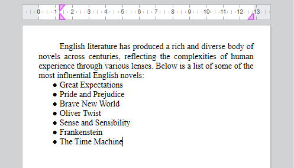

to import

<!-- REF lists-WP.Desc -->

## リスト

4D Write Pro はフラットなリスト(単一レベル) と複数レベルのリストをサポートしています。

### 単一レベルのリスト

4D Write Pro は主に2つのタイプの単一レベルのリストをサポートします:

- 順番なしリスト: リストの項目は箇条書き記号、カスタムの箇条書き記号、あるいはマーカーとして使用される画像でマークされます。
- 順番付きリスト: リストの項目は番号または文字でマークされます。

これらは以下の方法で作成することができます:

- [4D Write Pro インターフェース](https://doc.4d.com/4Dv20/4D/20.2/Entry-areas.300-6750367.ja.html#5865253) のツールバーまたはサイドバー
- `listStyleType` あるいは `listStyleImage` の[標準アクション](./standard-actions)
- あるいは[WP SET ATTRIBUTE](../commands/wp-set-attributes) コマンドを使用して[プログラムで作成する](../commands-legacy/4d-write-pro-attributes.md#リスト)。

標準アクション(`listStyleType` あるいは `listStyleImage`) あるいはツールバー/サイドバーを使用してリストが作成された場合、4D Write Pro はマーカーがテキストの内側に表示されるように、自動的にテキストの前に余白を挿入します。 挿入される余白の値は、デフォルトタブのオフセット(`wk tab default`) に対応します。



[WP SET ATTRIBUTE コマンド](../commands-legacy/4d-write-pro-attributes.md#リスト)コマンドを使用してリストが作成された場合、具体的な余白は設定されておらず、デフォルトでマーカーは段落の左端に追加されます。 必要であれば開発者はカスタムの余白を追加することができます。

:::tip 関連したblog 記事

[4D Write Pro – Adding a margin automatically when bullets are set using standard actions](https://blog.4d.com/4d-write-pro-adding-a-margin-automatically-when-bullets-are-set-using-standard-actions)

:::

### 複数レベルのリスト

マルチレベルリスト(複数レベルのリスト)は、[マルチレベルスタイルシート](../user-legacy/stylesheets.md#multi-level-list-style-sheets) に基づいています。 マルチレベルリストにはルートレベルのスタイルシートが一つと、一つ以上のサブレベルスタイルシートが含まれています。 各レベルはマルチレベルスタイルシートに関連づけられており、またリスト内での深さを表します(レベル1、レベル2、レベル3、など)。

新しいサブレベルが作成されると、レベルの番号振り分けは1 から再スタートします。 マルチレベルリスト内で要素を追加または削除した場合、番号は自動的に調整されます。


[WP New style sheet](../commands/wp-new-style-sheet.md) コマンドで作成され、[WP SET ATTRIBUTE](../commands/wp-set-attributes.md) を使用して段落に適用することができます。

マルチレベルリストは以下の方法で管理することができます:

- 段落[スタイルシート属性](../commands-legacy/4d-write-pro-attributes.md#スタイルシート) (例えば`wk list level index`、 `wk list level count`、および `wk list concat string format` など)
- レベル管理専用の[標準アクション](../user-legacy/standard-actions.md) (`listLevelAppend`、 `listLevelInc`、 `listLevelDec` など)
- マーカー管理の番号管理専用の標準アクション(`listConcatStringFormat`、 `listNumberFormat`)。

:::tip 関連したblog 記事

[4D Write Pro – Creating Multi-level Bullet or Numbered Lists Using Multi-level list Style Sheets](https://blog.4d.com/4d-write-pro-creating-multi-level-bullet-or-numbered-lists-using-multi-level-paragraph-style-sheets)

:::

<!-- END REF -->

<!-- REF multi-level-list-style-sheets.Desc -->

## 複数レベルリストスタイルシート

複数レベル(マルチレベル)リストスタイルシートは、[マルチレベルリスト](../user-legacy/using-a-4d-write-pro-area.md#multi-level-lists) を作成するために使用されます。

マルチレベルリストスタイルシートを作成するためには、[WP New style sheet](../commands/wp-new-style-sheet.md) を使用し、必要な階層の数を*listLevelCount* 引数に渡します。 次に関連した段落スタイルシートの階層を定義します: 一つの**ルートレベル** スタイルシートと、それにリンクした一つ以上の**サブレベル** スタイルシートです。 各レベルはリスト内の深さ(レベル1、レベル2、レベル3、など)を表し、 それぞれ自動的に"ルートレベル名 + lvl + インデックス"という形式の名前が付けられます。例えば"Mylist lvl 2" といった具合です。

マルチレベルリストスタイルをカスタマイズするために、段落スタイルシートオブジェクトは[スタイルシート属性](../commands-legacy/4d-write-pro-attributes.md#スタイルシート)を使用してカスタマイズすることが可能です。

マルチレベルリストスタイルシートは、以下のコマンドによって完全にサポートされています: [`WP Get style sheet`](../commands/wp-get-style-sheet.md)、 [`WP SET ATTRIBUTES`](../commands/wp-set-attributes.md)、 [`WP DELETE STYLE SHEET`](../commands/wp-delete-style-sheet.md)。

### 例題

以下の例は3階層のマルチレベルリストスタイルシートを作成し、それを段落へと割り当てます。

```4d
// 3階層のマルチレベルリストスタイルシートを作成
WP New style sheet(wpArea; wk type paragraph; "MyList"; 3)

// 各階層を取得
var $level1; $level2; $level3 : Object
$level1:=WP Get style sheet(wpArea; "MyList"; 1) // Root level
$level2:=WP Get style sheet(wpArea; "MyList"; 2) // 1st sub-level
$level3:=WP Get style sheet(wpArea; "MyList"; 3) // 2nd sub-level

// スタイルをカスタマイズする
WP SET ATTRIBUTES($level1; {listStyleType: wk upper latin; fontBold: wk true})
WP SET ATTRIBUTES($level2; {listConcatStringFormat: True})
WP SET ATTRIBUTES($level3; {listStringFormatLtr: "(#)"})

// マルチレベルスタイルシートを段落に適用する
var $paragraphs : Collection
$paragraphs:=WP Get elements(wpArea; wk type paragraph)

WP SET ATTRIBUTES($paragraphs[0]; wk style sheet; $level1)
WP SET ATTRIBUTES($paragraphs[1]; wk style sheet; $level2)
WP SET ATTRIBUTES($paragraphs[2]; wk style sheet; $level3)
```

実行結果:


最初のサブレベルを削除するには以下を実行します:

```4d
WP DELETE STYLE SHEET(wpArea; "MyList"; 2)
```

実行結果:


### 定義済属性値

マルチレベルリストスタイルシートを作成すると、それらは定義済みの値を使用します:

- カレントのレイアウト単位によって、`wk margin left` = 0.75 cm \* (そこまでのレベルの数) あるいは 0.25 インチ \* (そこまでのレベルの数)
- `wk list type` = `wk decimal`
- `wk name` は、ルートレベルのスタイルシート名から取られます(サブレベルにおいては読み取り専用になります)
- `wk list level count` は、指定された値が全てのレベルに対して設定されます

  - 例:

    - ルートレベル: `"MyList"`
    - 最初のサブレベル: `"MyList lvl 2"`
    - 二つ目のサブレベル: `"MyList lvl 3"`

<!-- END REF -->

