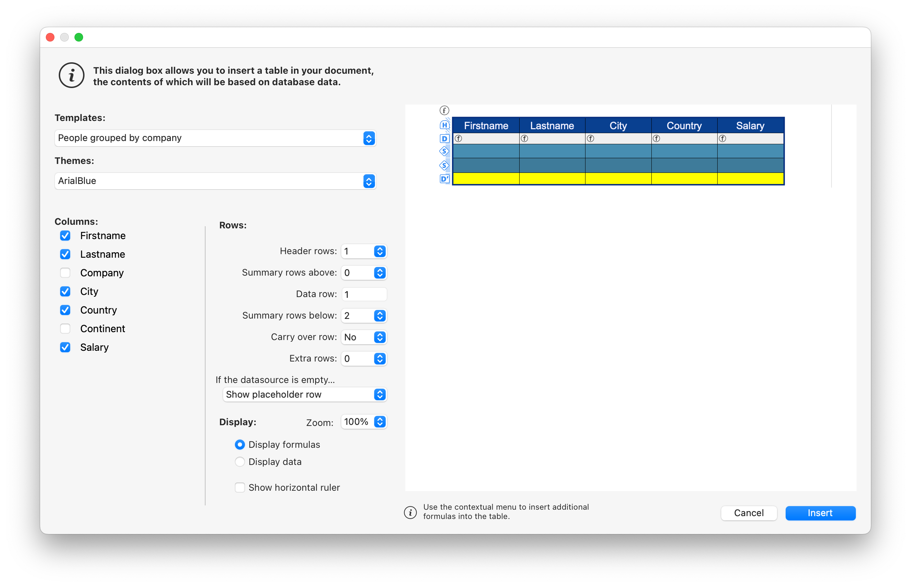
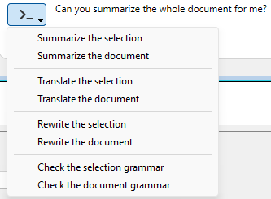
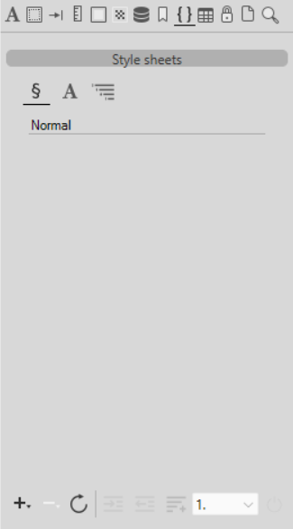

d---
id: writeprointerface
title: 4D Write Pro Interface
slug: /WritePro/write-pro-interface
---------------------------------------------------

4D WritePro インターフェースは、エンドユーザーが 4D Write Proドキュメントを簡単にカスタマイズできるパレットを提供します。

4D のデベロッパーは、これらのパレットをアプリケーションに簡単に実装することができます。 それにより、エンドユーザーは、フォントやテキストの揃え方向、ブックマーク、表レイアウト、フレームなど、4D Write Pro のプロパティをすべて管理することができます。

## インストールとドキュメンテーション

4D Write Pro インターフェースは、[プロジェクト内にインストールする](../Project/components.md#概要) する必要のある**4D コンポーネント** です。 4D Write Pro インターフェースのソースファイルは[Github 上で提供されています](https://github.com/4d/4D-WritePro-Interface)。

インターフェースのマニュアルについては、*4D デザインリファレンス* の [4D Write Pro エリアのドキュメント](https://doc.4d.com/4Dv20/4D/20/Entry-areas.300-6263967.ja.html) を参照ください。 ここには以下のような情報があります:

- 表ウィザード設定ドキュメンテーション
- 統合されたAIについての ドキュメント.

## 表ウィザード

表ウィザードは、コンテキスト、データソース、およびフォーミュラを使用した、データベースのデータに基づく表組みの作成をさらに簡素化します。

エンドユーザーがアクセスできる表ウィザードは、4D デベロッパーが設定し提供するテンプレートをロードします。 これにより、デベロッパーはユーザーの特定のユースケースやビジネス要件に応じてテンプレートをカスタマイズすることができます。

表ウィザードには、デフォルトのテンプレートおよびテーマが用意されており、デベロッパーはそれらを、アプリケーションで必要とされる内容に適合させることができます。

アプリケーションに表ウィザードを実装するために、デベロッパーはテンプレートファイルを作成し、設定することができます。

### WP表ウィザードのインターフェース

ユーザーは、4D Write Pro インタフェースツールバーとサイドバーの "表を挿入" メニューボタンから表ウィザードダイアログを開きます。



このインターフェースで、ユーザーは最初のドロップダウンリストからテンプレートまたはテーブルを選択し、2番目のドロップダウンリストからテーマを選択します。

##### 列について:


テンプレートまたはテーブルの選択に応じて、テンプレートに保存されているフィールドのリストが表示されます (BLOB およびオブジェクト型は自動的に除外されます)。 表の列として表示させたいフィールドは、フィールド名の左にあるチェックボックスで選択します。また、表示する列の順序はフィールドをドラッグしてリスト内を移動させることで変更することができます。

##### 行について:


表ウィザードでは、ヘッダー行と追加の行の数 (それぞれ 0～5) を定義したり、[ブレーク行](https://doc.4d.com/4Dv20/4D/20/Handling-tables.200-6229469.ja.html#6233076) (小計行) を繰り返し行の上または下に設定したり、[キャリーオーバー行](https://doc.4d.com/4Dv20/4D/20/Handling-tables.200-6229469.ja.html#6236686) の表示/非表示を選択したりすることもできます。

さらに、次のオプションを使用して、データソースが空の場合の表組みの動作を選択できます: データ行を表示、データ行を非表示、表を非表示、プレースホルダー行を表示。

##### 表示について:


ユーザーは、ドロップダウンリストから希望するオプションを選択することで、好みのズームレベルを調整し、ラジオボタンを使ってフォーミュラまたはデータを表示し、チェックボックスを使って水平ルーラーを表示するかどうかを選択します。

表の作成とカスタマイズが完了したら、**挿入** ボタンをクリックして、WPドキュメントに表組みを追加することができます。

ドキュメントに表が統合されると、ユーザーはそのスタイルをカスタマイズできます。 ツールバーやサイドバーの書式設定ツールはすべて利用可能です。

### WP表ウィザードのテンプレートの設定

テンプレートの設定には以下が含まれます:

- [テンプレートファイル](#テンプレートファイル): テーブルとフィールドを定義し、アプリケーションに適合したフォーミュラを用意します。
- [トランスレーションファイル](#トランスレーションファイル): テーブル、フィールド、フォーミュラの翻訳名を指定します。
- [テーマファイル](#テーマファイル): グラフィックスタイルとテーマをデザインしカスタマイズします。

表ウィザードを設定するにあたって、これら 3種類のファイルにはそれぞれ明確な役割がありますが、いずれも必須ではありません。

#### テンプレートファイル

テンプレートファイルを使って、以下のことが定義できます:

- 表のデータソースとして使用されるエンティティセレクションを返すフォーミュラ
- ブレーク行のフォーミュラ (ブレーク行を挿入できる場合)
- 表の列として使用できるデータクラス属性
- ブレーク行、キャリーオーバー行、プレースホルダー行、追加の行において、コンテキストメニューから選択可能なフォーミュラ

テンプレートファイルはプロジェクトの "[`Resources`](../Project/architecture.md#resources)/4DWP_Wizard/Templates" フォルダーに保存する必要があります。

JSON形式のテンプレートファイルには、以下の属性が含まれます:

| 属性                                   | 型          | 必須 | 説明                                                                          |
| :----------------------------------- | :--------- | :- | :-------------------------------------------------------------------------- |
| tableDataSource                      | Text       | ○  | 表のデータソースのフォーミュラ                                                             |
| columns                              | Collection | ○  | 表の列のコレクション                                                                  |
| columns.check        | Text       | ○  | 表ウィザードであらかじめチェックされている場合は true。 列のチェックをあらかじめ外しておく場合は false。                  |
| columns.header       | Text       | ○  | ユーザーに提示する表示名                                                                |
| columns.source       | Text       | ○  | Formula                                                                     |
| breaks                               | Collection |    | ブレークオブジェクトのコレクション。 ブレークの順番は重要です。 この順番は、ドキュメント内でブレーク行が繰り返し行の上にある場合の順番に対応します。 |
| breaks.label         | Text       | ○  | ユーザーに提示する表示名                                                                |
| breaks.source        | Text       | ○  | Formula                                                                     |
| breakFormulas                        | Collection |    | ブレーク行に適用可能なフォーミュラオブジェクトのコレクション                                              |
| breakFormulas.label  | Text       | ○  | ユーザーに提示する表示名                                                                |
| breakFormulas.source | Text       | ○  | Formula                                                                     |
| bcorFormulas                         | Collection |    | 下部キャリーオーバー行に適用可能なフォーミュラオブジェクトのコレクション                                        |
| bcorFormulas.label   | Text       | ○  | ユーザーに提示する表示名                                                                |
| bcorFormulas.source  | Text       | ○  | Formula                                                                     |
| extraFormulas                        | Collection |    | 追加の行に適用可能なフォーミュラオブジェクトのコレクション                                               |
| extraFormulas.label  | Text       | ○  | ユーザーに提示する表示名                                                                |
| extraFormulas.source | Text       | ○  | Formula                                                                     |
| placeholderFormulas                  | Collection |    | プレースホルダー行に挿入されるフォーミュラオブジェクトのコレクション                                          |

:::note フランス語のランゲージについて

もし、4Dランゲージがフランス語に設定された環境で実行される可能性があるのであれば、ランゲージ設定に関わらず正しく解釈されるよう、フォーミュラに [トークン](https://doc.4d.com/4Dv20/4D/20/Using-tokens-in-formulas.300-6237731.ja.html) を使用するようにしてください。

:::

##### 例題

JSONファイルの簡単な一例を以下に示します:

```json
{
    "tableDataSource": "ds.People.all().orderBy(\"toCompany.name asc, continent asc, country asc, city asc\")",
    "columns": [{
            "check": true,
            "header": "Firstname",
            "source": "This.item.firstname"
        }, {
            "check": true,
            "header": "Lastname",
            "source": "This.item.lastname"
        }, {
            "check": true,
            "header": "Salary",
            "source": "String(This.item.salary;\"###,###.00\")"
        }
    ],
    "breaks": [{
            "label": "Company",
            "source": "This.item.toCompany.name"
        }
    ],
    "breakFormulas": [{
            "label": "Company",
            "source": "This.item.toCompany.name"
    }, {
            "label": "Sum of salaries",
            "source": "String(This.breakItems.sum(\"salary\"); \"###,###.00\")"
        }
    ],
    "bcorFormulas": [{
            "label": "Sum of salaries",
            "source": "String(This.tableData.sum(\"salary\"); \"###,###.00\")"
        }
    ],
    "extraFormulas": [{
            "label": "Sum of salaries",
            "source": "String(This.tableData.sum(\"salary\"); \"###,###.00\")"
        }
    ]
}


```

#### トランスレーションファイル

トランスレーションファイルは、テンプレート、テーマ、テーブル、フィールド、およびフォーミュラの翻訳名を指定します。 これらのファイルはプロジェクトの "[`Resources`](../Project/architecture.md#resources)/4DWP_Wizard/Translations" フォルダーに追加します。

各トランスレーションファイルには、対応する言語コード (英語なら "en"、日本語なら "ja" など) のファイル名を付けます。

JSON形式のトランスレーションファイルには、以下の属性が含まれます:

| 属性        | 型          | 必須 | 説明                                                              |
| :-------- | :--------- | :- | :-------------------------------------------------------------- |
| テーブル      | Collection |    | 翻訳されたテーブルオブジェクトのコレクション                                          |
| fields    | Collection |    | 翻訳されたフィールドオブジェクトのコレクション                                         |
| formulas  | Collection |    | 翻訳されたフォーミュラオブジェクトのコレクション                                        |
| fileNames | Collection |    | 翻訳された fileNameオブジェクトのコレクション (テーマとテンプレート名に適用) |

これら属性に含まれるコレクションの各オブジェクト要素は以下の属性を含みます:

| 属性          | 型    | 必須 | 説明         |
| :---------- | :--- | :- | :--------- |
| original    | Text | ○  | 翻訳の対象となる原文 |
| translation | Text | ○  | 原文を翻訳したもの  |

これらの属性を定義することで、原文と翻訳されたコンテンツ間の適切な対応が確保されます。

テンプレート名やフォーミュラ名 (ブレーク行、キャリーオーバー行、追加の行) がトランスレーションファイルに存在する場合、表ウィザードではその翻訳が表示されます。 また、トランスレーションファイル内で定義されたテーブルだけが表ウィザードに (翻訳されて) 表示されます。

ユーザーがインターフェースでテーブルを選択したときには、トランスレーションファイルは追加の役割を果たします。 具体的には、ユーザーに提案されるテーブルやフィールドをフィルターします。 たとえば、テーブルID を非表示にするなど、この動作は `SET TABLE TITLES` や `SET FIELD TITLES` コマンドに似ています。

##### 例題

```json
{
    "tables": [{
            "original": "People",
            "translation": "従業員"
        }
    ],
    "fields": [{
            "original": "lastname",
            "translation": "名字"
        }, {
            "original": "firstname",
            "translation": "名前"
        }, {
            "original": "salary",
            "translation": "給与"
        }, {
            "original": "company",
            "translation": "会社"
        }
    ],
    "formulas": [{
            "original": "Sum of salary",
            "translation": "給与の合計"
        }
    ]
}


```

#### テーマファイル

4D WritePro Interface コンポーネントには、"Arial"、"CourierNew"、"YuGothic" などのテーマがデフォルトで用意されており、"Blue" や "Green" など複数のバリエーションが用意されています。 しかし、プロジェクト内の "[`Resources`](../Project/architecture.md#resources)/4DWP_Wizard/Themes" フォルダーにテーマファイルを配置することで、独自のテーマを作成することができます。

JSON形式のテーマファイルには、以下の属性が含まれます:

| 属性          | 型      | 必須 | 説明                                                              |
| :---------- | :----- | :- | :-------------------------------------------------------------- |
| default     | Object |    | すべての行に適用されるデフォルトスタイルを格納したオブジェクト。                                |
| table       | Object |    | 表組みに適用されるスタイル定義を格納したオブジェクト。                                     |
| rows        | Object |    | すべての行に適用されるスタイル定義を格納したオブジェクト。                                   |
| cells       | Object |    | すべてのセルに適用されるスタイル定義を格納したオブジェクト。                                  |
| header1     | Object |    | 先頭のヘッダー行に適用されるスタイル定義を格納したオブジェクト。                                |
| header2     | Object |    | 2つ目のヘッダー行に適用されるスタイル定義を格納したオブジェクト。                               |
| header3     | Object |    | 3つ目のヘッダー行に適用されるスタイル定義を格納したオブジェクト。                               |
| header4     | Object |    | 4つ目のヘッダー行に適用されるスタイル定義を格納したオブジェクト。                               |
| header5     | Object |    | 5つ目のヘッダー行に適用されるスタイル定義を格納したオブジェクト。                               |
| headers     | Object |    | header1、header2など専用のスタイル定義がない場合に、ヘッダー行に 適用されるスタイル定義を格納したオブジェクト。 |
| data        | Object |    | 繰り返し行に適用されるスタイル定義を格納したオブジェクト。                                   |
| break1      | Object |    | 1つ目のブレーク行に適用されるスタイル定義を格納したオブジェクト。                               |
| break2      | Object |    | 2つ目のブレーク行に適用されるスタイル定義を格納したオブジェクト。                               |
| break3      | Object |    | 3つ目のブレーク行に適用されるスタイル定義を格納したオブジェクト。                               |
| break4      | Object |    | 4つ目のブレーク行に適用されるスタイル定義を格納したオブジェクト。                               |
| break5      | Object |    | 5つ目のブレーク行に適用されるスタイル定義を格納したオブジェクト。                               |
| breaks      | Object |    | break1、break2など専用のスタイル定義がない場合に、ブレーク行に 適用されるスタイル定義を格納したオブジェクト。   |
| bcor        | Object |    | 下部キャリーオーバー行に適用されるスタイル定義を格納したオブジェクト。                             |
| placeholder | Object |    | プレースホルダー行に適用されるデフォルトスタイルを格納したオブジェクト。                            |

JSONファイルで設定する各属性に対して、以下の WP属性を定義することができます ([対応する WP定数](https://doc.4d.com/4Dv20/4D/20/4D-Write-Pro-Attributes.300-6229528.ja.html) を指定します):

| WP 属性           | 対応する WP定数           |
| :-------------- | :------------------ |
| textAlign       | wk text align       |
| backgroundColor | wk background color |
| borderColor     | wk border color     |
| borderStyle     | wk border style     |
| borderWidth     | wk border width     |
| font            | wk font             |
| color           | wk font color       |
| fontFamily      | wk font family      |
| fontSize        | wk font size        |
| padding         | wk padding          |

##### 例題

```json
{
    "default": {
           "backgroundColor": "#F0F0F0",
           "borderColor": "#101010",
           "borderStyle": 1,
           "borderWidth": "0.5pt",
           "font": "Times New Roman",
           "color": "#101010",
           "fontFamily": "Times New Roman",
           "fontSize": "7pt",
           "padding": "2pt"
    },
    "table": {
           "backgroundColor": "#E1EAF3"
    },
    "header1": {
           "textAlign": 2,
           "borderColor": "#41548F",
           "borderWidth": "1.5pt",
           "backgroundColor": "#979BA9",
           "color": "#F4F4FF",
           "font": "Times New Roman Bold"
    },
    "data": {
           "fontSize": "13pt",
           "textAlign": 0
    },
    "break1": {
           "textAlign": 2,
           "fontSize": "15pt"
    }
}


```

#### 参照

[4D Write Pro - 表ウィザード (チュートリアル動画)](https://www.youtube.com/watch?v=2ChlTju-mtM)

## 統合されたAI

4D Write Pro インターフェース内に統合されたAI を使用して、外部AI アプリケーションを使用することなくドキュメントを簡単に要約したり改善したりすることができます。

AI 機能を有効化すると、4D Write Pro ドキュメント上にチャットボックスが表示され、そこから*chatGPT* とやりとりをすることで選択したテキストやドキュメント自身を変更することができます。

:::note

4D Write Pro インターフェースはOpenAI を使用し、これを使用するためにはご自身のキーを提供する必要があります(以下参照)。

:::

### 制約

現在の実装では、この機能では以下のような制約があります:

- 使用するAI プロバイダーが決められていることと、OpenAI キーを渡す必要があること
- 基本的なチャット機能
- 画像処理なし
- 設定不可な定義済みアクションコマンド
- 定義済みの翻訳は英語→フランス語とフランス語→英語のみ

### AI機能の有効化

AI ダイアログボックスは4D Write Pro インターフェース内のボタンをクリックすることで利用可能になります。 このボタンは**デフォルトでは非表示** なので、明示的に有効化する必要があります。

AI ダイアログボックスボタンを表示するためには、以下の操作が必要です:

1. [OpenAI website](https://openai.com/api/) からAPI キーを取得する。
2. 以下の4D コードを実行する:

```4d

WP SetAIKey ("<Your OpenAI Key>") //

```

:::note

OpenAi キーの有効性に関するチェックは行われません。 キーが無効だった場合には、*chatGPT* ボックスは空のままになります。

:::

その後**A.I.** ボタンは、以下の場所に表示されます:


- **読み込み書き出し** タブ内の4D Write Pro ツールバー内
- **フォントスタイル** タブ内の4D Write Pro ウィジェット内。

AI ダイアログボックスを表示するには、ボタンをクリックしてください。

### AI ダイアログボックス

4D Write Pro AI ダイアログボックスを使用するとチャットエリアと4D Write Pro ドキュメントとの簡単なやりとりを可能にします。

#### プロンプトエリア

ウィンドウの下部には、**プロンプトエリア** があり、ここにAI に送信したい質問を入力することができます。

AI に質問を送信するためには、送信ボタンをクリックします:


同じリクエストが再度送信されると、ボタンのアイコンが変わります:


このエリアの左側にあるポップアップメニューには、通常AI にたずねるような一般的なアクションの一例が提供されています。

アクションを選択すると、それに対応した質問がプロンプトに入力さます。 必要であれば、質問を書き換えてから送信ボタンを押して送信することもできます:



:::note

デフォルトの翻訳アクションはカレントの4D のデフォルト設定に基づき、利用可能な言語に依存します。

:::

#### コピーボタン

これらのボタンはチャットエリア、基礎となる4D Write Pro ドキュメント、およびクリップボードとの基礎的なインタラクションを提示します:


- **標準テキストを返す**/**スタイル付きテキストを返す**: AI からの最後のレスポンスあるいは選択されたレスポンスをコピーし、4D Write Pro ドキュメント内のカレントの挿入ポイントへと挿入し、選択されたテキストがある場合にはそれを置き換えます。
- **標準テキストをコピー**/**スタイル付きテキストをコピー**: AI からの最後のレスポンスまたは選択されたレスポンスをクリップボード内へとコピーします。

どちらの場合にも、レスポンスがスタイル付きで提供されていた場合には、スタイル付きのテキストかスタイルなしのテキストをコピーするかを選ぶことができます。

:::note

チャットボックスはテキストのフォーマットにMarkdown ランゲージを使用します。 太字、イタリック、下線、タイトルなどの基本的なスタイルはサポートされています。 AI からのスタイル付きテキストを4D Write Pro エリアにペーストする場合、一部のフォーマット情報が失われる可能性があります。

:::

#### チャットエリア

チャットエリアは、AI との間のやりとり全体を表示します。 スクロールして、好きな部分を選択することができます。

このエリアを消去して空にするには、履歴エリアの消去ボタンをクリックします(ウィンドウと全てのやりとりをリセットします)。

#### 履歴

履歴エリアにはAI に送信したプロンプトが全て一覧表示されます。 チャットエリアの右上端にあるボタンを使用することで、このエリアを表示/非表示にすることができます。

消去ボタンを使用すると全てのやりとりを消去しウィンドウ全体をリセットすることができます。 これはAI ダイアログボックスを閉じて再度開くのと同じです。

## Multi-level list style sheets

4D Write Pro Interface allows users to create and manage [multi-level lists](./user-legacy/using-a-4d-write-pro-area.md#multi-level-lists) directly from both the toolbar and widget sidebar.

**Toolbar:**


**Sidebar:**



To manage multi-level list style sheets, click the  multi-level list button.

When the multi-level list mode is enabled, the Style Sheets panel displays the [multi-level list style sheets](./user-legacy/stylesheets.md#multi-level-list-style-sheets) defined in the document as well as [predefined templates](#predefined-templates).


### Managing multi-level style sheets

The Style Sheets panel allows you in general to:

-  Create a new style sheet.
-  Delete a style sheet.
-  Update a style sheet.

Once a multi-level list style sheet is selected, the panel provides also tools to manage the hierarchy and numbering of the list:

-  Increase the list level of selected paragraphs.
-  Decrease the list level of selected paragraphs.
-  Append a level to the list and create a new sub-level.
-  Modify numbering formats.
-  Concatenate numbering markers between levels.

### Creating a style sheet

To create a multi-level list style sheet you can either:

- Select and apply one of the predefined templates to the paragraph(s), the selected template and all it sub-levels are then displayed on the top part of the sytle sheets panel. You can customize its levels and formatting (such as numbering styles, colors, fonts, or hierarchy), and then create a new style sheet based on the resulting selection.

- Duplicate one of the existing style sheets via the Duplicate option in the  bottom menu.

- Click the  button and then "New style sheet based on selection" after having selected paragraph(s) to use for the style sheet according to the following:
  - If the selected paragraph(s) use(s) a list marker, a new multi-level list style sheet made of one level is created based on the current formatting.
  - If the selected paragraph(s) already use(s) a root-level or a sub-level of a multi-level list style sheet, the complete hierarchy is duplicated.

:::note

For detailed information about creating and configuring multi-level list style sheets by programming, see [Multi-level list style sheets](./user-legacy/stylesheets.md#multi-level-list-style-sheets).

:::

### Applying a multi-level list

You can apply either a multi-level list style sheet defined in the document or one of the predefined templates to the selected paragraphs using the Style Sheets panel:


### Predefined templates

The interface provides the following predefined multi-level list templates:

**Technical Blueprint**

Level 1: 1  
Level 2: 1.1  
Level 3: 1.1.1  
Level 4: 1.1.1.1  
Level 5: 1.1.1.1.1

**Legal & Governance**

Level 1: I.  
Level 2: A.  
Level 3: 1.  
Level 4: a)  
Level 5: (1)  
Level 6: (a)  
Level 7: (i)

**Educational Material**

Level 1: I.  
Level 2: 1.  
Level 3: 1.1.  
Level 4: a.  
Level 5: ●

**Meeting Minutes**

Level 1: 1.  
Level 2: ●

**Visual Hierarchy**

Level 1: ♣ (Club)  
Level 2: ♦ (Diamond)  
Level 3: ■ (Square)  
Level 4: □ (Hollow Square)  
Level 5: ● (Disc)  
Level 6: ○ (Circle)  
Level 7: – (Dash)

### Customizing predefined templates

You can customize the available templates to provide users with predefined multi-level lists that match the needs of your application.

The predefined multi-level list templates are defined in a JSON file named `multiLevelStyles.json`. This file is located in the 4D Write Pro Interface component Resources folder.

You can customize the available templates by adding your own `multiLevelStyles.json` file in either:

- the project's local Resources folder directly,
- a `4D WritePro Interface` folder located within the project Resources folder.

If a `multiLevelStyles.json` file is present in both locations, the file located in the `4D WritePro Interface` folder takes precedence.

Each template definition includes:

- a template name,
- one or more list levels,
- the 4D Write Pro attributes applied to each level. Any 4D Write Pro attribute can be used in a template definition.

You can use either the attribute names or the corresponding 4D Write Pro constants as JSON keys and values.
For example, the following definitions are equivalent:

- `"listStyleType": "wk upper roman"`
- `"wk list style type": "wk upper roman"`

#### 例題

Example of a customized JSON file:

```json
{
  "predefinedMultiLevelLists": [
    {
      "name": "Technical Blue Print Updated",
      "levels": [
        { "listStyleType": "wk decimal" },
        { "listStyleType": "wk decimal", "listConcatStringFormat": true }
      ]
    }
  ]
}
```

### 参照

- [Related blog post: Multi-Level Style Sheets in 4D Write Pro: Now With a Dedicated UI](https://blog.4d.com/multi-level-style-sheets-in-4d-write-pro-now-with-a-dedicated-ui)
- [multi-level list style sheets](./user-legacy/stylesheets.md#multi-level-list-style-sheets)
- [multi-level lists](.user-legacy/using-a-4d-write-pro-area.md#multi-level-lists)