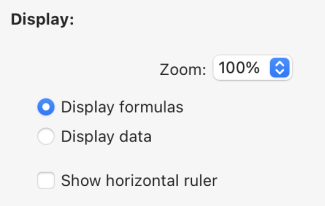

4D WritePro インターフェースは、エンドユーザーが 4D Write Proドキュメントを簡単にカスタマイズできるパレットを提供します。

4D のデベロッパーは、これらのパレットをアプリケーションに簡単に実装することができます。 それにより、エンドユーザーは、フォントやテキストの揃え方向、ブックマーク、表レイアウト、フレームなど、4D Write Pro のプロパティをすべて管理することができます。

インターフェースのマニュアルについては、*4D デザインリファレンス* の [4D Write Pro エリアのドキュメント](https://doc.4d.com/4Dv20/4D/20/Entry-areas.300-6263967.ja.html) を参照ください。

表ウィザードの設定に関するドキュメントは以下のとおりです。

## 表ウィザード

表ウィザードは、コンテキスト、データソース、およびフォーミュラを使用した、データベースのデータに基づく表組みの作成をさらに簡素化します。

エンドユーザーがアクセスできる表ウィザードは、4D デベロッパーが設定し提供するテンプレートをロードします。 これにより、デベロッパーはユーザーの特定のユースケースやビジネス要件に応じてテンプレートをカスタマイズすることができます。

表ウィザードには、デフォルトのテンプレートおよびテーマが用意されており、デベロッパーはそれらを、アプリケーションで必要とされる内容に適合させることができます。

アプリケーションに表ウィザードを実装するために、デベロッパーはテンプレートファイルを作成し、設定することができます。

### WP表ウィザードのインターフェース

ユーザーは、4D Write Pro インタフェースツールバーとサイドバーの "表を挿入" メニューボタンから表ウィザードダイアログを開きます。


このインターフェースで、ユーザーは最初のドロップダウンリストからテンプレートまたはテーブルを選択し、2番目のドロップダウンリストからテーマを選択します。

##### 列について:


テンプレートまたはテーブルの選択に応じて、テンプレートに保存されているフィールドのリストが表示されます (BLOB およびオブジェクト型は自動的に除外されます)。 表の列として表示させたいフィールドは、フィールド名の左にあるチェックボックスで選択します。また、表示する列の順序はフィールドをドラッグしてリスト内を移動させることで変更することができます。

##### 行について:


表ウィザードでは、ヘッダー行と追加の行の数 (それぞれ 0～5) を定義したり、[ブレーク行](https://doc.4d.com/4Dv20/4D/20/Handling-tables.200-6229469.ja.html#6233076) (小計行) を繰り返し行の上または下に設定したり、[キャリーオーバー行](https://doc.4d.com/4Dv20/4D/20/Handling-tables.200-6229469.ja.html#6236686) の表示/非表示を選択したりすることもできます。

##### 表示について:



ユーザーは、ドロップダウンリストから希望するオプションを選択することで、好みのズームレベルを調整し、ラジオボタンを使ってフォーミュラまたはデータを表示し、チェックボックスを使って水平ルーラーを表示するかどうかを選択します。

表の作成とカスタマイズが完了したら、**挿入** ボタンをクリックして、WPドキュメントに表組みを追加することができます。

ドキュメントに表が統合されると、ユーザーはそのスタイルをカスタマイズできます。 ツールバーやサイドバーの書式設定ツールはすべて利用可能です。

### WP表ウィザードのテンプレートの設定

テンプレートの設定には以下が含まれます:

* [テンプレートファイル](#テンプレートファイル): テーブルとフィールドを定義し、アプリケーションに適合したフォーミュラを用意します。
* [トランスレーションファイル](#トランスレーションファイル): テーブル、フィールド、フォーミュラの翻訳名を指定します。
* [テーマファイル](#テーマファイル): グラフィックスタイルとテーマをデザインしカスタマイズします。

表ウィザードを設定するにあたって、これら 3種類のファイルにはそれぞれ明確な役割がありますが、いずれも必須ではありません。

#### テンプレートファイル

テンプレートファイルを使って、以下のことが定義できます:

- 表のデータソースとして使用されるエンティティセレクションを返すフォーミュラ
- ブレーク行のフォーミュラ (ブレーク行を挿入できる場合)
- 表の列として使用できるデータクラス属性
- ブレーク行、キャリーオーバー行、追加の行において、コンテキストメニューから選択可能なフォーミュラ

:::info 制限

現在の実装 (4D v20 R2) では、ブレーク行、データソース、コンテキストメニューに使用されるフォーミュラは、ホストデータベースのメソッドの呼び出しをサポートしていません。 この制限は次のバージョンで外される予定です。

:::

テンプレートファイルはプロジェクトの "[`Resources`](../Project/architecture.md#resources)/4DWP_Wizard/Templates" フォルダーに保存する必要があります。

JSON形式のテンプレートファイルには、以下の属性が含まれます:

| 属性                   | タイプ        | 必須 | 説明                                                                          |
|:-------------------- |:---------- |:-- |:--------------------------------------------------------------------------- |
| tableDataSource      | Text       | ○  | 表のデータソースのフォーミュラ                                                             |
| columns              | Collection | ○  | 表の列のコレクション                                                                  |
| columns.check        | Text       | ○  | 表ウィザードであらかじめチェックされている場合は true。 列のチェックをあらかじめ外しておく場合は false。                  |
| columns.header       | Text       | ○  | ユーザーに提示する表示名                                                                |
| columns.source       | Text       | ○  | フォーミュラ                                                                      |
| breaks               | Collection |    | ブレークオブジェクトのコレクション。 ブレークの順番は重要です。 この順番は、ドキュメント内でブレーク行が繰り返し行の上にある場合の順番に対応します。 |
| breaks.label         | Text       | ○  | ユーザーに提示する表示名                                                                |
| breaks.source        | Text       | ○  | フォーミュラ                                                                      |
| breakFormulas        | Collection |    | ブレーク行に適用可能なフォーミュラオブジェクトのコレクション                                              |
| breakFormulas.label  | Text       | ○  | ユーザーに提示する表示名                                                                |
| breakFormulas.source | Text       | ○  | フォーミュラ                                                                      |
| bcorFormulas         | Collection |    | 下部キャリーオーバー行に適用可能なフォーミュラオブジェクトのコレクション                                        |
| bcorFormulas.label   | Text       | ○  | ユーザーに提示する表示名                                                                |
| bcorFormulas.source  | Text       | ○  | フォーミュラ                                                                      |
| extraFormulas        | Collection |    | 追加の行に適用可能なフォーミュラオブジェクトのコレクション                                               |
| extraFormulas.label  | Text       | ○  | ユーザーに提示する表示名                                                                |
| extraFormulas.source | Text       | ○  | フォーミュラ                                                                      |

:::note フランス語

もし、4Dランゲージがフランス語に設定された環境で実行される可能性があるのであれば、ランゲージ設定に関わらず正しく解釈されるよう、フォーミュラに [トークン](https://doc.4d.com/4Dv20/4D/20/Using-tokens-in-formulas.300-6237731.ja.html) を使用するようにしてください。

:::

##### 例題

JSONファイルの簡単な一例を以下に示します:

```json
{
    "tableDataSource": "ds.People.all().orderBy(\"toCompany.name asc, continent asc, country asc, city asc\")",
    "columns": [{
            "check": true,
            "header": "Firstname",
            "source": "This.item.firstname"
        }, {
            "check": true,
            "header": "Lastname",
            "source": "This.item.lastname"
        }, {
            "check": true,
            "header": "Salary",
            "source": "String(This.item.salary;\"###,###.00\")"
        }
    ],
    "breaks": [{
            "label": "Company",
            "source": "This.item.toCompany.name"
        }
    ],
    "breakFormulas": [{
            "label": "Company",
            "source": "This.item.toCompany.name"
    }, {
            "label": "Sum of salaries",
            "source": "String(This.breakItems.sum(\"salary\"); \"###,###.00\")"
        }
    ],
    "bcorFormulas": [{
            "label": "Sum of salaries",
            "source": "String(This.tableData.sum(\"salary\"); \"###,###.00\")"
        }
    ],
    "extraFormulas": [{
            "label": "Sum of salaries",
            "source": "String(This.tableData.sum(\"salary\"); \"###,###.00\")"
        }
    ]
}

```

#### トランスレーションファイル

トランスレーションファイルは、テンプレート、テーマ、テーブル、フィールド、およびフォーミュラの翻訳名を指定します。 これらのファイルはプロジェクトの "[`Resources`](../Project/architecture.md#resources)/4DWP_Wizard/Translations" フォルダーに追加します。

各トランスレーションファイルには、対応する言語コード (英語なら "en"、日本語なら "ja" など) のファイル名を付けます。

JSON形式のトランスレーションファイルには、以下の属性が含まれます:

| 属性        | タイプ        | 必須 | 説明                                                                                    |
|:--------- |:---------- |:-- |:------------------------------------------------------------------------------------- |
| tables    | Collection |    | Collection of translated table objects                                                |
| fields    | Collection |    | Collection of translated field objects                                                |
| formulas  | Collection |    | Collection of translated formula objects                                              |
| fileNames | Collection |    | Collection of translated fileName objects (applicable to the theme and template name) |

Whitin each one of these attribute, the translation object includes the following attributes:

| 属性          | タイプ  | 必須 | 説明                                      |
|:----------- |:---- |:-- |:--------------------------------------- |
| original    | Text | ○  | Original text intended for translation  |
| translation | Text | ○  | Translated version of the original text |

Defining these attributes within the translation object ensures proper organization and alignment between the source and translated content.

If the template name or the formula (break, carry-over row, or extra) exists in the translated file, its translation is applied in the Table Wizard. In addition, only the table defined within the translation file is displayed and translated.

The translation file serves an additional role when a user selects a table in the interface. It can filter the tables and fields proposed to the user. For example, to hide table IDs, this behavior is similar to the `SET TABLE TITLES` and `SET FIELD TITLES` commands.

##### 例題

```json
{
    "tables": [{
            "original": "People",
            "translation": "Personne"
        }
    ],
    "fields": [{
            "original": "lastname",
            "translation": "Nom"
        }, {
            "original": "firstname",
            "translation": "Prénom"
        }, {
            "original": "salary",
            "translation": "Salaire"
        }, {
            "original": "company",
            "translation": "Société"
        }
    ],
    "formulas": [{
            "original": "Sum of salary",
            "translation": "Somme des salaires"
        }
    ]
}

```

#### Theme files

A list of themes is provided by default in the 4D Write Pro Interface component, such as "Arial", "CourierNew" and "YuGothic", available in multiple variations like "Blue" and "Green". However, you can create your own theme by placing it in the "[`Resources`](../Project/architecture.md#resources)/4DWP_Wizard/Themes" folder within your project.

The theme file in JSON format contains the following attributes:

| 属性      | タイプ    | 必須 | 説明                                                                                                                                    |
|:------- |:------ |:-- |:------------------------------------------------------------------------------------------------------------------------------------- |
| default | Object |    | Object containing the default style applicable to all rows.                                                                           |
| table   | Object |    | Object containing the style definition applicable to the table.                                                                       |
| rows    | Object |    | Object containing the style definition applicable to all rows.                                                                        |
| cells   | Object |    | Object containing the style definition applicable to all cells.                                                                       |
| header1 | Object |    | Object containing the style definition applicable to the first header row.                                                            |
| header2 | Object |    | Object containing the style definition applicable to the second header row.                                                           |
| header3 | Object |    | Object containing the style definition applicable to the third header row.                                                            |
| header4 | Object |    | Object containing the style definition applicable to the fourth header row.                                                           |
| header5 | Object |    | Object containing the style definition applicable to the fifth header row.                                                            |
| headers | Object |    | Object containing the style definition applicable to the header rows, if a specific header (like header1, header2...) is not defined. |
| data    | Object |    | Object containing the style definition applicable to the repeated data row.                                                           |
| break1  | Object |    | Object containing the style definition applicable to the first break row.                                                             |
| break2  | Object |    | Object containing the style definition applicable to the second break row.                                                            |
| break3  | Object |    | Object containing the style definition applicable to the third break row.                                                             |
| break4  | Object |    | Object containing the style definition applicable to the fourth break row.                                                            |
| break5  | Object |    | Object containing the style definition applicable to the fifth break row.                                                             |
| breaks  | Object |    | Object containing the style definition applicable to the break rows, if a specific break (like break1, break2...) is not defined.     |
| bcor    | Object |    | Object containing the style definition applicable to the bottom carry-over row.                                                       |


For every attribute used in your JSON file (header, data, carry-over, summary, and extra rows), you can define the following WP attributes, mentionned with their [corresponding WP constant](https://doc.4d.com/4Dv20/4D/20/4D-Write-Pro-Attributes.300-6229528.en.html):

| WP attributes   | Corresponding WP constant |
|:--------------- |:------------------------- |
| textAlign       | wk text align             |
| backgroundColor | wk background color       |
| borderColor     | wk border color           |
| borderStyle     | wk border style           |
| borderWidth     | wk border width           |
| font            | wk font                   |
| color           | wk font color             |
| fontFamily      | wk font family            |
| fontSize        | wk font size              |
| padding         | wk padding                |

##### 例題

```json
{
    "default": {
           "backgroundColor": "#F0F0F0",
           "borderColor": "#101010",
           "borderStyle": 1,
           "borderWidth": "0.5pt",
           "font": "Times New Roman",
           "color": "#101010",
           "fontFamily": "Times New Roman",
           "fontSize": "7pt",
           "padding": "2pt"
    },
    "table": {
           "backgroundColor": "#E1EAF3"
    },
    "header1": {
           "textAlign": 2,
           "borderColor": "#41548F",
           "borderWidth": "1.5pt",
           "backgroundColor": "#979BA9",
           "color": "#F4F4FF",
           "font": "Times New Roman Bold"
    },
    "data": {
           "fontSize": "13pt",
           "textAlign": 0
    },
    "break1": {
           "textAlign": 2,
           "fontSize": "15pt"
    }
}

```

#### 参照

[4D Write Pro - Table Wizard (tutorial video)](https://www.youtube.com/watch?v=2ChlTju-mtM)