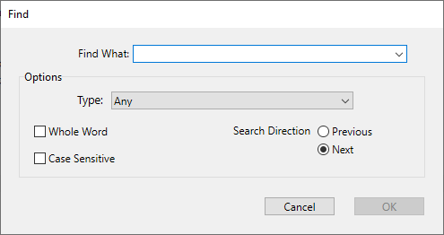

コードエディターには、カレントウィンドウ専用の検索/置換機能があります。

各ウィンドウのツールバーにある検索エリアを使用して単純な検索を実行することができます。

メソッド用の検索/置換コマンドは **編集** メニューの **検索** サブメニュー内にあります:

> **検索** サブメニューの上にある検索コマンドはコードエディター専用のものではなく、すべてのメソッド、クラス、関数を検索対象とするものです。**デザインモードを検索** 機能はツールバーからも簡単にアクセスできます。

## 検索

**検索...** コマンドを選択すると以下のダイアログボックスが表示されます:

このダイアログボックス内で定義された検索は最前面のメソッドに対して適用されます。

- **検索条件** エリアには、検索したい文字列を入力します。 このエリアはコンボボックスで、最新の検索/置換条件を15個、4D が終了するまで保持します。 **検索...** コマンドを選択する前にエディター中でテキストをハイライトすると、このエリアにそのテキストが表示されます。 このテキストを使用するか、別のテキストに置き換えることができます。
- **単語全体** オプションを選択すると、検索は (部分一致ではなく) 完全一致でおこなわれます。 たとえば、"client" を検索する場合、"clients" や "myclient" は検出されません。 By default, this option is not checked; therefore, a search for "var" will find "Myvar," "variation," etc. Be careful, unlike the **Whole Object Name** option of the Find in Design dialog box, the **Whole Word** option does not take object names into account. たとえば、このオプションを選択した場合、"My" をメソッド中で検索すると "My Variable" 変数が検出されます。 **語全体を含む** オプションを使用してデータベース全体を検索した場合、上記のような結果にはなりません。なぜならオブジェクト (ここでは変数のこと) の名称は "My Variable" であり、"My" とは一致しないからです。
- **大文字小文字を区別** オプションを使用すると、検索条件エリアに入力された文字の大小が区別されます。 たとえば、"MyVar" を検索した場合 "myVar" は検出されません。
- **前へ/次へ** ラジオボタンを使用して、現在カーソルのある方向を起点として、検索をおこなう方向を指定できます。

4D は現在のカーソル位置から検索を実行します。 **置換** ボタンをクリックすると、最初に見つかった語句に対する置換が実行されます。 その後は、**編集** メニューの **次を置換** / **前を置換** コマンドを使用して、同じ条件の検索/置換を繰り返すことができます。

### 同じものを検索

**同じものを検索** コマンドを使用すると、選択した文字列と同じ文字列を検索することができます。 このコマンドは、コードエディター内で一文字以上選択した場合に利用可能となります。

実行される検索は、現在のコードエディターウィンドウ内の "次を検索" と同じです。

### 次の/前の同じものを検索

**次の同じものを検索** と **前の同じものを検索** コマンドは、選択された文字列と *厳密に* 一致する文字列を検索するのに使用されます。 たとえば、文字の大小は一致しなければなりません。

### すべてをブックマーク

**すべてをブックマーク** コマンドは、検索または置換ダイアログボックスで検索がすでに定義されている場合に利用可能となります。 このコマンドを選択すると、4D は現在設定されている検索条件に当てはまる行にブックマークを設定します。 これにより、すべての検索結果に簡単に印をつけられます。

ブックマークに関する詳細は [ブックマークを使用する](./write-class-method.md#ブックマークを使用する) を参照ください。

## 置換

**置換** コマンドを選択すると以下のダイアログボックスが表示されます:

- **検索条件** エリアには、検索したい文字列や式を入力します。 検索ダイアログ同様、このエリアはコンボボックスで、最新の検索/置換条件を15個、4D が終了するまで保持します。 **置換...** コマンドを選択する前にエディター中でテキストをハイライトすると、このエリアにそのテキストが表示されます。
- **置換文字** エリアには、検索条件として入力された文字を置換する文字列を入力します。 このエリアもコンボボックスで、最新の検索/置換条件を15個、4D が終了するまで保持します。
- **単語全体** オプションを選択すると、検索/置換は (部分一致ではなく) 完全一致でおこなわれます。 たとえば、"client" を検索する場合、"clients" や "myclient" は検出されません。
- **大文字小文字を区別** オプションを使用すると、検索条件エリアに入力された文字の大小が区別されます。 たとえば、"MyVar" を検索した場合 "myVar" は検出されません。
- 検索ダイアログ同様、**前へ/次へ** ラジオボタンを使用して、現在カーソルのある方向を起点として、検索をおこなう方向を指定できます。

**置換** ボタンをクリックすると、最初に見つかった語句に対する置換が実行されます。 4D は現在のカーソル位置から検索を実行します。 その後は、**編集** メニューの **次を置換** / **前を置換** コマンドを使用して、同じ条件の検索/置換を繰り返すことができます。

**一括置換** ボタンをクリックすると、開かれているメソッド内で検索条件に合致するすべての語句が一度に置換されます。

## 定義を開く

**定義を開く...** コマンドは、コードエディター内で参照されている要素の定義を開きます。 これには、カーソルをオブジェクト (ランゲージ要素) 名の中に置き (または選択して)、**メソッド** メニューから **定義を開く...** を選択するか、エディターのコンテキストメニューを使用します。

**注**: この機能は **Ctrl+K** (Windows) または **Command+K** (macOS) のキーボードショートカットでも利用できます。

このコマンドは、ターゲットとなる要素によって効果が変化します。 例:

- プロジェクトメソッドを選択した状態で **定義を開く...** を選択した場合、コードエディターの新しいウィンドウ内にメソッドのコンテンツが表示されます。
- クラス名またはクラス属性を選択した状態で **定義を開く...** を選択した場合、コードエディター内にクラスが表示されます。

## エクスプローラーに表示

**エクスプローラーに表示...** コマンドは、ターゲット要素が選択された状態のエクスプローラーウィンドウを開きます。 これには、カーソルを要素名の中に置き (または選択して)、**メソッド** メニューから **エクスプローラーに表示...** を選択します。

## ドキュメンテーションを表示

**ドキュメンテーションを表示...** コマンドは、ターゲット要素のドキュメンテーションを開きます。 これには、カーソルを要素名の中に置き (または選択して)、**メソッド** メニューから **ドキュメンテーションを表示...** を選択するか、コンテキストメニューを使用します。 このコマンドは、ターゲットとなる要素によって効果が変化します。 例:

- プロジェクトメソッドまたはユーザークラスを選択した状態で **ドキュメンテーションを表示...** を選択すると、エクスプローラー内でメソッドを選択し、ドキュメンテーションタブを表示します。
- 4Dコマンドまたは 4Dクラス名を選択した状態で **ドキュメンテーションを表示...** を選択すると、オンラインドキュメントを開きます。

何も要素が選択されていない場合、コマンドは現在コードエディターで開かれているメソッドのドキュメンテーションを開きます。

## 参照を検索

**参照を検索...** コマンドは、**メソッド** メニューまたはコードエディターのコンテキストメニュー内にあり、データベース中で、メソッドの現在の項目が参照されているすべてのオブジェクト (メソッドやフォーム) を検索します。

現在の項目とは、選択されているもの、あるいはカーソルが置かれているものです。 フィールド名、変数名、コマンド、文字列等が該当します。 たとえば、以下のアクションを実行するとデータベース中で *vlNbCmd* 変数のオカレンスを探します:

このコマンドの結果は新規ウィンドウに表示されます。

## 呼出し元を検索

**メソッド** メニューの **呼出し元を検索...** コマンドはプロジェクトメソッドでのみ利用可能です。 このコマンドは、開かれているプロジェクトメソッドを参照しているすべてのオブジェクト (他のメソッドやメニュー) を検索します。

**注:** **呼出し元を検索...** コマンドは **エクスプローラー** の **メソッド** ページからも利用できます。

このコマンドの結果は新規ウィンドウに表示されます。

## 行番号を指定して移動

この検索コマンドは **メソッド** メニューの中にあります。 このコマンドは、移動したい行番号を指定するためのダイアログボックスを開きます。 **OK** ボタンをクリックすると、コマンドはメソッド内で該当行を検索し、ハイライトします。 このような検索は、実行時エラーでコンパイラーが示すエラー行を表示するのに便利です。

コードエディターウィンドウに行番号を表示するかしないかは、選択することができます。 このオプションについては [ブレークポイントエリア](./write-class-method.md#ブレークポイントエリア) を参照ください。

