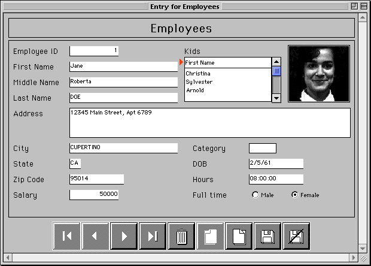
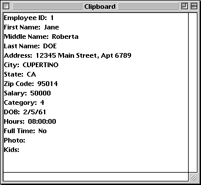

<!--REF #_command_.APPEND DATA TO PASTEBOARD.Syntax-->**APPEND DATA TO PASTEBOARD** ( *dataType* ; *data* )<!-- END REF-->
<!--REF #_command_.APPEND DATA TO PASTEBOARD.Params-->
| 引数 | 型 |  | 説明 |
| --- | --- | --- | --- |
| dataType | Text | &#8594;  | 追加するデータのタイプ |
| data | Blob | &#8594;  | ペーストボードに追加するデータ |

<!-- END REF-->

#### 説明 

<!--REF #_command_.APPEND DATA TO PASTEBOARD.Summary-->APPEND DATA TO PASTEBOARD コマンドは、*dataType*で指定されたデータタイプで*data*BLOB内にあるデータをペーストボードに追加します。<!-- END REF-->

**Note:** コピー/ペースト操作の場合、ペーストボードはクリップボードと同じです。

*dataType*には、追加するデータのタイプを指定する値を渡します。4D シグネチャ, UTI タイプ (Mac OS), フォーマット名/番号 (Windows), 4文字のタイプ (互換性) を渡すことができます。これらのデータタイプについてはの節を参照してください。

**Windowsユーザへの注意**: コマンドをテキストタイプのデータに対して使用するとき (*dataType* が"TEXT"、com.4d.private.text.native または com.4d.private.text.utf16)、Blob引数*data*に含まれる文字列はNULL文字で終了していなければなりません。 

通常、同一データの複数のインスタンスをペーストボードに追加、またはテキストやピクチャ以外のタイプのデータを追加するときには、APPEND DATA TO PASTEBOARDコマンドを使用します。ペーストボードに新しいデータを追加するには、まず最初に[CLEAR PASTEBOARD](clear-pasteboard.md "CLEAR PASTEBOARD")コマンドを使用してペーストボードを消去する必要があります。

消去と追加を実行するには:

* テキスト: [SET TEXT TO PASTEBOARD](set-text-to-pasteboard.md "SET TEXT TO PASTEBOARD")コマンドを使用します。
* ピクチャ: [SET PICTURE TO PASTEBOARD](set-picture-to-pasteboard.md "SET PICTURE TO PASTEBOARD")コマンドを使用します。
* ファイルパス名 (ドラッグ＆ドロップ) : [SET FILE TO PASTEBOARD](set-file-to-pasteboard.md "SET FILE TO PASTEBOARD")コマンドを使用します。

しかし、BLOBにテキストやピクチャが含まれている場合、APPEND DATA TO PASTEBOARD コマンドを使用してテキストやピクチャをペーストボードに追加できることに留意してください。

#### 例題 

ペーストボードコマンドとBLOBを使用すると、洗練されたカット/コピー/ペーストの仕組みを構築でき、たった1つのデータではなく構造化されたデータを扱うことができます。以下の例では、2つのプロジェクトメソッドSET RECORD TO PASTEBOARDとGET RECORD FROM PASTEBOARDは、ペーストボードとの間でコピーするためにレコード全体を1つのデータとして扱うことができます。

```4d
  // SET RECORD TO PASTEBOARD プロジェクトメソッド
  // SET RECORD TO PASTEBOARD ( 数値 )
  // SET RECORD TO PASTEBOARD ( テーブル 数値 )
 
 var $1;$vlField;$vlFieldType : Integer
 var $vpTable;$vpField : Pointer
 C_STRING(255;$vsDocName)
 var $vtRecordData;$vtFieldData : Text
 var $vxRecordData : Blob
 
  // ペーストボードをクリア (カレントレコードがない場合には空のままとなる)
 CLEAR PASTEBOARD
  // 引数で渡されたテーブル番号のテーブルポインタを得る
 $vpTable:=Table($1)
  // テーブルのカレントレコードがあれば
 If((Record number($vpTable->)>=0)|(Is new record($vpTable->)))
  // レコードのテキストイメージを保持するテキスト変数を初期化
    $vtRecordData:=""
  // レコードのフィールドごとに
    For($vlField;1;Last field number($1))
  // フィールドの型を取得
       GET FIELD PROPERTIES($1;$vlField;$vlFieldType)
  // フィールドのポインタを取得
       $vpField:=Field($1;$vlField)
  // フィールド型に基づき、適切な方法でデータをコピー
       Case of
          :(($vlFieldType=Is alpha field)|($vlFieldType=Is text))
             $vtFieldData:=$vpField->
          :(($vlFieldType=Is real)|($vlFieldType=Is integer)|($vlFieldType=Is longint)
             |($vlFieldType=Is date)|($vlFieldType=Is time))
             $vtFieldData:=String($vpField->)
          :($vlFieldType=Is Boolean)
             $vtFieldData:=String(Num($vpField->);"Yes;;No")
          Else
  // 他のデータタイプは無視
             $vtFieldData:=""
       End case
  // レコードのテキストイメージを保持するテキスト変数にフィールドデータを追加
       $vtRecordData:=$vtRecordData+Field name($1;$vlField)+":"+Char(9)+$vtFieldData+CR
  // Note: CRメソッドは、Mac OS上ではChar(13)を、Windows上ではChar(13)+Char(10)を返す
    End for
  // テキストイメージをペーストボードに置く
    SET TEXT TO PASTEBOARD($vtRecordData)
  // Temporary フォルダのスクラップファイル名
    $vsDocName:=Temporary folder+"Scrap"+String(1+(Random%99))
  // スクラップファイルがあれば削除する (ここでエラーをテストすべき)
    DELETE DOCUMENT($vsDocName)
  // スクラップファイルを作成
    SET CHANNEL(10;$vsDocName)
  // スクラップファイルにレコード全体を送信
    SEND RECORD($vpTable->)
  // スクラップファイルを閉じる
    SET CHANNEL(11)
  // スクラップファイルをBLOB読み込む
    DOCUMENT TO BLOB($vsDocName;$vxRecordData)
  // スクラップファイルはもう必要ない
    DELETE DOCUMENT($vsDocName)
  // ペーストボードにレコードの完全なイメージを追加
  // Note: ここではデータ型に"4Drc" を使用しています
    APPEND DATA TO PASTEBOARD("4Drc";$vxRecordData)
  // この時点でペーストボードには以下が含まれます:
  // (1) レコードのテキストイメージ (以下のスクリーンショットで見られるような)
  // (2) レコード全体のイメージ (ピクチャや BLOB フィールドを含む)
 End if
```

以下のようなレコードを表示させた時:



SET RECORD TO PASTEBOARD メソッドを\[Employees\] テーブルに適用すると、ペーストボードには以下のようなレコードのテキストイメージとレコード全体のイメージが含まれます。

  
  
  
GET RECORD FROM PASTEBOARDメソッドを使用して、このレコードイメージを他のレコードにペーストできます:  
  
```4d
  // GET RECORD FROM PASTEBOARDメソッド
  // GET RECORD FROM PASTEBOARD( 数値 )
  // GET RECORD FROM PASTEBOARD( テーブル 数値 )
 var $1;$vlField;$vlFieldType;$vlPosCR;$vlPosColon : Integer
 var $vpTable;$vpField : Pointer
 C_STRING(255;$vsDocName)
 var $vxPasteboardData : Blob
 var $vtPasteboardData;$vtFieldData : Text
 
  // 引数として渡されたテーブル番号のテーブルポインタを得る
 $vpTable:=Table($1)
  // カレントレコードがあれば
 If((Record number($vpTable->)>=0)|(Is new record($vpTable->)))
    Case of
  // ペーストボードに完全なレコードイメージが含まれているか?
       :(Pasteboard data size("4Drc")>0)
  // 含まれていればペーストボードの中身を取り出す
          GET PASTEBOARD DATA("4Drc";$vxPasteboardData)
  // Temporary フォルダ内のスクラップファイル名
          $vsDocName:=Temporary folder+"Scrap"+String(1+(Random%99))
  // スクラップファイルが存在すれば削除する (ここでエラーをテストすべき)
          DELETE DOCUMENT($vsDocName)
  // スクラップファイルにBLOBを保存
          BLOB TO DOCUMENT($vsDocName;$vxPasteboardData)
  // スクラップファイルを開く
          SET CHANNEL(10;$vsDocName)
  // スクラップファイルからレコード全体を取り込む
          RECEIVE RECORD($vpTable->)
  // スクラップファイルを閉じる
          SET CHANNEL(11)
  // スクラップファイルはもう必要ない
          DELETE DOCUMENT($vsDocName)
  // ペーストボードにTEXTが含まれているか?
       :(Pasteboard data size("TEXT")>0)
  // ペーストボードからテキストを取り出す
          $vtPasteboardData:=Get text from pasteboard
  // インクリメントするフィールド番号を初期化
          $vlField:=0
          Repeat
  // テキスト中で次のフィールド行を探す
             $vlPosCR:=Position(CR;$vtPasteboardData)
             If($vlPosCR>0)
  // フィールド行を取り出す
                $vtFieldData:=Substring($vtPasteboardData;1;$vlPosCR-1)
  // コロン ":" があれば
                $vlPosColon:=Position(":";$vtFieldData)
                If($vlPosColon>0)
  // フィールドデータのみを取り出す (フィールド名を削除)
                   $vtFieldData:=Substring($vtFieldData;$vlPosColon+2)
                End if
  // フィールド番号をインクリメント
                $vlField:=$vlField+1
  // ペーストボードには必要以上のデータが含まれていることがある...
                If($vlField<=Last field number($vpTable))
  // フィールドタイプを取得
                   GET FIELD PROPERTIES($1;$vlField;$vlFieldType)
  // フィールドへのポインタを取得
                   $vpField:=Field($1;$vlField)
  // フィールドのデータ型に基づき、適切な方法でデータをコピー
                   Case of
                      :(($vlFieldType=Is alpha field)|($vlFieldType=Is text))
                         $vpField->:=$vtFieldData
                      :(($vlFieldType=Is real)|($vlFieldType=Is integer)|($vlFieldType=Is longint))
                         $vpField->:=Num($vtFieldData)
                      :($vlFieldType=Is date)
                         $vpField->:=Date($vtFieldData)
                      :($vlFieldType=Is time)
                         $vpField->:=Time($vtFieldData)
                      :($vlFieldType=Is Boolean)
                         $vpField->:=($vtFieldData="Yes")
                      Else
  // 他のフィールドタイプは無視
                   End case
                Else
  // すべてのフィールドタイプに代入したのでループを抜ける
                   $vtPasteboardData:=""
                End if
  // 取り出したテキストを削除
                $vtPasteboardData:=Substring($vtPasteboardData;$vlPosCR+Length(CR))
             Else
  // 区切り文字が見つからないのでループを抜ける
                $vtPasteboardData:=""
             End if
  // データがある間ループする
          Until(Length($vtPasteboardData)=0)
       Else
          ALERT("The pasteboard does not any data that can be pasted as a record.")
    End case
 End if
```

#### システム変数およびセット 

ペーストボードにBLOBデータが正しく追加されると、OKシステム変数は１に設定されます。そうでなければ０が設定され、エラーが生成されます。

#### 参照 

[CLEAR PASTEBOARD](clear-pasteboard.md)  
[SET PICTURE TO PASTEBOARD](set-picture-to-pasteboard.md)  
[SET TEXT TO PASTEBOARD](set-text-to-pasteboard.md)  

#### プロパティ
|  |  |
| --- | --- |
| コマンド番号 | 403 |
| スレッドセーフである | &check; |
| システム変数を更新する | OK |
| サーバー上での使用は不可 ||


