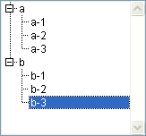
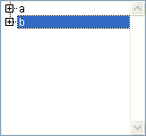
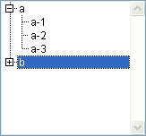

<!--REF #_command_.Count list items.Syntax-->**Count list items** ( {* ;} *list* {; *} ) : Integer<!-- END REF-->
<!--REF #_command_.Count list items.Params-->
| 引数 | 型 |  | 説明 |
| --- | --- | --- | --- |
| * | 演算子 | &#8594;  | 渡された場合, listはオブジェクト名 (文字列) 省略すると, listはリスト参照番号 |
| list | Integer, Text | &#8594;  | リスト参照番号 (* が省略された場合), または リストタイプオブジェクト名 (* が渡された場合) |
| * | 演算子 | &#8594;  | 省略すると (デフォルト): 表示されたリスト項目を返す (展開) 指定すると: すべてのリスト項目を返す |
| 戻り値 | Integer | &#8592; | (展開されて) 表示中のリスト項目数 (2番目の * が省略された場合) またはリスト項目の総数 (2番目の * が指定された場合) |

<!-- END REF-->

#### 説明 

<!--REF #_command_.Count list items.Summary-->**Count list items** コマンドは、*list*に渡した参照番号またはオブジェクト名のリスト上で現在表示中または項目総数を返します。<!-- END REF-->

最初のオプション引数 *\** を渡すと、*list* 引数はフォーム中に表示されているリストに対応するオブジェクト名 (文字列) です。この引数を渡さないと、*list* 引数は階層リスト参照 ([ListRef](# "階層リストへの参照")) です。ひとつのリストオブジェクトしか使わない場合や、(2番目の *\** を渡して) すべての項目の処理を行う場合、どちらのシンタックスも使用できます。他方同じリストを複数のオブジェクトで使用し、(2番目の *\** を省略して) 表示された項目で処理を行う際は、オブジェクト名に基づくシンタックスを使用する必要があります。それぞれのオブジェクトごとに個別の展開/折りたたみ状態を持つことができるからです。

**注:** リストオブジェクト名に@文字を使用し、フォーム上にこの名前に一致する複数のリストが存在する場合、**Count list items** コマンドは対応する名前の最初のオブジェクトにのみ適用されます。

2番目の *\** 引数を使用して、返される情報のタイプを指定します。この引数を渡した場合、リストが展開されているか、折りたたまれているかに関わらず、関数は項目総数を返します。  
この引数を省略すると、関数はリストやそのサブリストの現在の展開/折りたたみの状態に応じて、表示されている項目数を返します。

このコマンドは、フォームに表示されているリストで使用します。

#### 例題 

以下はアプリケーションモードで表示された、*hList*という名前の階層リストです:

  


```4d
 $vlNbItems:=Count list items(hList) // この時点で$vlNbItems は8を得ます。
 $vlNbTItems:=Count list items(hList;*) //$vlNbTItemsも8を得ます。
```



```4d
 $vlNbItems:=Count list items(hList) // この時点で$vlNbItems は$vlNbItemsは2を得ます。
 $vlNbTItems:=Count list items(hList;*) //$vlNbTItemsは8のままです。
```



```4d
 $vlNbItems:=Count list items(hList) // この時点で$vlNbItems は$vlNbItemsは5を得ます。
 $vlNbTItems:=Count list items(hList;*) //$vlNbTItemsは8のままです。
```

#### 参照 

[List item position](list-item-position.md)  
[Selected list items](selected-list-items.md)  

#### プロパティ
|  |  |
| --- | --- |
| コマンド番号 | 380 |
| スレッドセーフである | &check; |
| サーバー上での使用は不可 ||


