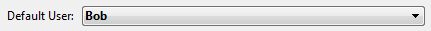

<!--REF #_command_.Current client authentication.Syntax-->**Current client authentication** {( *domain* ; *protocol* )} : Text<!-- END REF-->
<!--REF #_command_.Current client authentication.Params-->
| 引数 | 型 |  | 説明 |
| --- | --- | --- | --- |
| domain | Text | &#8592; | ドメイン名 |
| protocol | Text | &#8592; | "Kerberos"、"NTLM"、または空の文字列 |
| 戻り値 | Text | &#8592; | Windows が返すセッションユーザーのログイン名 |

<!-- END REF-->

#### 説明 

<!--REF #_command_.Current client authentication.Summary-->新しい **Current client authentication** コマンドは Windows の Active Directory サーバーにクライアントの認証を要求し、成功した場合には同クライアントの Windows ログイン名 (セッション ID) を返します。<!-- END REF-->認証に失敗した場合は、空の文字列が返されます。

このコマンドの使用は、Windows 環境で 4D Server に SSO (Single Sign On) 機能を実装している場合に限ります。詳細については *Windowsでのシングルサインオン(SSO)* を参照ください。

通常はクライアントとサーバーの両方が同じ Active Directory で管理されている必要がありますが、*SSOのための必須要件* でも説明されているように、違う設定にも対応することができます。

Windows セッションのログインに基づいてクライアントにアクセス権を付与するには、戻り値のログイン名を 4Dの識別モジュールに受け渡します。"デフォルトユーザー" を設定することで、4D Server のログインダイアログが表示されないようにしておけば、ユーザーが ID等を再入力する必要のないインターフェースを実装することができます (例題参照)。

このコマンドは次のテキストパラメーターを返すことができます (任意):

* *domain*: クライアントが所属するドメイン名
* *protocol*: Windows がユーザー認証に使用しているプロトコル名。値は "Kerberos" または "NTLM" のいずれかです。認証が失敗した場合には、空の文字列 ("") が返されます。

 ドメイン名やプロトコルによってアクセスを制限したい場合には、接続の可否を判断するのにこれらのパラメーターを利用することができます。

##### 認証のセキュリティレベル 

認証のセキュリティレベル (ログインユーザーの信用度) は使用されたユーザー識別方法によります。**Current client authentication** コマンドパラメーターに返される値を使い、クライアントが何に基づいてログインしているのかを確認して、そこからセキュリティレベルを評価することができます:

| **Login** (戻り値) | **Domain** | **Protocol** | **コメント**                                                                                                                       |
| --------------- | ---------- | ------------ | ------------------------------------------------------------------------------------------------------------------------------ |
| 空文字列            | 空文字列       | 空文字列         | ログインユーザーの認証情報を取得できませんでした                                                                                                       |
| 空以外             | 空文字列       | NTLM         | 戻り値はローカルマシンで定義されたローカルIDです                                                                                                      |
| 空以外             | 空以外        | NTLM         | 戻り値は *domain* パラメーターに返されたドメインで NTLM プロトコルの認証を受けた ID です。この場合、セキュリティを向上するにはドメインを検証する必要があります。つまり、予想されるドメインでの認証をユーザーが受けているかを確認します。 |
| 空以外             | 空以外        | Kerberos     | 戻り値は予想されるドメインでケルベロスプロトコルの認証を受けた ID です。この設定は一番高いセキュリティレベルを提供します。                                                                |

これらの条件についての詳細は を参照ください。

#### 例題 

4D のユーザーとグループの機能に基づいたアクセス管理のシステムを持つ 4D Server があります。Windows の 4Dリモートユーザーが、別途ログイン操作を行わなくても適切なアクセス権でもってこのサーバーに直接接続できるよう、アプリケーションを設定します:  

1. データベース設定の "セキュリティ" ページで、デフォルトユーザーを設定します:  
  
この設定を行うと、サーバーに接続するリモートの 4D に対してパスワードダイアログが表示されず、すべてのクライアントは "Bob" としてログインします。
2. On Server Open Connection データベースメソッドに次のコードを追加し、Active Directory でユーザー認証を確認します:

```4d
  // On Server Open Connection データベースメソッド
 var $0;$1;$2;$3 : Integer
 $login:=Current client authentication($domain;$protocol)
 If($login #"") // ログイン名が返された場合
  // カスタムの認証メソッドをコールします
    $0:=CheckCredentials($login)
  // 成功の場合に 0、エラーの場合には -1 を返すようにします
 Else
    $0:=-1 // ログイン名が空文字列の場合は接続を拒否します
 End if
```

**注:** この例で紹介した基本シナリオは、実際のアプリケーションに応用する必要があります。例えば次のような実装に基づいた、カスタムの 4D ユーザー認証メソッド (例では CheckCredentials) が考えられます:

* Active Driectory の情報を 4D のユーザーとグループ名に複製して自動的にマッピング
* 戻り値をカスタムの \[user\] テーブルと照合
* LDAP を使ってユーザー情報を取得
