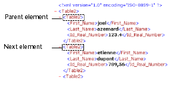
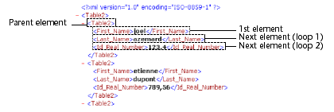

<!--REF #_command_.DOM Get next sibling XML element.Syntax-->**DOM Get next sibling XML element** ( *elementRef* {; *siblingElemName* {; *siblingElemValue*}} ) : Text<!-- END REF-->
<!--REF #_command_.DOM Get next sibling XML element.Params-->
| 引数 | 型 |  | 説明 |
| --- | --- | --- | --- |
| elementRef | Text | &#8594;  | XML要素参照 |
| siblingElemName | Text | &#8592; | 兄弟XML要素名 |
| siblingElemValue | Text | &#8592; | 兄弟XML要素値 |
| 戻り値 | Text | &#8592; | 兄弟XML要素参照 |

<!-- END REF-->

#### 説明 

<!--REF #_command_.DOM Get next sibling XML element.Summary-->DOM Get next sibling XML element コマンドは参照として渡したXML要素の次の兄弟要素の参照を返します。<!-- END REF--> この参照は他のXML解析コマンドで使用できます。

*siblingElemName* と *siblingElemValue* 引数が渡されると、兄弟要素の名前と値がそれぞれ返されます。 

このコマンドはXMLの子要素の間をナビゲートするために使用されます。

最後の兄弟要素の後、システム変数は0に設定されます。

#### 例題 1 

引数として渡した要素の次の兄弟要素の参照を取得します:

```4d
 var $xml_Parent_Ref;$next_XML_Ref : Text
 $next_XML_Ref:=DOM Get next sibling XML element($xml_Parent_Ref)
```



#### 例題 2 

引数で渡した親要素のすべての子要素をループで参照します:

```4d
 var $xml_Parent_Ref;$first_XML_Ref;$next_XML_Ref : Text
 
 $first_XML_Ref:=DOM Get first child XML element($xml_Parent_Ref)
 $next_XML_Ref:=$first_XML_Ref
 While(OK=1)
    $next_XML_Ref:=DOM Get next sibling XML element($next_XML_Ref)
 End while
```



#### システム変数およびセット 

コマンドが正しく実行され、解析された要素が参照された要素の最後の兄弟要素でない場合、システム変数OKに1が設定されます。エラーが発生したり、解析された要素が参照された要素の最後の兄弟要素である場合、0が設定されます。

#### 参照 

[DOM Get first child XML element](dom-get-first-child-xml-element.md)  

#### プロパティ
|  |  |
| --- | --- |
| コマンド番号 | 724 |
| スレッドセーフである | &check; |
| システム変数を更新する | OK |
| サーバー上での使用は不可 ||


