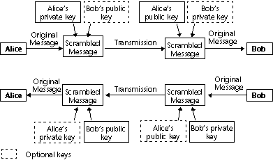

<!--REF #_command_.ENCRYPT BLOB.Syntax-->**ENCRYPT BLOB** ( *toEncrypt* ; *sendPrivKey* {; *recipPubKey*} )<!-- END REF-->
<!--REF #_command_.ENCRYPT BLOB.Params-->
| 引数 | 型 |  | 説明 |
| --- | --- | --- | --- |
| toEncrypt | Blob | &#8596; | 暗号化するデータ |
||| | 暗号化されたデータ |
| sendPrivKey | Blob | &#8594;  | 送信者の秘密鍵 |
| recipPubKey | Blob | &#8594;  | 受信者の公開鍵 |

<!-- END REF-->

#### 説明 

<!--REF #_command_.ENCRYPT BLOB.Summary-->ENCRYPT BLOB コマンドは、*toEncrypt* BLOBの内容を送信者の秘密鍵*sendPrivKey*を使用して暗号化します。<!-- END REF-->オプションとして、同時に受信者の公開鍵*recipPubKey*も使用できます。これらの鍵は、[GENERATE ENCRYPTION KEYPAIR](generate-encryption-keypair.md) （セキュアプロトコルテーマ）を使用して生成します。 

**Note:** このコマンドは、TLSプロトコルアルゴリズムおよび暗号化機能を利用します。したがって、このコマンドを使用するためには、4D Webサーバ通信にTLSを使用しない場合でも、TLSプロトコルに必要となる各コンポーネントがマシン上に正しくインストールされているか確認してください。このプロトコルについての詳細は、[WEB SERVICE SET PARAMETER](web-service-set-parameter.md) の節を参照してください。

* 送信者の秘密鍵のみを暗号化に使用されると、公開鍵の所有者だけがこの情報を読み取れます。このシステムにより、送信者自身が情報の暗号化を行ったということが保証されます。
* 送信者の秘密鍵と受信者の公開鍵を同時に使用することにより、情報の読み取りを行えるのは1人の受信者だけであることが保証されます。

鍵を納めるBLOBは、PKCS内部フォーマットです。クロスプラットフォームであるこの形式では、電子メールやテキストファイルにコピー＆ペーストすることにより簡単に鍵のやり取りや処理を行うことができます。

コマンドを実行すると、BLOB *toEncrypt*には暗号化されたデータが納められます。このデータの解読は、引数として渡された送信者の公開鍵を使用した上で[DECRYPT BLOB](decrypt-blob.md) コマンドによってのみ行えます。さらに、情報の暗号化の際にオプションである受信者の公開鍵を使用すると、解読には受信者の秘密鍵も必要になります。

**“Alice”と“Bob”の間で行われるメッセージ交換のための、公開及び秘密鍵を使用した暗号化の原則**



**Note**: BLOB内容の変更（意図的かどうかに関わらず）を防ぐため、暗号にはチェックサム機能が含まれています。したがって、暗号化されたBLOBは変更しないでください。変更を行うと、解読できなくなるおそれがあります。 

##### 暗号化コマンドの最適化 

データの暗号化を行うと、アプリケーションの実行速度が低下し、2つの鍵を使用した場合は特に遅くなります。しかし、以下の最適化に関するヒントを考慮してみることをお勧めします: 

* 現時点で使用可能なメモリに応じて、コマンドは“同期”モードまたは“非同期”モードで実行されます。  
非同期モードでは他のプロセスを中断しないので、より高速になります。使用可能なメモリが、暗号化するデータの少なくとも2倍ある場合、このモードが自動的に使用されます。  
メモリがそれ以下の場合、セキュリティ上の理由から、同期モードが使用されます。このモードでは他のプロセスを中断するため、速度はより低下します。
* BLOBのサイズが大きい場合、BLOBの重要な小さな部分のみを暗号化して、処理しなければならないデータ量や時間を減らすことができます。

#### 例題 

**一つのキーを使用する**  
  
会社で、4Dデータベースに格納されるデータを秘密にしておきたいとします。そしてこれらの情報をファイルにしてインターネット経由で子会社に送信する必要があります。  
  
1) 会社は[GENERATE ENCRYPTION KEYPAIR](generate-encryption-keypair.md "GENERATE ENCRYPTION KEYPAIR")コマンドを使用して一組の鍵を生成します:  

```4d
  //Method GENERATE_KEYS_TXT
 var $BPublicKey;$BPrivateKey : Blob
 GENERATE ENCRYPTION KEYPAIR($BPrivateKey;$BPublicKey)
 BLOB TO DOCUMENT("PublicKey.txt";$BPublicKey)
 BLOB TO DOCUMENT("PrivateKey.txt";$BPrivateKey)
```
  
  
2) 会社側は秘密鍵を保存し、各子会社へは公開鍵を含むドキュメントのコピーを送信します。最高のセキュリティを維持するため、鍵は子会社に手渡すディスクにコピーしてください。  
  
3) 次に、機密情報（例えば、テキストフィールドに保存したもの）をBLOBにコピーします。この情報は、秘密鍵を使用して暗号化されます:   

```4d
  //Method ENCRYPT_INFO
 var $vbEncrypted;$vbPrivateKey : Blob
 var $vtEncrypted : Text
 $vtEncrypted:=[Private]Info
 VARIABLE TO BLOB($vtEncrypted;$vbEncrypted)
 DOCUMENT TO BLOB("PrivateKey.txt";$vbPrivateKey)
 If(OK=1)
    ENCRYPT BLOB($vbEncrypted;$vbPrivateKey)
    BLOB TO DOCUMENT("Update.txt";$vbEncrypted)
 End if
```

  
4) 更新用ファイルは、インターネットのような非暗号化チャネルで子会社に送ることができます。万一、第三者がこの暗号化されたファイルを入手した場合でも、公開鍵なしではファイルを解読できません。  
  
5) 各子会社では、公開鍵を使用してドキュメントの解読が可能です:  

```4d
  //Method DECRYPT_INFO
 var $vbEncrypted;$vbPublicKey : Blob
 var $vtDecrytped : Text
 var $vtDocRef : Time
 ALERT("Please select an encrypted document.")
 $vtDocRef:=Open document("") //Select Update.txt
 If(OK=1)
    CLOSE DOCUMENT($vtDocRef)
    DOCUMENT TO BLOB(Document;$vbEncrypted)
    DOCUMENT TO BLOB("PublicKey.txt";$vbPublicKey)
    If(OK=1)
       DECRYPT BLOB($vbEncrypted;$vbPublicKey)
       BLOB TO VARIABLE($vbEncrypted;$vtDecrypted)
       CREATE RECORD([Private])
       [Private]Info:=$vtDecrypted
       SAVE RECORD([Private])
    End if
 End if
```

  
キーペア**を使用**

ある会社が情報のやり取りにインターネットを利用したいものとします。各子会社は機密情報を受信し、また本社へ情報の送信も行います。したがって要件は次の2 つです:  
\- 受信だけがメッセージを読むことができます。  
\- 受信側は、メッセージの送信が送信者自身によって行われたという証拠を取得しなければなりません。

1) 本社および各子会社では、それぞれ独自の鍵のペアを生成します（GENERATE\_KEYS\_TXTGENERATE\_KEYS\_TXTメソッドを使用）。 

2) 秘密鍵は双方で秘密にしておきます。各子会社は、自分の公開鍵を本社へ送り、本社もまた独自の公開鍵を送信します。公開鍵ではメッセージを解読するのに十分ではないため、この鍵の転送に暗号化のチャネルを使用する必要はありません。 

3) 送信する情報を暗号化するため、子会社や本社ではENCRYPT\_INFO\_2メソッドを実行します。このメソッドは、送信側の秘密鍵と受信側の公開鍵を使用して情報の暗号化を行います: 

```4d
  //Method ENCRYPT_INFO_2
 var $vbEncrypted;$vbPrivateKey;$vbPublicKey : Blob
 var $vtEncrypt)C_TIME($vtDocRef : Text
 $vtEncrypt:=[Private]Info
 VARIABLE TO BLOB($vtEncrypt;$vbEncrypted)
  // Your own private key is loaded...
 DOCUMENT TO BLOB("PrivateKey.txt";$vbPrivateKey)
 If(OK=1)
  // ...and the recipient’s public key
    ALERT("Please select the recipient’s public key.")
    $vhDocRef:=Open document("") //Public key to load
    If(OK=1)
       CLOSE DOCUMENT($vtDocRef)
       DOCUMENT TO BLOB(Document;$vbPublicKey)
  //BLOB encryption with the two keys as parameters
       ENCRYPT BLOB($vbEncrypted;$vbPrivateKey;$vbPublicKey)
       BLOB TO DOCUMENT("Update.txt";$vbEncrypted)
    End if
 End if
```
  
  
4) 暗号化したファイルが、インターネット経由で受信側に送信されます。万が一第三者がこのファイルを入手した場合、たとえ公開鍵を持っていたとしても、受信側の秘密鍵も必要となるため、メッセージを解読できません。  
  
5) 受信側はそれぞれ、独自の秘密鍵と送信側の公開鍵を使用してドキュメントの解読が可能です:  

```4d
  //Method DECRYPT_INFO_2
 var $vbEncrypted;$vbPublicKey;$vbPrivateKey : Blob
 var $vtDecrypted : Text
 var $vhDocRef : Time
 ALERT("Please select the encrypted document.")
 $vhDocRef:=Open document("") //Select the Update.txt file
 If(OK=1)
    CLOSE DOCUMENT($vhDocRef)
    DOCUMENT TO BLOB(Document;$vbEncrypted)
  //Your own private key is loaded
    DOCUMENT TO BLOB("PrivateKey.txt";$vbPrivateKey)
    If(OK=1)
  // ...and the sender’s public key
       ALERT("Please select the sender’s public key.")
       $vhDocRef:=Open document("") //Public key to load
       If(OK=1)
          CLOSE DOCUMENT($vhDocRef)
          DOCUMENT TO BLOB(Document;$vbPublicKey)
  //Decrypting the BLOB with two keys as parameters
          DECRYPT BLOB($vbEncrypted;$vbPublicKey;$vbPrivateKey)
          BLOB TO VARIABLE($vbEncrypted;$vtDecrypted)
          CREATE RECORD([Private])
          [Private]Info:=$vtDecrypted
          SAVE RECORD([Private])
       End if
    End if
 End if
```

#### 参照 

  
[DECRYPT BLOB](decrypt-blob.md)  
[Encrypt data BLOB](encrypt-data-blob.md)  
[GENERATE ENCRYPTION KEYPAIR](generate-encryption-keypair.md)  

#### プロパティ
|  |  |
| --- | --- |
| コマンド番号 | 689 |
| スレッドセーフである | &check; |
| サーバー上での使用は不可 ||


