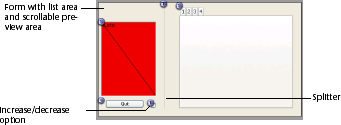
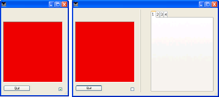

<!--REF #_command_.FORM SET SIZE.Syntax-->**FORM SET SIZE** ( {*object* ;} *horizontal* ; *vertical* {; *} )<!-- END REF-->
<!--REF #_command_.FORM SET SIZE.Params-->
| 引数 | 型 |  | 説明 |
| --- | --- | --- | --- |
| object | Text | &#8594;  | フォームの境界を指定するオブジェクト名 |
| horizontal | Integer | &#8594;  | * が渡されていれば: 水平マージン (ピクセル) * が省略されていれば: 幅 (ピクセル) |
| vertical | Integer | &#8594;  | * が渡されていれば: 垂直マージン (ピクセル) * が省略されていれば: 高さ (ピクセル) |
| * | 演算子 | &#8594;  | 渡されれば: horizontalとvertical引数で 指定されたマージンを加える  (自動サイズまたはobjectが指定されればそれを基ととしたサイズ) 省略すれば: horizontalとverticalをフォームの幅と高さにする |

<!-- END REF-->

*このコマンドはスレッドセーフではないため、プリエンプティブなコードには使えません。*


#### 説明 

<!--REF #_command_.FORM SET SIZE.Summary-->**FORM SET SIZE** コマンドを使用すると、プログラムからカレントフォームのサイズを変更することができます。<!-- END REF-->新しいサイズは、カレントプロセスに対して定義され、フォームには保存されません。

デザインモードと同様に、このコマンドを使用して、3通りの方法でフォームサイズを設定することができます:

* 自動: すべてのオブジェクトが表示されるよう、4Dがフォームサイズを決定。縦横マージンを追加可能。
* 指定したフォームオブジェクトの位置に基づき決定する。縦横マージンを追加可能。
* 幅と高さを直接指定。

フォームのリサイズに関する詳細は、*4D Design Reference*マニュアルを参照してください。

**自動サイズ**  
自動でフォームサイズを設定したい場合、以下のシンタックスを使用します:  

```4d
 FORM SET SIZE(horizontal;vertical;*)
```

この場合、*horizontal* と *vertical*にはそれぞれ右と下に追加するマージンをピクセル単位で渡します。

**オブジェクトを基にしたサイズ**  
オブジェクトを基にフォームサイズを決定したい場合、以下のシンタックスを使用します:  

```4d
 FORM SET SIZE(object;horizontal;vertical)
```

この場合、*horizontal* と *vertical*にはそれぞれオブジェクトの右と下に追加するマージンをピクセル単位で渡します。*\** 引数を渡すことはできません。

**サイズ指定**  
フォームサイズを固定で指定したい場合、下のシンタックスを使用します:  

```4d
 FORM SET SIZE(horizontal;vertical)
```

この場合、*horizontal* と *vertical*にはそれぞれフォームの高さと幅を指定します。

**FORM SET SIZE** コマンドはフォームサイズを変更しますが、サイズ調整プロパティも考慮します。例えば、フォームの最小幅が500ピクセルの場合に、コマンドで幅を400ピクセルに設定すると、新しいフォーム幅は500ピクセルになります。  
また、このコマンドはフォームウィンドウのサイズは変更しないという点に注意してください。ウインドウサイズを変更しないでフォームサイズを変えることもできます（その逆も同様）。フォームウィンドウのサイズを変更する方法については、[RESIZE FORM WINDOW](resize-form-window.md) コマンドを参照してください。

#### 例題 

次の例題は、エクスプローラタイプのウィンドウの設定方法を示しています。以下のフォームはデザインモードで作成します:



フォームのサイズは “自動”です。

ウィンドウは以下のコードで表示されます:

```4d
 $ref:=Open form window([Table1];"Form1";Plain form window;Horizontally centered;Vertically centered;*)
 DIALOG([Table1];"Form1")
 CLOSE WINDOW
```

ウィンドウの右の部分はオプションのクリックにより表示されたり隠されたりします。:



このボタンに関連付けられたメソッドは以下のようになります:

```4d
 Case of
    :(Form event code=On Load) //v17 以前ではForm event を使用すること
       var b1;<>collapsed : Boolean
       var margin : Integer
       margin:=15
       b1:=<>collapsed
       If(<>collapsed)
          FORM SET HORIZONTAL RESIZING(False)
          FORM SET SIZE("b1";margin;margin)
       Else
          FORM SET HORIZONTAL RESIZING(True)
          FORM SET SIZE("tab";margin;margin)
       End if
 
    :(Form event code=On click) //v17 以前ではForm event を使用すること
       <>collapsed:=b1
       If(b1)
  //collapsed
          OBJECT GET COORDINATES(*;"b1";$l;$t;$r;$b)
          GET WINDOW RECT($lf;$tf;$rf;$bf;Current form window)
          SET WINDOW RECT($lf;$tf;$lf+$r+margin;$tf+$b+margin;Current form window)
          FORM SET HORIZONTAL RESIZING(False)
          FORM SET SIZE("b1";margin;margin)
 
       Else
  //expanded
          OBJECT GET COORDINATES(*;"tab";$l;$t;$r;$b)
          GET WINDOW RECT($lf;$tf;$rf;$bf;Current form window)
          SET WINDOW RECT($lf;$tf;$lf+$r+margin;$tf+$b+margin;Current form window)
          FORM SET HORIZONTAL RESIZING(True)
          FORM SET SIZE("tab";margin;margin)
       End if
 
 End case
```

#### 参照 

[FORM SET HORIZONTAL RESIZING](form-set-horizontal-resizing.md)  
[FORM SET VERTICAL RESIZING](form-set-vertical-resizing.md)  