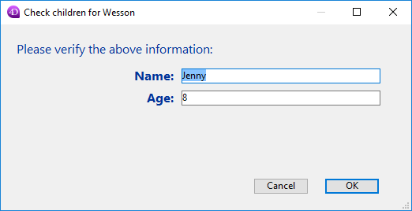

<!--REF #_command_.Form.Syntax-->**Form**  -> 戻り値<!-- END REF-->
<!--REF #_command_.Form.Params-->
| 引数 | 型 |  | 説明 |
| --- | --- | --- | --- |
| 戻り値 | Object | &#8592; | カレントフォームに関連付けられているフォームデータ |

<!-- END REF-->

#### 説明 

<!--REF #_command_.Form.Summary-->**Form** コマンドは、 カレントフォームに関連付けられているオブジェクトがある場合にはそれを返します。<!-- END REF-->4D は以下の場合においてはカレントフォームにオブジェクトを自動的に関連付けます:

* カレントフォームが[DIALOG](dialog.md) コマンドによって表示された場合。
* カレントフォームがサブフォームである場合。
* あるテーブルフォームがスクリーン上に表示されている場合。

##### DIALOG フォーム 

カレントフォームが[DIALOG](dialog.md) コマンドの呼び出しによって表示されている場合、**Form** は空のオブジェクトを返すか、あるいはこのコマンドに引数として渡された*formData* オブジェクト(あれば)を返します。

##### サブフォーム 

カレントフォームがサブフォームである場合、返されるオブジェクトは親コンテナ変数に応じて変わります:

* 親コンテナに関連付けられている変数がオブジェクトとして型指定されていている([C\_OBJECT](c-object.md))場合、**Form** はこの変数の値を返します。  
この場合、**Form** によって返されるオブジェクトは以下の式によって返されるものと同じです:  
```4d  
 (OBJECT Get pointer(Object subform container))->  
```
* 親コンテナに関連付けられている変数がオブジェクトとして型指定されていない場合、**Form** は4D によってサブフォームコンテキストにおいて維持されている空のオブジェクトを返します。

詳細な情報については、*ページサブフォーム* の章を参照してください。

##### テーブルフォーム 

**Form** は画面上に表示されているテーブルフォームに関連づけられているオブジェクトを返します。出力フォームから表示されている入力フォーム(例: レコードをダブルクリックした後の入力フォーム)のコンテキストにおいては、返されたオブジェクトには以下のプロパティを持つオブジェクトを返します:

| **プロパティ**  | **型**  | **詳細**                  |
| ---------- | ------ | ----------------------- |
| parentForm | オブジェクト | 親出力フォームの**Form** オブジェクト |

#### 例題 

人物のレコードを表示しているフォームにおいて、"Check children" ボタンを押すとその人物の子供の名前と年齢を検証あるいは変更するダイアログが開く場合を考えます:


**注:** "Children" オブジェクトフィールドはこの例題においての構造を示すために表示されているだけです。

検証フォームにおいて、[Form](form.md) オブジェクトプロパティを変数へと割り当てているものとします:


"Check children" ボタンの中身のコードは以下のようになります:

```4d
 var $win;$n;$i : Integer
 var $save : Boolean
 ARRAY OBJECT($children;0)
 OB GET ARRAY([Person]Children;"children";$children) //children 配列を取得
 $save:=False //save 引数を初期化
 
 $n:=Size of array($children)
 If($n>0)
    $win:=Open form window("Edit_Children";Movable form dialog box)
    SET WINDOW TITLE("Check children for "+[Person]Name)
    For($i;1;$n) //各子供に対して
       DIALOG("Edit_Children";$children{$i}) //値を含んだダイアログを表示
       If(OK=1) //ユーザーはOKをクリックした
          $save:=True
       End if
    End for
    If($save=True)
       [Person]Children:=[Person]Children //強制的にオブジェクトフィールドを更新
    End if
    CLOSE WINDOW($win)
 Else
    ALERT("No child to check.")
 End if
```

**注:** この例題ではデータベース内においてオブジェクト記法が有効化されていることが前提となります(*互換性ページ* を参照してください)。

フォームはそれぞれの子供についての情報を表示します:



値が変更されてOKボタンがクリックされた場合、フィールドは更新されます(その後、親のレコードも保存される必要があります)。

#### 参照 

[DIALOG](dialog.md)  