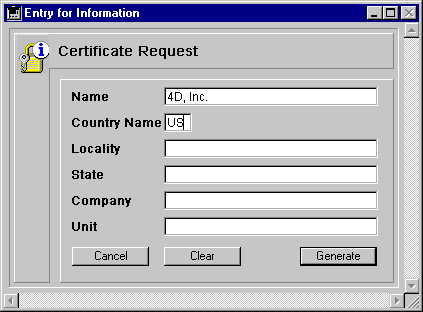

<!--REF #_command_.GENERATE CERTIFICATE REQUEST.Syntax-->**GENERATE CERTIFICATE REQUEST** ( *privKey* ; *certifRequest* ; *codeArray* ; *nameArray* )<!-- END REF-->
<!--REF #_command_.GENERATE CERTIFICATE REQUEST.Params-->
| 引数 | 型 |  | 説明 |
| --- | --- | --- | --- |
| privKey | Blob | &#8594;  | 秘密鍵BLOB |
| certifRequest | Blob | &#8592; | CSRを受け取るBLOB |
| codeArray | Integer array | &#8594;  | 情報コードリスト |
| nameArray | Text array | &#8594;  | 名前リスト |

<!-- END REF-->

#### 説明 

<!--REF #_command_.GENERATE CERTIFICATE REQUEST.Summary-->**GENERATE CERTIFICATE REQUEST** コマンドは、Verisign(R)等の認証局で使用されているPKCSフォーマットで証明書リクエストを生成します。<!-- END REF-->証明書はSSL暗号化プロトコルの重要な役割を持ちます。これはSSLモードで接続している各ブラウザに送信され、Webサイトの“IDカード” (このコマンドに指定した情報をもとに作成) とともに、ブラウザが受信情報の解読に使用できる公開鍵も納められています。さらにこの証明書には、整合性を保証する認証局により加えられた各種情報も納められます。

**Note:** 4D Webサーバで使用するSSLプロトコルに関する詳細は[WEB SERVICE SET PARAMETER](web-service-set-parameter.md) の節を参照してください。

証明書リクエストには、[GENERATE ENCRYPTION KEYPAIR](generate-encryption-keypair.md) コマンドで生成した一対の鍵が使用され、各種情報が納められます。認証局では、このリクエストと他の引数を組み合わせて証明書を作成します。

*privKey* には[GENERATE ENCRYPTION KEYPAIR](generate-encryption-keypair.md) コマンドで生成した秘密鍵を納めたBLOBを渡します。

*certifRequest*には空のBLOBを渡します。コマンドが実行されると、この引数には証明書リクエストがbase64で暗号化されたPKCSフォーマットで納められます。このリクエストを認証局へ提出する目的で、例えば[BLOB TO DOCUMENT](blob-to-document.md) コマンドを使用して、.pemの接尾辞がついたテキストファイルへ保存することができます。

**警告:** 秘密鍵はリクエストの作成に使用しますが、認証局へ送信してはいけません。

*codeArray* (倍長整数) および*nameArray* (文字列) にはそれぞれ、認証局から要求されるコード番号と情報内容を納めます。  
必要とされるコードおよび名称は、認証局や証明書の用途によって変わる場合があります。しかし、証明書の通常の用途であれば (SSL経由でのWebサーバ接続)、この配列には以下の項目を納める必要があります:

| **提供する情報**                | **codeArray** | **nameArray (例)** |
| ------------------------- | ------------- | ----------------- |
| CommonName                | 13            | www.4D-Japan.com  |
| CountryName (two letters) | 14            | JP                |
| LocalityName              | 15            | Setagaya-ku       |
| StateOrProvinceName       | 16            | Tokyo             |
| OrganizationName          | 17            | 4D Japan, Ltd.    |
| OrganizationUnit          | 18            | Web Administrator |

コードと情報内容の入力順は問いませんが、これら2つの配列は同期していなくてはなりません。つまり、*codeArray*の3番目の項目の値が15 (LocalityName) であれば、*nameArray*の3番目の項目にはその情報を納める必要があります。ここの例題ではSetagaya-kuになります。

#### 例題 

“Certificate request”フォームには、標準の証明書リクエストで必要となる6つのフィールドが含まれています。**Generate**ボタンは証明書リクエストを納めたドキュメントをディスク上に作成します。([GENERATE ENCRYPTION KEYPAIR](generate-encryption-keypair.md) コマンドで作成された) 秘密鍵を納めた“Privatekey.txt”もディスク上に存在している必要があります:

  
  
以下は**Generate**ボタンのメソッドです:

```4d
  // bGenerate オブジェクトメソッド
 
 var $vbprivateKey;$vbcertifRequest : Blob
 var $tableNum : Integer
 ARRAY LONGINT($tLCodes;6)
 ARRAY STRING(80;$tSInfos;6)
 
 $tableNum:=Table(Current form table)
 For($i;1;6)
    $tSInfos{$i}:=Field($tableNum;$i)->
    $tLCodes{$i}:=$i+12
 End for
 If(Find in array($tSInfos;"")#-1)
    ALERT("All fields should be filled.")
 Else
    ALERT("Select your private key.")
    $vhDocRef:=Open document("")
    If(OK=1)
       CLOSE DOCUMENT($vhDocRef)
       DOCUMENT TO BLOB(Document;$vbprivateKey)
       GENERATE CERTIFICATE REQUEST($vbPrivateKey;$vbcertifRequest;$tLCodes;$tSInfos)
       BLOB TO DOCUMENT("Request.txt";$vbcertifRequest)
    Else
       ALERT("Invalid private key.")
    End if
 End if
```

#### 参照 

[GENERATE ENCRYPTION KEYPAIR](generate-encryption-keypair.md)  
[HTTP SET CERTIFICATES FOLDER](http-set-certificates-folder.md)  