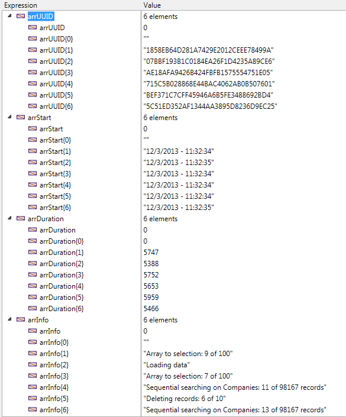

<!--REF #_command_.GET ACTIVITY SNAPSHOT.Syntax-->**GET ACTIVITY SNAPSHOT** ( arrActivities | arrUUID ; *arrStart* ; *arrDuration* ; *arrInfo* {; *arrDetails*}{; *} )<!-- END REF-->
<!--REF #_command_.GET ACTIVITY SNAPSHOT.Params-->
| 引数 | 型 |  | 説明 |
| --- | --- | --- | --- |
| arrActivities &#124; arrUUID | Object array, テキスト配列 | &#x1F858; | オペレーションの詳細な情報(オブジェクト配列)<br/>またはオペレーションの UUID(テキスト配列) |
| arrStart | テキスト配列 | &#x1F858; | オペレーションの開始時刻 |
| arrDuration | 倍長整数配列 | &#x1F858; | オペレーションの所要時間(ミリ秒単位) |
| arrInfo | テキスト配列 | &#x1F858; | オペレーションを説明するラベル |
| arrDetails | Object array | &#x1F858; | コンテキストと、(あれば)サブオペレーションの詳細 |
| * | 演算子 | &#x1F852; | 渡した場合、サーバーの状態を取得 |

<!-- END REF-->

#### 説明 

<!--REF #_command_.GET ACTIVITY SNAPSHOT.Summary-->**GET ACTIVITY SNAPSHOT**コマンドは、4D 上で進行中のデータ操作の詳細を記載した配列を、一つまたは複数の配列に返します。<!-- END REF-->これらの操作は、通常進捗ウィンドウが表示されます。

この情報は、もっとも時間のかかっているオペレーションまたは頻繁に使用されているオペレーション(キャッシュ書き込みやフォーミュラの実行など)のスナップショットを取るのに使われます。

**注:** **GET ACTIVITY SNAPSHOT** コマンドによって返された情報は、4D Server のリアルタイムモニターのページに表示されているデータと同じです。 ( *4D Server Reference Guide* を参照して下さい。)

デフォルトとして、 **GET ACTIVITY SNAPSHOT** はローカルに実行されている操作のみ処理します(4D シングルユーザー、4D サーバーまたはリモートモードの4Dなど)。それに加え、リモートモードの4Dでは、サーバーで実行されている操作のスナップショットを取ることもできます。そのためには最後の引数として、 *\** 演算子を渡して下さい。サーバーのデータはローカルに復元されます。  
*\** 演算子は、コマンドが4Dサーバーや4Dシングルユーザー上で実行された場合には無視されます。

**GET ACTIVITY SNAPSHOT** コマンドではシンタックスを使用することができます:

* オブジェクト配列のみを使用するシンタックス
* 複数の配列を使用するシンタックス

##### 第一シンタックス: GET ACTIVITY SNAPSHOT ( arrActivities {; \*}) 

この記法では、リアルタイムモニターの全てのオペレーションが構造化された形式で4D オブジェクト配列( *arrActivities* 引数で指定）に返されます。配列の各要素は、以下の様に構築されたオブジェクトになっています:

```RAW
[    {        "message":"xxx",        "maxValue":12321,        "currentValue":63212,        "interruptible:0,        "remote":0,        "uuid":"deadbeef",        "taskId":xxx,        "startTime":"2014-03-20 13:37:00:123",        "duration":92132,        "dbContextInfo":{            "task_id": xxx,            "user_name": Jean,            "host_name": HAL,            "task_name": "CreateIndexLocal",            "client_uid": "DE4DB33F33F"            "user4d_id ": 1,            "client_version ": 123456        },        "dbOperationDetails":{            table: "myTable"            field: "Field_1"        },        "subOperations":[            {"message":"xxx",            ...}            ]    },    {...}]
```

返されたそれぞれのプロパティの詳細は以下の通りです:

* *message* (テキスト): オペレーションのラベル
* *maxValue* (数値): オペレーションに設定された繰り返しの回数(繰り返ししないオペレーションには-1が返されます)
* *currentValue* (数値): カレントの繰り返し回数
* *interruptible* (数値): オペレーションがユーザーによって割り込み可能かどうか(0=true, 1=false)
* *remote* (数値): オペレーションがクライアントとサーバー間でペアになっているかどうか(0=true, 1=false)
* *uuid* (テキスト): オペレーションのUUID識別子
* *taskId* (数値): オペレーションの開始時のプロセスの内部識別子
* *startTime* (テキスト): "yyyy-mm-dd hh:mm:ss:mls" フォーマットでのオペレーションの開始時刻
* *duration* (数値): オペレーションの持続時間(ミリ秒単位)
* *dbContextInfo* (オブジェクト): データベースエンジンによって管理されるオペレーションに関係する情報。以下のプロパティを格納します:  
   * *host\_name* (文字列): オペレーションを起動したホストの名前  
   * *user\_name* (文字列): オペレーションを起動したセッションの4Dユーザー名  
   * *task\_name* (文字列): オペレーションを起動したプロセス名  
   * *task\_id* (数字): オペレーションを起動したプロセスのID番号  
   * *client\_uid* (文字列): 任意。オペレーションを起動したクライアントのUUID  
   * *is\_remote\_context* (ブール、0 または 1): 任意。データベースオペレーションがクライアントによって起動されたのか(値1)、ストアドプロシージャーから起動されたのか(値0)を表します。  
   * *user4d\_id* (数字): クライアント側のカレントの4DユーザーのID番号  
   * *client\_version* (文字列): アプリケーションの4Dエンジンのバージョンを表す4桁の数字。 [Application version](application-version.md) コマンドで返されるものと同じ  
**注:** client\_uid と is\_remote\_context は、クライアント/サーバーモードでのみ使用可能です。client\_uid はクライアントマシンからデータベースオペレーションが開始された場合のみ返されます。
* *dbOperationDetails* (オブジェクト): このプロパティはオペレーションがデータベースエンジンを呼び出した場合にのみ返されます(例えばクエリや並べ替えなどが相当します)。これはオペレーション自身に関連する特定の情報を含んだオブジェクトです。返されるプロパティは、実行されたデータベースオペレーションのタイプによります。具体的には、プロパティには以下が含まれます:  
   * table (文字列): オペレーションに関連したテーブルの名前  
   * field (文字列): オペレーションに関連したフィールドの名前  
   * queryPlan (文字列): オペレーションに対して定義されたクエリプラン  
   * ...
* *subOperations* (配列): カレントのオペレーションのサブオペレーション(あれば)を含んだオブジェクトの配列。それぞれのサブ要素のストラクチャはメインオブジェクトないのものと同じです。カレントオペレーションにサブオペレーションが何もない場合、*subOperations* は空の配列になります。

##### 第二シンタックス: GET ACTIVITY SNAPSHOT ( arrUUID ; arrStart ; arrDuration ; arrInfo {;arrSubOp} {; \*}) 

この記法では、リアルタイムモニターの全てのオペレーションが、同期した複数の配列に返されます(オペレーションがあるたび、全ての配列に要素が追加されていきます)。返される配列は以下の通りです:

* *arrUUID*: それぞれのオペレーションに対する UUID が保存されます(第一シンタックスでの*arrActivities* オブジェクトの*uuid* プロパティと対応します)。
* *arrStart*: それぞれのオペレーションの開始時刻が格納されます(第一シンタックスでの*arrActivities* オブジェクトの*startTime*プロパティと対応します)。
* *arrDuration*: それぞれのオペレーションの所要時間がミリ秒単位で格納されます(第一シンタックスでの*arrActivities* オブジェクトの*duration*プロパティと対応します)。
* *arrInfo* : それぞれのオペレーションを説明するラベルが保存されます(第一シンタックスでの*arrActivities* オブジェクトの*message*プロパティと対応します)。
* *arrSubOp* (任意): この配列の要素には、 "subOperations" プロパティを格納するオブジェクトが入っています。このプロパティの値はカレントオペレーションのサブ処理を全て含んだ object 配列となっています。カレントのオペレーションにサブ処理が何もない場合、 subOperations の値は空の配列となります(第一シンタックスでの*arrActivities* オブジェクトの *subOperations*プロパティと対応します)。
* *arrDetails* (任意): この配列のそれぞれの要素は、以下のプロパティを含むオブジェクトです:  
   * *"dbContextInfo"* (オブジェクト): 上記を参照のこと  
   * *"dbOperationDetails"* (オブジェクト): 上記を参照のこと  
   * "subOperations": このプロパティの値は、カレントオペレーションに対するサブオペレーションを全て含んだオブジェクト配列です。もしカレントのオペレーションにサブオペレーションが何もない場合、*subOperations* プロパティの値は空の配列となります(*arrActivities* オブジェクトの *subOperations* プロパティと対応します)

#### 例題 

4D か 4Dサーバーにおける個別のプロセスにおいて以下のメソッドを実行した場合、下図の様にオペレーションのスナップショットを返します:

```4d
 ARRAY TEXT(arrUUID;0)
 ARRAY TEXT(arrStart;0)
 ARRAY LONGINT(arrDuration;0)
 ARRAY TEXT(arrInfo;0)
 
 Repeat
    GET ACTIVITY SNAPSHOT(arrUUID;arrStart;arrDuration;arrInfo)
    If(Size of array(arrUUID)>0)
       TRACE // デバッガを呼び出し
    End if
 Until(False) // 無限ループ
```

以下の様な配列が返されます:


