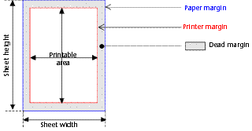

<!--REF #_command_.GET PRINTABLE MARGIN.Syntax-->**GET PRINTABLE MARGIN** ( *left* ; *top* ; *right* ; *bottom* )<!-- END REF-->
<!--REF #_command_.GET PRINTABLE MARGIN.Params-->
| 引数 | 型 |  | 説明 |
| --- | --- | --- | --- |
| left | Integer | &#8592; | 左マージン |
| top | Integer | &#8592; | 上マージン |
| right | Integer | &#8592; | 右マージン |
| bottom | Integer | &#8592; | 下マージン |

<!-- END REF-->

#### 説明 

<!--REF #_command_.GET PRINTABLE MARGIN.Summary-->GET PRINTABLE MARGIN コマンドは、[Print form](../commands/print-form.md)、[PRINT SELECTION](print-selection.md) そして [PRINT RECORD](print-record.md) コマンドに使用されるマージンの現在値を返します。<!-- END REF--> 

値は、用紙の端からの長さがピクセル単位で返されます。

[GET PRINTABLE AREA](get-printable-area.md "GET PRINTABLE AREA")コマンドを使用すると、用紙サイズの取得、および印刷可能領域の計算を行うことができます。

##### 印刷可能なマージンの管理 

デフォルトで、4Dにおける印刷に関する計算は“印刷可能マージン”に基づいています。このシステムの利点は、フォームが自動的に新しいプリンタに 適応するということです（フォームは印刷可能領域に配置されるため）。その一方で、事前に印刷されたフォームの場合は、プリンタを変更すると印刷可能マー ジンが変わる可能性があるため、正確に印刷されるように各項目を配置することができませんでした。

4Dバージョン6.8.1以降、[Print form](../commands/print-form.md)、[PRINT SELECTION](print-selection.md)および[PRINT RECORD](print-record.md) コマンドを使用して行うフォームの印刷を、各プリンタ共通の固定マージン（用紙マージン、つまり用紙の物理的な許容限界寸法）に基づいて行うことができるようになりました。これを行うには、 [GET PRINTABLE MARGIN](get-printable-margin.md)、 [SET PRINTABLE MARGIN](set-printable-margin.md) および[GET PRINTABLE AREA](get-printable-area.md) コマンドを使用します。

#### 印刷用語について 

**用紙マージン**: 用紙マージンは、用紙の物理的な許容限界寸法に相当します。

**プリンタマージン**: プリンタマージンは、その位置を越えてプリンタが印刷できないことを示すマージンです（プリントローラー、プリンタヘッドの行程終端等の物質的な理由により）。この値は、プリンタやフォーマットごとに異なります。

**デッドマージン**: 用紙マージンとプリンタマージンとの間の領域のことです。

#### 参照 

[GET PRINTABLE AREA](get-printable-area.md)  
[Print form](../commands/print-form.md)  
[SET PRINTABLE MARGIN](set-printable-margin.md)  

#### プロパティ
|  |  |
| --- | --- |
| コマンド番号 | 711 |
| スレッドセーフである | &check; |
| サーバー上での使用は不可 ||

