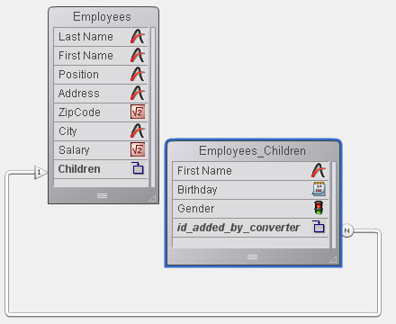

<!--REF #_command_.Get subrecord key.Syntax-->**Get subrecord key** ( *idField* ) : Integer<!-- END REF-->
<!--REF #_command_.Get subrecord key.Params-->
| 引数 | 型 |  | 説明 |
| --- | --- | --- | --- |
| idField | Field | &#8594;  | 以前のサブテーブルリレーションの"サブテーブルリレーション"または"倍長整数"型のフィールド |
| 戻り値 | Integer | &#8592; | リレーションの内部キー |

<!-- END REF-->

#### 説明 

<!--REF #_command_.Get subrecord key.Summary-->**Get subrecord key**コマンドは、変換されたサブテーブルを使用する4Dコードから、標準のテーブルに対して作業を行うコードへの移行を容易にします。<!-- END REF-->

**注意:** 4Dバージョン11よりサブテーブルはサポートされていません。旧バージョンのデータベースを変換すると、既存のサブテーブルは標準のテーブルに変換され、自動リレーションにより親テーブルとリンクされます。以前のサブテーブルはNテーブルとなり、親テーブルは1テーブルになります。1テーブル中、以前のサブテーブルフィールドは"サブテーブルリレーション"型の特別なフィールドに変換され、Nテーブルには特別な"サブテーブルリレーション"型のフィールドが“id\_added\_by\_converter”という名称で追加されます。 

これは変換されたデータベースにおいてサブテーブルの動作の互換性を保持するためのものです。しかし変換されたデータベースにおいて、すべてのサブテーブルメカニズムを標準のテーブルを使用したメカニズムに置き換えることを強く推奨します。

この作業ではまず特別な自動リレーションを削除してサブテーブルから継承したメカニズムを恒久的に無効にし、その後関連するコードを書き換える必要があります。**Get subrecord key**コマンドはリレーションで使用される内部IDを返し、このIDを使用することでこの書き換えを容易に行うことができます。この内部IDは実際のリレーションを不要とし、リレーションがもう存在しないにもかかわらず、開発者は以前のサブテーブルのセレクションで作業を行うことができます。

変換された以下のストラクチャーで例題を見てみましょう: 



4D では以下のコードが依然動作しますが、更新する必要があります:

```4d
 ALL SUBRECORDS([Employees]Children)
 $total:=Records in subselection([Employees]Children)
 vFirstnames:=""
 For($i;1;$total)
    vFirstnames:=vFirstnames+[Employees]Children'FirstName+" "
    NEXT SUBRECORD([Employees]Children)
 End for
```

このコードを以下のように書き換えることができます:

```4d
 QUERY([Employees_Children];[Employees_Children]id_added_by_converter=Get subrecord key([Employees]Children))
 $total:=Records in selection([Employees_Children])
 vFirstnames:=""
 For($i;1;$total)
    vFirstnames:=vFirstnames+[Employees_Children]FirstName+" "
    NEXT RECORD(Employees_Children)
 End for
```

**注:** **Get subrecord key**コマンド実行時、カレントレコードがロードされていない場合は0を返します。

2番目のコードは標準の4Dコマンドを使用していますが、リレーションが存在するしないにかかわらず以前と同様に動作します。リレーションを取り除くと、コマンドは倍長整数フィールドに格納された値を返します。

*idField*引数にはサブテーブルリレーション型のフィールド (リレーションがまだ存在する場合) または倍長整数タイプのフィールド (リレーションを取り除いた場合) を渡します。これ以外の場合エラーが生成されます。

このコマンドを使用することで、遷移的なコードを書くことができます。アプリケーションのアップグレードの最終ステージで、このコマンドの呼び出しを取り除くことができます。

#### id\_added\_by\_converter フィールドに値を割り当てる 

4D v14 R3 以降、"id\_added\_by\_converter" フィールドに値を割り当てることが出来るようになりした。以前は、この値は4D自身によってのみ割り当てられ、デベロッパは変換されたサブテーブルにレコードを追加するためには廃止されたコマンド *\_o\_CREATE SUBRECORD* などを使用する必要がありました。

この改良により、サブテーブルを含む古いデータベースをより自在に変換する事ができるようになりました。まず、特殊な"サブテーブルリレーション"を保持したまま、リレートされたレコードを通常のものと同じように追加したり修正したりできます。全てのメソッドを更新し終えたら、コードを書き換えることなく、この特殊なリレーションを通常なリレーションと置き換えることができます。

例えば、上記のストラクチャーに対して、以下の様なコードを書く事ができます:

```4d
 CREATE RECORD([Employees])
 [Employees]LastName:="Jones"
 CREATE RECORD([Employees_Children])
 [Employees_Children]FirstName:="Natacha"
 [Employees_Children]BirthDate:=!12/24/2013!
 [Employees_Children]id_added_by_converter:=Get subrecord key([Employees]Children)
 SAVE RECORD([Employees_Children])
 SAVE RECORD([Employees]
```

上記のコードは、特殊なリレーションに対しても通常のリレーションに対しても有効です。
