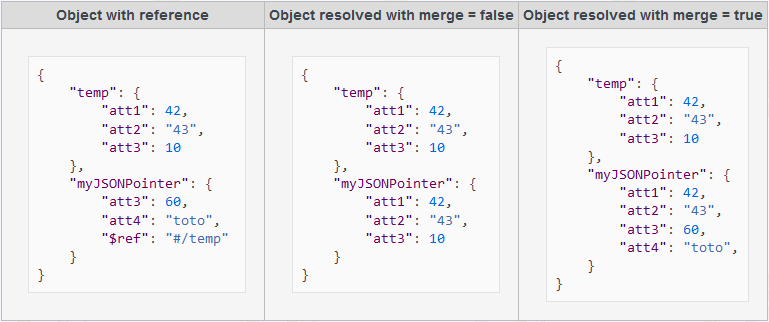

<!--REF #_command_.JSON Resolve pointers.Syntax-->**JSON Resolve pointers** ( *object* {; *options*} ) -> 戻り値<!-- END REF-->
<!--REF #_command_.JSON Resolve pointers.Params-->
| 引数 | 型 |  | 説明 |
| --- | --- | --- | --- |
| object | オブジェクト | &#x1F852; | 解決するJSONポインターを含んだオブジェクト型 |
| &#x1F858; | 解決したJSONポインターを含んだオブジェクト型(結果がオブジェクト型の場合のみ) |
| options | オブジェクト | &#x1F852; | ポインター解決のオプション |
| 戻り値 | オブジェクト | &#x1F850; | 処理の結果を含んだオブジェクト型 |

<!-- END REF-->

#### 説明 

<!--REF #_command_.JSON Resolve pointers.Summary-->**JSON Resolve pointers** コマンドは、*object* 引数内にある全てのJSON ポインターを、*options* 引数で指定した設定(あれば)に基づいて、解決します。<!-- END REF-->

JSON ポインターは、以下のような場合に特に有用です:

* 情報を分解するために、外部JSON ドキュメントの一部埋め込んだり、あるいはあるJSON ドキュメントの一部を同じJSON ドキュメント内の他の箇所に再使用したりする。
* JSON 内での再起的構造を表現する。
* JSON に保存されたデフォルトのプロパティを含んだテンプレートオブジェクトを定義する。

*object* 引数には、解決すべきJSON ポインターを含んだオブジェクト型を渡します(JSON ポインターシンタックスについての詳細な情報については、以下の*JSON ポインターを定義する* の段落を参照してください)。

**注:** ソースとなる*object* 引数は、コマンド実行後更新され、ポインター解決の結果が含まれます(ただし結果がオブジェクト型でない場合を除きます、以下参照)。オリジナルの*object* 引数をそのまま残しておきたい場合には、事前に[OB Copy](ob-copy.md) コマンドを使用することを検討して下さい。

オプションとして、*options* 引数にはポインターを解決するときに使用する特定のプロパティを格納したオブジェクト型を渡すことができます。以下のプロパティがサポートされています:

| **プロパティ**  | **値の型** | **詳細**                                                                                                               |
| ---------- | ------- | -------------------------------------------------------------------------------------------------------------------- |
| rootFolder | 文字列     | *object* 引数内の相対ポインターを解決する際に使用するフォルダーへの(標準の4D シンタックスを使用した)絶対パス。デフォルトのフォルダーはデータベースのResources フォルダーとなっています。             |
| merge      | ブール     | オブジェクトをポインターオブジェクトに一部併合する(true)か、完全に置き換えるか(false)を指定します。デフォルトはfalse です。 |

コマンドが実行されたあと、結果は以下のようになります: 

* ポインター解決の結果がオブジェクト型であった場合、*object* 引数は更新され、結果のオブジェクト型を格納します。
* ポインター解決の結果がスカラー値(テキスト、数値、等)であった場合、*object* 引数は変更なしで残され、結果の値は戻り値の"value" プロパティへと返されます。

どのような場合においても、コマンドは以下のプロパティを格納したオブジェクト型を返します:

| **プロパティ**               | **値の型** | **詳細**                                                             |
| ----------------------- | ------- | ------------------------------------------------------------------ |
| value                   | 任意      | *object* 引数を処理したコマンドの結果。結果がオブジェクト型の場合には、中身は出力の*object* 引数と同じになります。 |
| success                 | ブール     | 全てのポインターが正常に解決されていた場合にはtrue。                                       |
| errors                  | コレクション  | エラーのコレクション(あれば)                                                    |
| errors\[\].code         | 数値      | エラーコード                                                             |
| errors\[\].message      | 文字列     | エラーメッセージ                                                           |
| errors\[\].pointerURI   | 文字列     | ポインター値                                                             |
| errors\[\].referredPath | 文字列     | ドキュメントのフルパス                                                        |

#### JSON ポインターを定義する 

```undefined
{
   "$ref":<path>#<json_pointer>
}
```

##### 再帰性とパスの解決 

JSON ポインターは再帰的に解決されます。これはつまりポインターが解決されたドキュメント内にポインターが更に含まれていた場合、それもまた再帰的に解決され、全てのポインターが解決されるまで繰り返されるということです。このコンテキストにおいては、JSON ポインターURI内のファイルパスは、すべて相対パスあるいは絶対パスのどちらも可能です。パスは区切り文字として'/' を使用し、以下の方法で解決されなければなりません:

* 相対パスは'/' から始まってはいけません。相対パスはそのパス文字列が見つかったJSON ドキュメントに対して相対的に解決されます。
* 絶対パスは'/' から始まります。絶対パスとして受け入れられるのは[ファイルシステムパス名](https://developer.4d.com/docs/ja/Concepts/paths/#filsystem%E3%83%91%E3%82%B9%E5%90%8D) のみです。例えば、"/RESOURCES/templates/myfile.json" は、カレントデータベースのResources フォルダ内に配置されている"myfile.json" というファイルを指します。

**注:**

* 名前の解決には、大文字と小文字は区別されます。
* 4D はネットワーク越しにあるjson ファイルへのパス("http/https"から始まるパス)は解決しません。

#### 例題 1 

この基本的な例題では、どのようにしてオブジェクト型の中でJSON ポインターを設定して置き換えるかを考えます:

```4d
  // 何らかの値を持ったオブジェクト型を作成
 var $o : Object
 $o:=New object("value";42)
 
  // JSON ポインターオブジェクトを作成
 var $ref : Object
 $ref:=New object("$ref";"#/value")
 
  // JSON ポインターオブジェクトをプロパティとして追加
 $o.myJSONPointer:=$ref
 
  // 全体を解決して、ポインターが解決されたことを確認する
 var $result : Object
 $options:=New object("rootFolder";Get 4D folder(Current resources folder);"merge";True)
 $result:=JSON Resolve pointers($o;$options)
 If($result.success)
    ALERT(JSON Stringify($result.value))
  //{"value":42,"myJSONPointer":42}
 Else
    ALERT(JSON Stringify($result.errors))
 End if
```

#### 例題 2 

```undefined
{
    "lastname": "Doe",
    "firstname": "John",
    "billingAddress": { 
        "street": "95 S. Market Street",
        "city": "San Jose",
        "state": "California" 
    },
    "shippingAddress": { "$ref": "#/billingAddress" }
}
```

#### 例題 3 

```undefined
{
    "rights": { 
        "$ref": "defaultSettings.json#/defaultRights",
        "delete": true,
        "id": 456
    }
}
```

#### 参照 

  