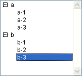

<!--REF #_command_.List item parent.Syntax-->**List item parent** ( {* ;} *list* ; itemRef | * ) : Integer<!-- END REF-->
<!--REF #_command_.List item parent.Params-->
| 引数 | 型 |  | 説明 |
| --- | --- | --- | --- |
| * | 演算子 | &#8594;  | 指定時, listはオブジェクト名 (文字列) 省略時, listはリスト参照番号 |
| list | Integer, Text | &#8594;  | リスト参照番号 (* 省略時), または リストオブジェクト名 (* 指定時) |
| itemRef &#124; * | 演算子, 倍長整数 | &#8594;  | 項目参照番号, または 0: リストに最後に追加された項目, または *: カレントのリスト項目 |
| 戻り値 | Integer | &#8592; | 親項目の項目参照番号 または ない場合0 |

<!-- END REF-->

#### 説明 

<!--REF #_command_.List item parent.Summary-->List item parent コマンドは、親項目の項目参照番号を返します。<!-- END REF-->

*list*にはリスト参照番号またはオブジェクト名を渡します。

オプションの第一引数 *\** を渡すと、*list* 引数はフォーム上のリストオブジェクトに対応するオブジェクト名 (文字列) です。この引数を渡さない場合、*list* 引数は階層リスト参照 ([ListRef](# "階層リストへの参照")) です。リストオブジェクトを一つしか使わない場合や、2番目の *\** を使用しない場合は、両方のシンタックスを使用できます。他方フォーム上に同じ階層リストを参照する複数のオブジェクトがある場合で、2番目の *\** を渡して現在選択されている項目を参照する場合、それぞれのオブジェクトが個別に選択された項目をもつので、オブジェクト名に基づくシンタックスを使用しなければなりません。

**Note:** オブジェクト名に @ 文字を使用することで、名前に対応するオブジェクトが複数検索された場合、List item parent コマンドは最初に見つけたオブジェクトを処理の対象とします。

*itemRef*にはリスト中の項目参照番号、あるいは0、または \* を渡します。0を渡した場合、コマンドはリストに最後に追加した項目に適用されます。\* を渡した場合、コマンドはリストのカレント項目に適用されます。複数の項目が選択されている場合、最後に選択された項目がカレントの項目となります。

戻り値として、対応する項目がリスト上に存在し、かつその項目がサブリスト上にある場合（つまり親項目を持つ）、親項目の項目参照番号が返されます。

渡した項目参照番号を持つ項目が存在しない場合や、\* を渡したが選択項目が存在しない場合、または項目が親を持たない場合は、List item parentは0を返します。

項目参照番号を使用して作業を実行する場合、項目がユニークな参照番号を持つリストを作成します。そうでなければ、項目を区別できません。詳細については、[APPEND TO LIST](append-to-list.md "APPEND TO LIST")の説明を参照してください。

#### 例題 

*hList*があるとき、アプリケーションモードで以下のように表示されます:



項目参照番号は以下のように設定されています:

| **項目**  | **項目参照番号** |
| ------- | ---------- |
| *a*     | *100*      |
| *a - 1* | *101*      |
| *a - 2* | *102*      |
| *b*     | *200*      |
| *b - 1* | *201*      |
| *b - 2* | *202*      |
| *b - 3* | *203*      |

  
* 項目“b - 3”が選択されているとき、以下のコードで*$vlParentItemRef*には200が返されます。これは項目“b”の項目参照番号です:

```4d
 $vlItemPos:=Selected list items(hList)GET LIST ITEM(hList;$vlItemPos;$vlItemRef;$vsItemText)$vlParentItemRef:=List item parent(hList;$vlItemRef) // $vlParentItemRef gets 200
```

* “a - 1”が選択されていると、“a”.の項目参照番号である100が*$vlParentItemRef* に返されます。
* “a” または “b”が選択されていると、これらの項目には親項目がないため*$vlParentItemRef*には0が返されます。

#### 参照 

[GET LIST ITEM](get-list-item.md)  
[List item position](list-item-position.md)  
[SELECT LIST ITEMS BY REFERENCE](select-list-items-by-reference.md)  
[SET LIST ITEM](set-list-item.md)  

#### プロパティ
|  |  |
| --- | --- |
| コマンド番号 | 633 |
| スレッドセーフである | &check; |
| サーバー上での使用は不可 ||


