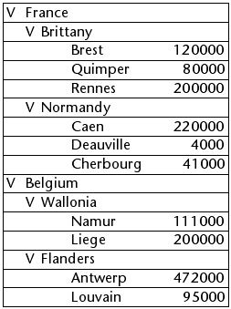
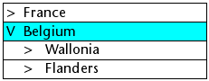
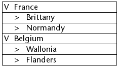

<!--REF #_command_.LISTBOX EXPAND.Syntax-->**LISTBOX EXPAND** ( {* ;} *object* {; *recursive* {; *selector* {; *line* {; *column*}}}} )<!-- END REF-->
<!--REF #_command_.LISTBOX EXPAND.Params-->
| 引数 | 型 |  | 説明 |
| --- | --- | --- | --- |
| * | 演算子 | &#8594;  | 指定時、objectはオブジェクト名 (文字列)<br/>省略時、objectは変数 |
| object | any | &#8594;  | オブジェクト名 (* 指定時) または <br/>変数 (* 省略時) |
| recursive | Boolean | &#8594;  | True = サブレベルを展開<br/>False = サブレベルを展開しない |
| selector | Integer | &#8594;  | 展開するリストボックスのパーツ |
| line | Integer | &#8594;  | 展開するブレーク行の番号、または<br/>展開するリストボックスレベルの番号 |
| column | Integer | &#8594;  | 展開するブレーク列の番号 |

<!-- END REF-->

#### 説明 

<!--REF #_command_.LISTBOX EXPAND.Summary-->LISTBOX EXPAND コマンドは*object*と*\**で指定したリストボックスオブジェクトのブレーク行を展開するために使用します。<!-- END REF-->

オプションの*\** 引数を渡した場合、*object*引数はオブジェクト名 (文字列) です。この引数を渡さない場合*object*は変数です。この場合、文字列ではなく変数参照を渡します。 

リストボックスが階層モードとして設定されていない場合、コマンドはなにも行いません。階層リストボックスに関する詳細は*階層リストボックス*を参照してください。

 オプションの*recursive*引数を使用してリストボックスの階層サブレベルの展開を指定できます。Trueを渡すか省略すると、すべてのレベルおよびすべてのサブレベルが展開されます。Falseを渡すと指定された一番目のレベルのみが展開されます。

オプションの*selector*引数を使用して、コマンドのスコープを指定できます。この引数には*List Box*テーマの以下の定数のいずれかを渡すことができます:

| 定数           | 型    | 値 | コメント                                                                                                                                             |
| ------------ | ---- | - | ------------------------------------------------------------------------------------------------------------------------------------------------ |
| lk all       | 倍長整数 | 0 | コマンドはすべてのサブレベルに作用します (引数省略時のデフォルト値)。                                                                                                             |
| lk selection | 倍長整数 | 1 | コマンドは選択されたサブレベルに作用します。                                                                                                                           |
| lk break row | 倍長整数 | 2 | コマンドは*row* と *column*引数で指定された"セル"に属するサブレベルに作用します。これらの引数は標準モードのリストボックスの行および列番号を表すことに留意してください。階層表現ではありません。*row* と *column* 引数が省略されると、コマンドは何も行いません。 |
| lk level     | 倍長整数 | 3 | コマンドは*level*列に対応するすべてのブレーク行に作用します。この引数は標準モードのリストボックスの列番号を指定し、階層表現を考慮しません。*level*引数が省略されると、コマンドはなにも行いません。                                         |

このコマンドはブレーク行を選択しません。

選択あるいはリストボックスがブレーク行を含んでいないか、すべてのブレーク行がすでに展開されている場合、コマンドはなにも行いません。

#### 例題 

以下の例題では、コマンドのさまざまな利用方法を示します。以下の配列がリストボックスに表示されているものとします:


```4d
  //リストボックスのすべてのブレーク行とサブ行を展開する
 LISTBOX EXPAND(*;"MyListbox")
```



```4d
  //選択された第一レベルのブレーク行を展開する
 LISTBOX EXPAND(*;"MyListbox";False;lk selection)
  //"Belgium"行が選択されている場合
```



```4d
  //Brittanyブレーク行を展開し、サブレベルは展開しない
 LISTBOX EXPAND(*;"MyListbox";False;lk break row;1;2)
```


```4d
  //一番目の列 (国) のみを展開
 LISTBOX EXPAND(*;"MyListbox";False;lk level;1)
```



#### 参照 

[LISTBOX COLLAPSE](listbox-collapse.md)  

#### プロパティ
|  |  |
| --- | --- |
| コマンド番号 | 1100 |
| スレッドセーフである | &check; |
| サーバー上での使用は不可 ||


