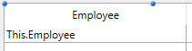

<!--REF #_command_.LISTBOX INSERT COLUMN FORMULA.Syntax-->**LISTBOX INSERT COLUMN FORMULA** ( {* ;} *object* ; *colPosition* ; *colName* ; *formula* ; *dataType* ; *headerName* ; *headerVariable* {; *footerName* ; *footerVar*} )<!-- END REF-->
<!--REF #_command_.LISTBOX INSERT COLUMN FORMULA.Params-->
| 引数 | 型 |  | 説明 |
| --- | --- | --- | --- |
| * | 演算子 | &#8594;  | 指定時, objectはオブジェクト名 (文字列) 省略時, objectは変数 |
| object | any | &#8594;  | オブジェクト名 (* 指定時) または 変数 (* 省略時) |
| colPosition | Integer | &#8594;  | 列挿入位置 |
| colName | Text | &#8594;  | 列オブジェクト名 |
| formula | Text | &#8594;  | 列に関連付ける4Dフォーミュラ |
| dataType | Integer | &#8594;  | フォーミュラの結果型 |
| headerName | Text | &#8594;  | 列ヘッダーオブジェクト名 |
| headerVariable | Integer, Pointer | &#8594;  | 列ヘッダー変数 |
| footerName | Text | &#8594;  | 列フッターオブジェクト名 |
| footerVar | Variable, Pointer | &#8594;  | 列フッター変数 |

<!-- END REF-->

#### 説明 

<!--REF #_command_.LISTBOX INSERT COLUMN FORMULA.Summary-->**LISTBOX INSERT COLUMN FORMULA**コマンドは、*object*引数および *\** で指定されたリストボックスに列を挿入します。<!-- END REF--> 

**LISTBOX INSERT COLUMN FORMULA**コマンドは[LISTBOX INSERT COLUMN](listbox-insert-column.md)コマンドと同様の動作を行いますが、列のコンテンツとしてフォーミュラを指定可能な点が異なります。

このタイプのコンテンツはリストボックスの"データソース"プロパティが**カレントセレクション**、**命名セレクション**、あるいは**コレクションまたはエンティティセレクション**に設定されている場合にのみ使用できます (この点に関する詳細は*リストボックスオブジェクトの管理*を参照してください)。

**注:** このコマンドは階層モードで表示されているリストボックスの最初の列に適用されてもなにも行いません。

オプションの引数 *\** を渡すことにより、*object*引数がオブジェクト名（文字列）であることを示します。この引数を渡さない場合、*object*引数が変数であることを示します。この場合、文字列ではなく変数参照を指定します。オブジェクト名についての詳細は*オブジェクトプロパティ*を参照してください。

新しい列は、*colPosition*引数で指定された列の直前に挿入されます。*colPosition*引数の値が列の合計数よりも大きい場合、最後の列の後ろにカラムが追加されます。

*colName* 引数には挿入する列のオブジェクト名を渡します。 

*formula* 引数には有効なフォーミュラを渡します。例えば:

* 命令
* フォーミュラエディタで生成したフォーミュラ
* 4D コマンドの呼び出し
* プロジェクトメソッドの呼び出し

コマンドが呼び出される際、*formula*は解析・実行されます。

**注:** フォーミュラが4Dコマンドを呼び出す場合、アプリケーションのローカライズの影響を受けないようにするため、[Command name](command-name.md)を使用してください。

*dataType* 引数は、フォーミュラを実行した結果の型を指定するために使用します。*Field and Variable Types*テーマの以下の定数の1つを渡さなければなりません:

| 定数         | 型    | 値  |
| ---------- | ---- | -- |
| Is Boolean | 倍長整数 | 6  |
| Is date    | 倍長整数 | 4  |
| Is picture | 倍長整数 | 3  |
| Is real    | 倍長整数 | 1  |
| Is text    | 倍長整数 | 2  |
| Is time    | 倍長整数 | 11 |

*formula* の結果が期待するデータ型に対応しない場合、エラーが生成されます。

*headerName*と*headerVar*には、挿入される列のヘッダーのオブジェクト名および変数を渡します。

*footerName*と*footerVar*にも、挿入される列のフッターのオブジェクト名および変数を渡すことができます。

**注:** オブジェクト名は、フォーム内で重複してはいけません。*colName*や*headerName*、*footerName*に渡される名前が既に使用されていないことを確認してください。重複した名前を指定すると、列は作成されず、エラーが生成されます。

##### 動的な挿入 

4D v14 R3以降、フォーム実行中にこのコマンドを使用してカラムをリストボックス内へと動的に挿入することが出来るようになりました。その際、必要な変数(フッター、ヘッダー)の定義を4Dが自動的に行うようになりました。  

  
これを可能にするため、**LISTBOX DUPLICATE COLUMN** は*colVariable*(配列型リストボックスのみ)、*headerVar*、*footerVar* 引数において**Nil** (**\->\[\]**) ポインターを引数として受け入れるようになりました。Nilポインターを渡してコマンドを実行すると、4Dは必要な変数を動的に作成します(詳細に関しては、 のセクションを参照して下さい)。  
  
ヘッ ダー変数とフッター変数は常に特定のタイプで作成されるという点に注意して下さい(ヘッダーは倍長整数、フッターはテキスト)。

#### 例題 1 

リストボックスの右に列を追加し、従業員の年齢を計算するフォーミュラを関連付けます:

```4d
 vAge:="Today's Date-[Employees]BirthDate)\365"
 $last:=Get number of listbox columns(*;"ListBox1")+1
 LISTBOX INSERT COLUMN FORMULA(*;"ListBox1";$last;"ColFormula";vAge;Is real;"Age";HeaderVar)
```

#### 例題 2 

コレクション型のリストボックスにカラムを追加する場合を考えます:

```4d
  //コレクションを作成
 var emps : Collection
 emps:=New collection(New object("Employee";"John Doe";"JobTitle";"CEO");New object("Employee";"Mary Smith";"JobTitle";"CTO");New object("Employee";"Jane Turner";"JobTitle";"CFO"))
```

カラムの中身はコレクションの各要素ごとに評価されており、*This.Employee* というデータソース式を通して以下のように参照されます:



実行時:


職務の肩書きを表示するカラム:

```4d
 LISTBOX INSERT COLUMN FORMULA(*;"EmpLB";2;"2nd Column";"This.JobTitle";Is text;"JTHeader";header2)
 OBJECT SET TITLE(header2;"Title")
```

リストボックスに追加されたカラム:


#### 参照 

[LISTBOX INSERT COLUMN](listbox-insert-column.md)  

#### プロパティ

|  |  |
| --- | --- |
| コマンド番号 | 970 |
| スレッドセーフである | &cross; |


