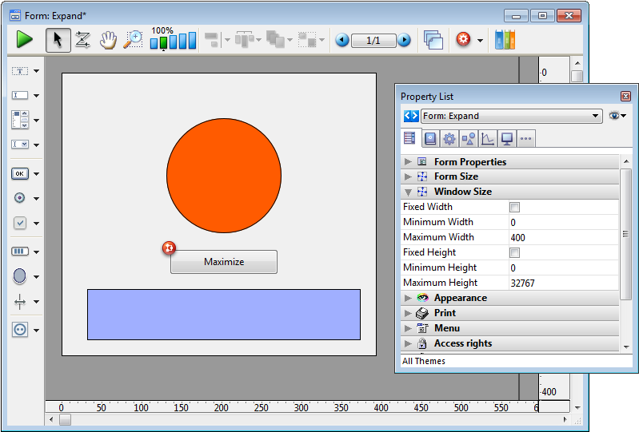
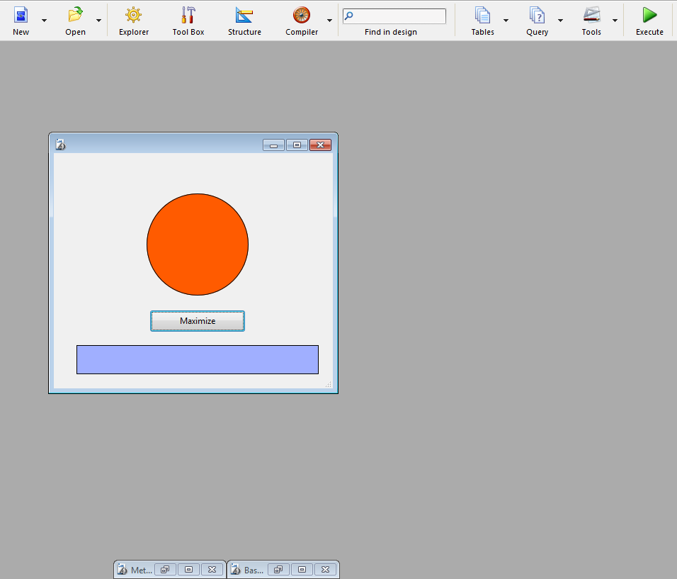

<!--REF #_command_.MAXIMIZE WINDOW.Syntax-->**MAXIMIZE WINDOW** {( *window* )}<!-- END REF-->
<!--REF #_command_.MAXIMIZE WINDOW.Params-->
| 引数 | 型 |  | 説明 |
| --- | --- | --- | --- |
| window | Integer | &#8594;  | ウィンドウ参照番号、または省略時は すべてのカレントプロセス最前面ウィンドウ (Windows) またはカレントプロセスの最前面ウィンドウ (Mac OS) |

<!-- END REF-->

*このコマンドはスレッドセーフではないため、プリエンプティブなコードには使えません。*


#### 説明 

<!--REF #_command_.MAXIMIZE WINDOW.Summary-->MAXIMIZE WINDOW コマンドは、*window*に渡された参照番号のウィンドウを最大化します。<!-- END REF-->この引数が省略されると、同じ効果がカレントプロセスのすべての最前面ウィンドウ (Windows) またはカレントプロセスの最前面ウィンドウ (Mac OS) に適用されます。 

このコマンドは4Dアプリケーションウィンドウのズームボックスをクリックするのと同じ効果があります。 最大化したいウィンドウにはズームボックスがある必要があります。*window* で指定したウィンドウにズームボックスがない場合、コマンドは何もしません。

2回目のクリック、または [MINIMIZE WINDOW](minimize-window.md)の呼び出しは、ウィンドウを最初のサイズへと縮小します。Windowsでは、 [MINIMIZE WINDOW](minimize-window.md) コマンドを引数なしで呼び出した場合、全てのアプリケーションウィンドウを最初のサイズへと縮小します。

*window* で指定されたウィンドウがすでに最大化されている場合、このコマンドは何もしません。

##### Windows 

ウィンドウサイズがアプリケーションウィンドウ (MDI モード) または画面 (SDI モード) と同じサイズまで最大化されます。最大化されたウィンドウは最前面ウィンドウになります。*window* 引数を渡さないと、コマンドはすべてのアプリケーションウィンドウに適用されます。 


  
Windowsのズームボックス

ウィンドウサイズに制約(例えばフォームウィンドウ等)があるウィンドウにコマンドを適用した場合:

* ターゲットとなるサイズが制約と何も干渉しない場合、ウィンドウは"最大化"されます (つまり、MDI モードにおいてはアプリケーションウィンドウ、SDI モードにおいては画面と同じサイズになります。タイトルバーと境界線は表示されず、コントロールボタン(最小化、復元、閉じるなどのボタン)はアプリケーションメニューバーの右側へと移動されます)。
* 少なくとも一つ以上サイズ制約と干渉する場合(例えば、MDIウィンドウの幅が100でフォームウィンドウの最大幅が80に設定されているとき)、ウィンドウは"最大化"はされず、許容されたサイズ内での最大のサイズへと戻ります。このサイズはMDIウィンドウによって、または制約によって定義されています。この方法なら、サイズ制約付きのウィンドウがリサイズされた場合でもインターフェースは一定に保たれます。

##### Mac OS 

ウィンドウのサイズが、その内容に合わせて増やされます。*window* 引数を渡さないと、コマンドはカレントプロセスの最前面ウィンドウに適用されます。 


  
Mac OSのズームボックス

* ズームはウィンドウのコンテンツに基づいて行われます。ですからコマンドはウィンドウの中身が定義済みのコンテキストにおいて(例えばフォームメソッド等で)呼び出される必要があります。それ以外の場合にはコマンドは何もしません。
* ウィンドウはその”最大の”サイズへと設定されます。ウィンドウに、フォームプロパティにてサイズが定義済みの場合、ウィンドウサイズはその定義されたサイズになります。

#### 例題 1 

この例題は、フォームが開かれたときに、そのフォームをフルスクリーンサイズにします。以下のコードをフォームメソッドに置きます:

```4d
  // In the Form method
 
 MAXIMIZE WINDOW
```

#### 例題 2 

ここでは、Windows (MDI モード) においてサイズ制約がどのように扱われるのかを見ていきます。以下のフォームにはサイズ制約(最大幅=400)があります:



ボタンのメソッドには、以下の様なコードがあります:

```4d
 MAXIMIZE WINDOW(Current form window)
```

この場合、以下の様なウィンドウにおいてユーザーがボタンをクリックした場合:



... ウィンドウは"最大化"はされず、高さのみが伸びる結果となります:


#### 参照 

[Is window maximized](is-window-maximized.md)  
[MINIMIZE WINDOW](minimize-window.md)  
[REDUCE RESTORE WINDOW](reduce-restore-window.md)  