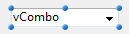

<!--REF #_command_.OBJECT Get data source.Syntax-->**OBJECT Get data source** ( {* ;} *object* ) : Pointer<!-- END REF-->
<!--REF #_command_.OBJECT Get data source.Params-->
| 引数 | 型 |  | 説明 |
| --- | --- | --- | --- |
| * | 演算子 | &#8594;  | 指定時: object はオブジェクト名(文字列)<br/>省略時: object は変数またはフィールド |
| object | any | &#8594;  | オブジェクト名( * 指定時)、または変数やフィールド( * 省略時) |
| 戻り値 | Pointer | &#8592; | オブジェクトのカレントデータソースに対するポインター |

<!-- END REF-->

*このコマンドはスレッドセーフではないため、プリエンプティブなコードには使えません。*


#### 説明 

<!--REF #_command_.OBJECT Get data source.Summary-->**OBJECT Get data source**コマンドは、引数 *object* と *\** で指定したオブジェクトの、カレントのデータソースを返します。<!-- END REF-->

オブジェクトのデータソースはデザインモードのプロパティリストを使用するか、 [OBJECT SET DATA SOURCE](object-set-data-source.md) コマンドを使用することで定義できます。

任意の *\** 演算子を渡した場合、 *object* 引数でオブジェクト名を文字列で指定します。省略時には *object* 引数でフィールドまたは変数を指定します。

#### 例題 

フォーム内に以下の様に定義されたコンボボックスがあるとします:



以下のコードを実行すると:

```4d
 $vPtr :=OBJECT Get data source(*;"vCombo")
  // $vPtr の値は -> vCombo
```

#### 参照 

[OBJECT SET DATA SOURCE](object-set-data-source.md)  