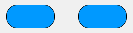

<!--REF #_command_.OBJECT SET CORNER RADIUS.Syntax-->**OBJECT SET CORNER RADIUS** ( {* ;} *object* ; *radius* )<!-- END REF-->
<!--REF #_command_.OBJECT SET CORNER RADIUS.Params-->
| 引数 | 型 |  | 説明 |
| --- | --- | --- | --- |
| * | 演算子 | &#8594;  | 指定時objectはオブジェクト名 (文字列) 省略時objectは変数またはフィールド |
| object | any | &#8594;  | オブジェクト名 (* 指定時)、またはフィールドまたは変数 (* 省略時) |
| radius | Integer | &#8594;  | 丸い角の新しい半径(ピクセル単位) |

<!-- END REF-->

#### 説明 

<!--REF #_command_.OBJECT SET CORNER RADIUS.Summary-->**OBJECT SET CORNER RADIUS** コマンドは、*object* 引数で指定したオブジェクトの角の半径を*radius* 引数で指定した半径に変更します。<!-- END REF-->新しい半径はそのプロセスに対してのみ有効で、フォーム内には保存されません。

このコマンドは以下のオブジェクトに対して使用することができます:

* 四角形
* 入力(4D プロジェクトのみ)
* テキストエリア(4D プロジェクトのみ)

オプションの *\** 引数を渡すと、*object* 引数はオブジェクト名 (文字列) です。この引数を渡さない場合、*object* にはフィールドまたは変数を指定します。この場合、文字列ではなく変数参照を渡してください(フィールドまたは変数オブジェクトのみ)。

*radius* 引数には、オブジェクトの角に対して適用したい新しい半径の値をピクセル単位で渡します。

**注意**: 入力およびテキストエリアオブジェクトに対しては、角の半径プロパティは、境界線スタイルが"なし"、"標準"、"点線" の場合にのみ利用可能です。

*角の半径プロパティ* を使用することで、この値をフォームレベルで変更することができます(*角の半径(四角)* も参照してください)。

#### 例題 1 

フォーム内に、以下の様に"Rect1" と "Rect2" と名付けられた長方形が入っています:


以下のコードを実行することによってその角の半径を変えることができます:

```4d
 OBJECT SET CORNER RADIUS(*;"Rect@";20)
```



#### 例題 2 

フォーム内に、以下のような"required-label" と名前のついたテキスト入力エリアがある場合を考えます:


以下のコードを実行した場合:

```4d
 OBJECT SET CORNER RADIUS(*;"required-label";10)
```


テキストエリア(および入力)に対しては、四角形とは異なり、角の丸み部分は元々のオブジェクトエリアの外側に膨らんで描画されている点に注意してください。

#### 参照 

[OBJECT Get corner radius](object-get-corner-radius.md)  

#### プロパティ
|  |  |
| --- | --- |
| コマンド番号 | 1323 |
| スレッドセーフである | &check; |
| サーバー上での使用は不可 ||


