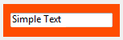

<!--REF #_command_.OBJECT SET RGB COLORS.Syntax-->**OBJECT SET RGB COLORS** ( {* ;} *object* ; *foregroundColor* {; *backgroundColor* {; *altBackgrndColor*}} )<!-- END REF-->
<!--REF #_command_.OBJECT SET RGB COLORS.Params-->
| 引数 | 型 |  | 説明 |
| --- | --- | --- | --- |
| * | 演算子 | &#8594;  | 指定時, Objectはオブジェクト名 (文字列) 省略時, Objectはフィールドまたは変数 |
| object | any | &#8594;  | オブジェクト名 (* 指定時), または フィールドまたは変数 (* 省略時) |
| foregroundColor | Text, Integer | &#8594;  | 前景色のRGBカラー |
| backgroundColor | Text, Integer | &#8594;  | 背景色のRGBカラー |
| altBackgrndColor | Text, Integer | &#8594;  | 奇数行の背景色RGBカラー |

<!-- END REF-->

*このコマンドはスレッドセーフではないため、プリエンプティブなコードには使えません。*


#### 説明 

<!--REF #_command_.OBJECT SET RGB COLORS.Summary-->**OBJECT SET RGB COLORS** コマンドは、引数*object*とオプション引数の *\** によって指定されるオブジェクトの前景色と背景色を変更します。<!-- END REF-->コマンドがリストボックスに対して適用される場合、引数を更に使用して奇数行の背景色を変更することができます。

オプションの *\** 引数を指定した場合、*object*はオブジェクト名です (文字列) 。オプションの \* 引数を省略すると、*object*はフィールドまたは変数です。この場合、文字列ではなくフィールドまたは変数参照 (フィールドまたは変数のみ) を指定します。オブジェクト名に関する詳細は*オブジェクトプロパティ* を参照してください。

オプションの引数*altBackgrndColor*を使用して、奇数行の背景色を設定することができます。この引数は、指定されたオブジェクトがリストボックスまたはリストボックスの列である場合にのみ使用できます。この引数を使用した場合、*backgroundColor*引数は偶数行に対してのみ使用されます。奇数行背景色を使用すると、リストがより読みやすくなります。

*object* がリストボックスオブジェクトを指す場合、奇数行背景色はリストボックス全体に対して使用されます。*object* がリストボックスの任意の列を指す場合、設定した色はその列に対してだけ使用されます。

**カラーの定義**

*foregroundColor*, *backgroundColor*, および *altBackgrndColor* 引数にRGB カラーを渡して指定します。以下のフォーマットがサポートされています:

| **フォーマット名**                 | **型** | **詳細**                                                                                                                                                                                                                                                                                                                                                                          | **例**                                                     |
| --------------------------- | ----- | ------------------------------------------------------------------------------------------------------------------------------------------------------------------------------------------------------------------------------------------------------------------------------------------------------------------------------------------------------------------------------- | --------------------------------------------------------- |
| CSS カラー名                    | テキスト  | 標準のCSS2 カラー名。<br/> 利用可能な名前の一覧は、オンライン上の様々なページで確認することができます。(例: [htmlcolorcodes.com](https://htmlcolorcodes.com/color-names/) など) "transparent" を使用することで、背景に対して透明度を設定することができます(ただし*backgroundColor* および *altBackgrndColor* 引数に対してのみ使用することができます)。 "" (空の文字列)を*foregroundColor* または *backgroundColor* に対して使用することでそれらの変数を変更しないままにします。                                         | "red", "cyan", "lightblue"                                |
| CSS カラー "#rrggbb" シンタックス    | テキスト  | 標準のCSS2 16進数カラーコード: rr = カラーの赤成分 gg = カラーの緑成分 bb = カラーの青成分                                                                                                                                                                                                                                                                                                                      | "#ff0000", "#00FFFF", "#ADD8E6"                           |
| CSS カラー "rgb(r,g,b)" シンタックス | テキスト  | 標準のCSS2 rgb カラーコード: r = カラーの赤成分(0〜255) g = カラーの緑成分(0〜255) b = カラーの青成分(0〜255)                                                                                                                                                                                                                                                                                                    | "rgb(255,255,0)", "rgb(255,0,0)"                          |
| 4-バイトRGB 値                  | 倍長整数  | 4-バイトの倍長整数(フォーマット0x00rrggbb)。16進数の値をとります:<br/> rr = カラーの赤成分 gg = カラーの緑成分 bb = カラーの青成分                                                                                                                                                                                                                                                                                   | 0x00000000, 0x00FF7F7F                                    |
| 4D "system" カラー定数           | 倍長整数  | オブジェクトを自動カラーで描画する際に4Dが使用するカラー。利用可能定数は以下の通り(*SET RGB COLORS* テーマ):<br/> Background color Background color none (*backgroundColor* および *altBackgrndColor* 引数においてのみ使用可能) Dark shadow color Disable highlight item color Foreground color Highlight menu background color Highlight menu text color Highlight text background color Highlight text color Light shadow color | **注:* 自動カラーは、システムに依るとともに、そのカラーが適用されるオブジェクトの種類によっても変わります。* |

#### 例題 1 

以下のフォームには*vsColorValue*と*vsColor*という2つの入力不可変数と*thRed*、*thGreen*、*thBlue*という3つのサーモメータが含まれます。


以下は、これらのオブジェクト用メソッドです:

```4d
  // vsColorValue入力不可オブジェクトメソッド
 Case of
    :(FORM Event=On Load)
       vsColorValue:="0x00000000"
 End case
  // vsColor入力不可変数オブジェクトメソッド
 Case of
    :(FORM Event=On Load)
       vsColor:=""
       OBJECT SET RGB COLORS(vsColor;0x00FFFFFF;0x0000)
 End case
 
  // thRed サーモメーターオブジェクトメソッド
 CLICK IN COLOR THERMOMETER
 
  // thGreen サーモメーターオブジェクトメソッド
 CLICK IN COLOR THERMOMETER
 
  // thBlue サーモメーターオブジェクトメソッド
 CLICK IN COLOR THERMOMETER
```

3つのサーモメータから呼ばれるプロジェクトメソッドは以下のとおり:

```4d
  // CLICK IN COLOR THERMOMETER プロジェクトメソッド
 OBJECT SET RGB COLORS(vsColor;0x00FFFFFF;(thRed<<16)+(thGreen<<8)+thBlue)
 vsColorValue:=String((thRed<<16)+(thGreen<<8)+thBlue;" & x")
 If(thRed=0)
    vsColorValue:=Substring(vsColorValue;1;2)+"0000"+Substring(vsColorValue;3)
 End if
```

サーモメータの値からカラー値を計算するためにを使用しています。

実行されるとフォームは以下のように表示されます:


#### 例題 2 

背景色を透明に、フォントカラーを明るい色に設定する場合:



```4d
 OBJECT SET RGB COLORS(*;"myVar";Light shadow color;Background color none)
```


#### 参照 

[OBJECT GET RGB COLORS](object-get-rgb-colors.md)  
[Select RGB Color](select-rgb-color.md)  