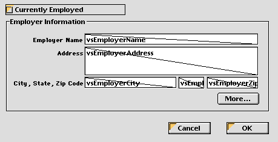
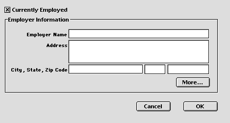
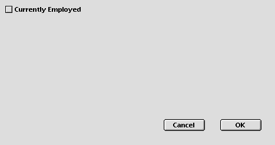

<!--REF #_command_.OBJECT SET VISIBLE.Syntax-->**OBJECT SET VISIBLE** ( {* ;} *object* ; *visible* )<!-- END REF-->
<!--REF #_command_.OBJECT SET VISIBLE.Params-->
| 引数 | 型 |  | 説明 |
| --- | --- | --- | --- |
| * | 演算子 | &rarr; | 指定時, Objectはオブジェクト名 (文字列) 省略時, Objectはフィールドまたは変数 |
| object | any | &rarr; | オブジェクト名 (* 指定時), または フィールドまたは変数 (* 省略時) |
| visible | Boolean | &rarr; | True: 表示, False: 非表示 |

<!-- END REF-->

#### 説明 

<!--REF #_command_.OBJECT SET VISIBLE.Summary-->OBJECT SET VISIBLE コマンドは、*object*によって指定されるオブジェクトを表示、あるいは非表示にします。<!-- END REF--> 

オプションの *\** 引数を指定した場合、*object*はオブジェクト名です (文字列) 。オプションの \* 引数を省略すると、*object*はフィールドまたは変数です。この場合、文字列ではなくフィールドまたは変数参照 (フィールドまたは変数のみ) を指定します。オブジェクト名に関する詳細はを参照してください。

引数*visible*に[True](true.md "True")渡すとオブジェクトが表示されます。引数*visible*に[FALSE](false.md "FALSE")を渡すとオブジェクトが非表示になります。

#### 例題 

以下の図はデザインモードにおける典型的なフォームです:



**Employer Information**グループボックスにあるオブジェクトは、（グループボックスを含めて）どれもオブジェクトの名前に “employer”という文字が入っています。**Currently Employed**チェックボックスをオンにすると、オブジェクトが表示されます。チェックボックスをオフにすると、オブジェクトが表示されなくなります。  
以下は、チェックボックスのオブジェクトメソッドです。

```4d
  // cbCurrentlyEmployed チェックボックスオブジェクトメソッド
 Case of
    :(Form event code=On Load)
       cbCurrentlyEmployed:=1
 
    :(Form event code=On Clicked)
  // "emp"をオブジェクト名に含むオブジェクトを表示/非表示にする
       OBJECT SET VISIBLE(*;"@emp@";cbCurrentlyEmployed#0)
  // チェックボックスは常に表示する
       OBJECT SET VISIBLE(cbCurrentlyEmployed;True)
 End case
```

実行されるとフォームは以下のように表示されます:



または:



#### 参照 

[OBJECT Get visible](object-get-visible.md)  
[OBJECT SET ENTERABLE](object-set-enterable.md)  