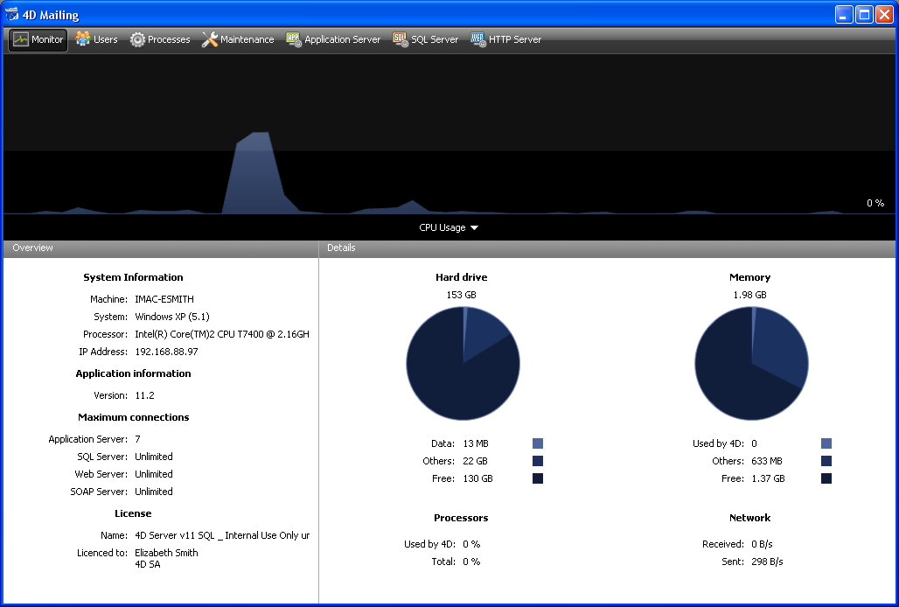

<!--REF #_command_.OPEN ADMINISTRATION WINDOW.Syntax-->**OPEN ADMINISTRATION WINDOW**<!-- END REF-->
<!--REF #_command_.OPEN ADMINISTRATION WINDOW.Params-->
| このコマンドは引数を必要としません |  |
| --- | --- |

<!-- END REF-->

*このコマンドはスレッドセーフではないため、プリエンプティブなコードには使えません。*


#### 説明 

<!--REF #_command_.OPEN ADMINISTRATION WINDOW.Summary-->**OPEN ADMINISTRATION WINDOW**コマンドは、コマンドを実行したマシン上でサーバ管理ウィンドウを開きます。<!-- END REF-->4D Serverの管理ウィンドウで現在のパラメタを表示させたり、さまざまなメンテナンス操作を行ったりできます (4D Server Reference Guide参照)。4D Server のバージョン11から、このウィンドウをクライアントマシン上で表示できるようになりました: 



このコマンドは、4D Serverに接続した4Dアプリケーションまたは4D Serverから呼び出さなければなりません。以下の場合、コマンドは何も行いません: 

* ローカルモードの4Dアプリケーションから呼び出された場合。
* Designer でもAdministrator でもないユーザが実行した場合 (この場合エラー-9991 が生成されます。 *データベースエンジンエラー (-10602 -> 4004)*参照)。

#### 例題 

この例を管理ボタンに割り当てることができます: 

```4d
 If(Application type=4D local mode)
    OPEN SECURITY CENTER
  // ...
 End if
 If(Application type=4D remote mode)
    OPEN ADMINISTRATION WINDOW
  // ...
 End if
 If(Application type=4D Server)
  // ...
    OPEN SECURITY CENTER
 End if
```

#### システム変数およびセット 

コマンドが正しく実行されるとOKシステム変数に1が設定されます。そうでなければ0が設定されます。

#### 参照 

[OPEN SECURITY CENTER](open-security-center.md)  