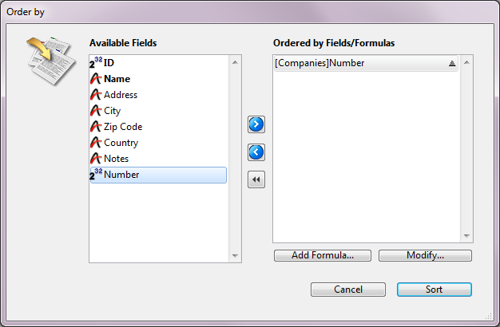

<!--REF #_command_.ORDER BY.Syntax-->**ORDER BY** ( {*aTable* ;}{ *aField* }{; > または < }{; *aField2* ; > または <2 ; ... ; *aFieldN* ; > または <N}{; *} )<!-- END REF-->
<!--REF #_command_.ORDER BY.Params-->
| 引数 | 型 |  | 説明 |
| --- | --- | --- | --- |
| aTable | Table | &#8594;  | セレクションをソートするテーブル, または 省略した場合、デフォルトテーブル |
| aField | Field | &#8594;  | 各レベルのソートするフィールド |
| > または < | 演算子 | &#8594;  | 各レベルのソート方向: >: 昇順, または <: 降順 |
| * | 演算子 | &#8594;  | ソート継続フラグ |

<!-- END REF-->

#### 説明 

<!--REF #_command_.ORDER BY.Summary-->**ORDER BY** は、カレントプロセスの*aTable*のカレントレコードセレクションをソートします。<!-- END REF-->ソートが終了すると、セレクションの先頭レコードがカレントレコードとなります。 

*aTable*引数を省略した場合、コマンドはデフォルトテーブルに適用されます (デフォルトテーブルが事前に設定されていれば)。デフォルトテーブルが設定されていない場合、4Dは引数として渡された最初のフィールドのテーブルを使用します。引数を渡さず、デフォルトテーブルも設定されていない場合、エラーが生成されます。

*aField*、 *\>* または *<*、 *\** 引数を指定しない場合、**ORDER BY** コマンドは*aTable*を対象とした並び替えエディタを表示します:



並び替えエディタの使用に関する詳細は、4D Design Referenceを参照してください。

*aField*引数と*\> または <* 引数を指定した場合、標準のORDER BYエディターは表示されず、並べ替えはプログラムによって定義されます。セレクションは一つのレベルあるいは複数のレベルにおいて並べ替えが可能です。各並べ替えのレベルに対して、*aField* 引数にはフィールドを、*\> または <* 引数には並べ替え順を指定します。"大なり"記号(>)を渡した場合には昇順に、"小なり"記号(<)を渡した場合には降順に並べ替えされます。  
並べ替え順を指定する*\> または <* 引数を省略した場合、デフォルトの並べ替え順は昇順になります。

一つのフィールドだけが指定されていて(並べ替えレベル1)それがインデックス付けがされている場合、そのインデックスは並べ替えに使用されます。そのフィールドがインデックスされていない、あるいは複数のフィールドが指定されている場合、並べ替えはシーケンシャルに実行されます(ただし複合インデックスの場合は除く)。フィールドは並べ替えされる(セレクションの)テーブルか、あるいは引数で指定したテーブルに自動リレーションで関連付けられた1テーブルに所属しているものを指定可能です。  
並べ化されたフィールドが複数インデックスに含まれている場合、**ORDER BY**はそのインデックスを並べ替えに使用します。

複数の並べ替え(複数のフィールドに対する並べ替え)に対しては、必要に応じて**ORDER BY**を何度でも呼び出し任意の *\** 引数を指定することもできますが、最後の**ORDER BY**の呼び出しは除きます。最後の呼び出しは実際の並べ替え操作を開始させるからです。  
**警告:** このシンタックスでは、一度の**ORDER BY**の呼び出しにつき、一つの並べ替えレベル(フィールド)しか渡すことはできません。

どのように定義された並べ替えであっても、実際の並べ替え操作が実行に時間がかかる場合には、4Dは進捗サーモメーターを含めたメッセージを自動的に表示します。これらのメッセージは[MESSAGES ON](messages-on.md) と [MESSAGES OFF](messages-off.md)のコマンドを使用して付けたり消したりすることができます。進捗サーモメーターが表示された場合、ユーザーは停止ボタンを押して並べ替えを中止することができます。

並べ替えが中止されることなく実行された場合、OK変数は*1*に設定されます。ユーザーがキャンセルあるいは中止をクリックした場合、**ORDER BY**は実際には何の並べ替えを実行することなく終了し、OK変数を*0* (ゼロ)に設定します。

##### 

**注:** このコマンドはオブジェクト型フィールドをサポートしません。

#### 例題 1 

以下の例は\[Products\]テーブルを対象とした並び替えエディタを表示します:

```4d
 ORDER BY([Products])
```

#### 例題 2 

以下の例は、デフォルトテーブルを対象とした並び替えエディタを表示します (デフォルトテーブルが設定されていた場合):  

```4d
 ORDER BY
```

#### 例題 3 

以下の例は\[Products\]テーブルのカレントセレクションをnameフィールドで昇順に並べ替えます:

```4d
 ORDER BY([Products];[Products]Name;>)
```

#### 例題 4 

以下の例は\[Products\]テーブルのカレントセレクションをnameフィールドで降順に並べ替えます:

```4d
 ORDER BY([Products];[Products]Name;<)
```

#### 例題 5 

以下の例は\[Products\]テーブルのカレントセレクションをtypeとpriceフィールドで、両レベルとも昇順に並べ替えます:

```4d
 ORDER BY([Products];[Products]Type;>;[Products]Price;>)
```

#### 例題 6 

以下の例は\[Products\]テーブルのカレントセレクションをtypeとpriceフィールドで、両レベルとも降順に並べ替えます:

```4d
 ORDER BY([Products];[Products]Type;<;[Products]Price;<)
```

#### 例題 7 

以下の例は\[Products\]テーブルのカレントセレクションをtypeの昇順およびpriceの降順で並べ替えます:

```4d
 ORDER BY([Products];[Products]Type;>;[Products]Price;<)
```

#### 例題 8 

以下の例は\[Products\]テーブルのカレントセレクションをtypeの降順およびpriceの昇順で並べ替えます:

```4d
 ORDER BY([Products];[Products]Type;<;[Products]Price;>)
```

#### 例題 9 

以下の例は、\[Products\]Nameフィールドにインデックスが設定されている場合は、インデックスソートを実行します: 

```4d
 ORDER BY([Products];[Products]Name;>)
```

#### 例題 10 

以下の例は\[Products\]テーブルをnameフィールドで昇順にソートします: 

```4d
 ORDER BY([Products];[Products]Name)
```

#### 例題 11 

以下の例は、フィールドにインデックスが設定されていてもいなくても、シーケンシャルソートを実行します: 

```4d
 ORDER BY([Products];[Products]type;>;[Products]Price;>)
```

#### 例題 12 

 以下のコードは、リレートフィールドを使用してシーケンシャルソートを実行します:

```4d
 SET FIELD RELATION([Employee]Company_ID;Automatic;Do not modify)
 ORDER BY([Employee];[Company]LastName)
 SET FIELD RELATION([Employee]Company_ID;Structure configuration;Do not modify)
```

#### 例題 13 

データベースに\[Contacts\]LastName + \[Contacts\]FirstNameの複合インデックスが設定されている場合、以下の例題は2レベルのソートをインデックスを使用して行います:

```4d
 ORDER BY([Contacts];[Contacts]LastName;>;[Contacts]FirstName;>)
```

#### 例題 14 

アプリケーションモードで表示される出力フォームで、ユーザが列ヘッダをクリックすると昇順にソートが行われるようにします。

**Shift**キーを押しながら他の縦の列ヘッダをクリックすると、複数レベルでソートが実行されます:


各列ヘッダには、以下のオブジェクトメソッドが記述されたハイライトボタンが置かれています:

```4d
 MULTILEVEL(->[CDs]Title) //Title column header button
```

各ボタンは、列フィールドに対応するポインタを引数に、MULTILEVELプロジェクトメソッドを呼び出します。MULTILEVELプロジェクトメソッドは、以下の通りです:

```4d
  // MULTILEVEL Project Method
  // MULTILEVEL (Pointer)
  // MULTILEVEL (->[テーブル]フィールド)
 
 var $1) //ソートレベル (フィールド : Pointer
 var $lLevelNb : Integer
 
  //ソートレベルを取得
 If(Not(Shift down)) //1レベルのソート
    ARRAY POINTER(aPtrSortField;1)
    aPtrSortField{1}:=$1
 Else
    $lLevelNb:=Find in array(aPtrSortField;$1) //このフィールドは既にソートされているか?
    If($lLevelNb<0) //されていなければ
       INSERT IN ARRAY(aPtrSortField;Size of array(aPtrSortField)+1;1)
       aPtrSortField{Size of array(aPtrSortField)}:=$1
    End if
 End if
  //ソートを実行
 $lLevelNb:=Size of(aPtrSortField)
 If($lLevelNb>0) //最低1つのソートレベルがある
    For($i;1;$lLevelNb)
       ORDER BY([CDs];(aPtrSortField{$i})->;>;*) //ソート定義を構築
    End for
    ORDER BY([CDs]) //* を省略して、実際のソートを実行する
 End if
```

#### 参照 

[ORDER BY FORMULA](order-by-formula.md)  

#### プロパティ
|  |  |
| --- | --- |
| コマンド番号 | 49 |
| スレッドセーフである | &check; |
| システム変数を更新する | OK |
| カレントレコードを変更する ||
| サーバー上での使用は不可 ||


