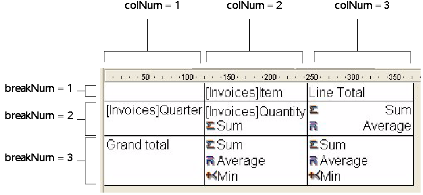

<!--REF #_command_.QR SET TOTALS DATA.Syntax-->**QR SET TOTALS DATA** ( *area* ; *colNum* ; *breakNum* ; operator | value )<!-- END REF-->
<!--REF #_command_.QR SET TOTALS DATA.Params-->
| 引数 | 型 |  | 説明 |
| --- | --- | --- | --- |
| area | Integer | &#8594;  | エリア参照 |
| colNum | Integer | &#8594;  | カラム番号 |
| breakNum | Integer | &#8594;  | ブレーク番号 |
| operator &#124; value | 倍長整数, 文字 | &#8594;  | セルの演算子の値またはセルの内容 |

<!-- END REF-->

*このコマンドはスレッドセーフではないため、プリエンプティブなコードには使えません。*

#### 説明 

<!--REF #_command_.QR SET TOTALS DATA.Summary-->**Note:** このコマンドで小計を作成することはできません。<!-- END REF-->

##### リストモード 

QR SET TOTALS DATA コマンドを使用し、ブレーク (総計または小計) に関する詳細を設定できます。 

*area*にはクイックレポートエリアの参照を渡します。

*colNum*にはデータをセットすセルのカラム番号を渡します。

*breakNum*には、データをセットするブレークの番号 (小計または総計) を渡します。小計の場合、*breaknum*にはソート番号を指定します。総計の場合、*breaknum* には-3または定数*qr grand total*を指定します。

*operator*には、セル内に存在するすべての演算子の和を指定します。テーマの定数を使用して、<operator>を指定することができます:

| 定数                    | 型    | 値  |
| --------------------- | ---- | -- |
| qr average            | 倍長整数 | 2  |
| qr count              | 倍長整数 | 16 |
| qr max                | 倍長整数 | 8  |
| qr min                | 倍長整数 | 4  |
| qr standard deviation | 倍長整数 | 32 |
| qr sum                | 倍長整数 | 1  |
  
  
*operator*が0の場合、演算子は存在しません。 

*value*にはセルに格納するテキストを指定します。

**Note:** *operator*と*value*は相互に排他的な引数です、したがって*operator*または*value*のいずれか一方だけを設定してください。

次の値を渡すことができます:  
\- # …ブレークまたは小計をトリガする値。  
\- ##S …合計に置き換えられます。  
\- ##A …平均に置き換えられます。  
\- ##C …回数に置き換えられます。  
\- ##X …最大値に置き換えられます。  
\- ##N …最小値に置き換えられます。  
\- ##D …標準偏差に置き換えられます。  
\- ##xx …xxにはカラム番号を指定し、その番号のカラムのフォーマットを用いて、カラムの値で置き換えられます。このカラムが存在しない場合、置き換えは実行されません。

##### クロステーブルモード 

QR SET TOTALS DATA コマンドを使用し、特定のセルの詳細を設定することができます。 

*area*にはクイックレポートエリアの参照を渡します。

*colNum*には、データを設定するセルのカラム番号を渡します。

*breakNum*には、データを設定するセルの行番号を渡します。

*operator*には、セル内に存在するすべての演算子の和を指定します。テーマの定数を使用できます (上記参照)。

*value*にはセルに格納するテキストを指定します。

次の図は、クロステーブルモードでカラムとブレーク引数の組み合わせ方について示しています:

##### Supported Types of Data 

サポートされるデータのタイプ:

* タイトル  
タイトルは、引数*value*を用いて渡します。実際のところ*value*には文字列を指定し、次に示すセルに対してのみ渡すことができます。  
*colNum=3 breakNum=1*および*colNum=1* *breakNum=3*
* 演算子  
単独の演算子、または演算子の組み合わせ (上図を参照) は、次のセルに対して渡すことができます:  
*colNum*\=2, *breakNum*\=2  
*colNum*\=3, *breakNum*\=2  
*colNum*\=2, *breakNum*\=3  
これら最後の2つの値は、セル (Column 3; Row 3) に対しても影響を与える点に注意してください。セル (Column 2; Row 3) に集計計算を定義する場合、セル (Column 2; Row 3) の内容は常にセル(Column 3; Row 3) をも定義します。

無効な*area*番号を渡した場合、エラー番号-9850が生成されます。  
無効な*colNum*引数を渡した場合、エラー番号-9852が生成されます。  
無効な*breakNum*引数を渡した場合、エラー番号-9853が生成されます。

#### 参照 

[QR GET TOTALS DATA](qr-get-totals-data.md)  