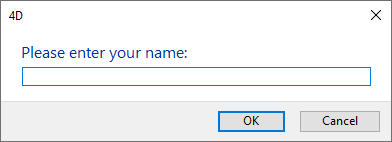
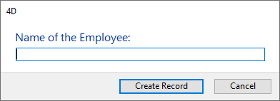
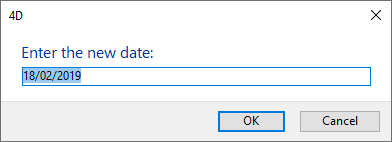

<!--REF #_command_.Request.Syntax-->**Request** ( *message* {; *defaultResponse* {; *OKButtonTitle* {; *CancelButtonTitle*}}} )  -> 戻り値<!-- END REF-->
<!--REF #_command_.Request.Params-->
| 引数 | 型 |  | 説明 |
| --- | --- | --- | --- |
| message | Text | &#8594;  | リクエストダイアログボックスに表示するメッセージ |
| defaultResponse | Text | &#8594;  | テキスト入力エリアにデフォルトで表示するデータ |
| OKButtonTitle | Text | &#8594;  | OKボタンのタイトル |
| CancelButtonTitle | Text | &#8594;  | キャンセルボタンのタイトル |
| 戻り値 | Text | &#8592; | ユーザが入力した値 |

<!-- END REF-->

#### 説明 

<!--REF #_command_.Request.Summary-->**Request**コマンドは、メッセージ、テキスト入力エリア、OKボタン、キャンセルボタンで構成されるリクエストダイアログボックスを表示します。<!-- END REF-->

*message*引数には表示するメッセージを渡します。メッセージが表示エリアに収まりきらない場合 (通常50文字程度ですが、使用される文字種やOS、言語により異なります) は切り取られます。

デフォルトでは、**OK**ボタンのタイトルは“OK”で、**キャンセル**ボタンのタイトルは"キャンセル"です。これらのボタンタイトルを変更するには、オプションの*OKButtonTitle*や*CancelButtonTitle*引数に新しいカスタムボタンタイトルを指定します。必要であれば、渡したカスタムタイトルの幅に応じて、ボタンの幅を左方向にリサイズします。

**OK**ボタンはデフォルトボタンです。ユーザが**OK**ボタンをクリックするか**Enter**キーを押してダイアログを受け入れると、OKシステム変数が1に設定されます。ユーザが**キャンセル**ボタンをクリックしてダイアログをキャンセルすると、OKシステム変数は0に設定されます。

ユーザはテキスト入力エリアにテキストを入力できます。デフォルトの値を指定するには、*defaultResponse*引数にデフォルトのテキストを渡します。ユーザが**OK**をクリックすると**Request**はその文字列を返します。ユーザが**キャンセル**をクリックすると**Request**は空の文字列 ("") を返します。返される値が数値または日付のいずれかでなければならない場合は、**Request**が返した文字列に対して[Num](num.md)や[Date](date.md)を使用して正しいデータタイプに変換します。

**Tip:** フォームあるいはオブジェクトメソッド中で、On Activate や On Deactivateを処理するセクションから**Request**コマンドを呼ばないでください。これは永久ループを引き起こします。

**Tip:** ユーザから複数の情報を得なければならない場合、**Request**ダイアログボックスを何度も表示するのではなく、そのためのフォームを作成して[DIALOG](dialog.md)でそれを表示します。

#### 例題 1 

このコードを実行すると: 

```4d
 $vsPrompt:=Request("Please enter your name:")
```

以下のようなリクエストダイアログボックスを(Windows 環境下において)表示します:



#### 例題 2 

以下のコードを実行すると:

```4d
 vsPrompt:=Request("Name of the Employee:";"";"Create Record";"Cancel")
 If(OK=1)
    ADD RECORD([Employees])
  //注: vsPrompt はフォームメソッドのOn Loadイベントにおいて
  //[Employees]Last name フィールドへとコピーされるものとします
 End if
```

以下のようなリウエストダイアログボックスを(Windows 環境下において)表示します:




#### 例題 3 

以下のコードを実行すると:

```4d
 $vdPrompt:=Date(Request("Enter the new date:";String(Current date)))
```

以下のようなリクエストダイアログボックスを(Windows 環境下において)表示します:




#### 参照 

[ALERT](alert.md)  
[CONFIRM](confirm.md)  