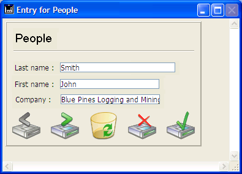
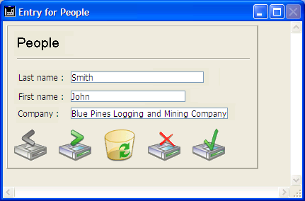

<!--REF #_command_.RESIZE FORM WINDOW.Syntax-->**RESIZE FORM WINDOW** ( *width* ; *height* )<!-- END REF-->
<!--REF #_command_.RESIZE FORM WINDOW.Params-->
| 引数 | 型 |  | 説明 |
| --- | --- | --- | --- |
| width | Integer | &#8594;  | 現在のフォームウィンドウ幅に追加あるいは取り除く ピクセル数 |
| height | Integer | &#8594;  | 現在のフォームウィンドウ高に追加あるいは取り除く ピクセル数 |

<!-- END REF-->

#### 説明 

<!--REF #_command_.RESIZE FORM WINDOW.Summary-->RESIZE FORM WINDOW コマンドはカレントフォームウィンドウのサイズを変更します。<!-- END REF-->

*width* と *height*引数には、現在のウィンドウサイズに追加したいピクセル数を渡します。現在のサイズを変更したくない場合は0を渡します。サイズを小さくするには、*width* と *height* に負数を渡します。 

このコマンドはリサイズボックスを使用した手動によるサイズ変更と同じ効果を生み出します (ウィンドウのタイプがサイズ変更を許可する場合)。結果、コマンドはフォームプロパティで定義されたサイズの制限やサイズ変更のオブジェクトプロパティを考慮します。例えばフォームが許可するサイズよりも大きなサイズにウィンドウをリサイズしようとした場合、コマンドの効果はありません。 

このコマンドの動作は[SET WINDOW RECT](set-window-rect.md "SET WINDOW RECT") コマンドの動作と異なることに注意してください。[SET WINDOW RECT](set-window-rect.md "SET WINDOW RECT") コマンドはウィンドウのリサイズ時にフォームのプロパティやコンテンツを考慮に入れません。またこのコマンドはフォームサイズを変更する必要がないことにも留意してください。フォームのサイズをプログラムで変更するには[FORM SET SIZE](form-set-size.md "FORM SET SIZE") コマンドを参照してください。

#### 例題 

以下のウィンドウがあります (フィールドとフレームに水平方向に拡大のプロパティが設定されています):



以下の行を実行すると:

```4d
 RESIZE FORM WINDOW(25;0)
```

ウィンドウは以下のように表示されます:



#### 参照 

[FORM GET PROPERTIES](form-get-properties.md)  
[FORM SET SIZE](form-set-size.md)  
[SET WINDOW RECT](set-window-rect.md)  

#### プロパティ
|  |  |
| --- | --- |
| コマンド番号 | 890 |
| スレッドセーフである | &check; |
| サーバー上での使用は不可 ||


