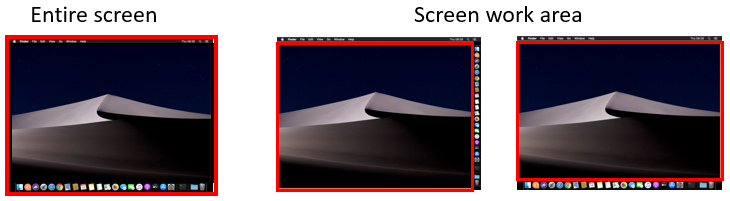

<!--REF #_command_.SCREEN COORDINATES.Syntax-->**SCREEN COORDINATES** ( *left* ; *top* ; *right* ; *bottom* {; *screen* {; *screenArea*}} )<!-- END REF-->
<!--REF #_command_.SCREEN COORDINATES.Params-->
| 引数 | 型 |  | 説明 |
| --- | --- | --- | --- |
| left | Integer | &#8592; | 画面エリアの左端のグローバル座標 |
| top | Integer | &#8592; | 画面エリアの上端のグローバル座標 |
| right | Integer | &#8592; | 画面エリアの右端のグローバル座標 |
| bottom | Integer | &#8592; | 画面エリアの下端のグローバル座標 |
| screen | Integer | &#8594;  | 画面番号、または省略した場合には主画面(メインスクリーン) |
| screenArea | Integer | &#8594;  | 画面全体(デフォルト)または利用可能エリア |

<!-- END REF-->

#### 説明 

<!--REF #_command_.SCREEN COORDINATES.Summary-->SCREEN COORDINATES コマンドは、*screenID* に指定した画面のグローバル座標を引数*left*、*top*、*right*と*bottom*に返します。<!-- END REF-->

引数*screenID* を省略した場合、このコマンドは主画面(メインスクリーン) の座標を返します。

任意の*screenArea* 引数を使用すると、画面エリア全体の座標が欲しい(デフォルト)か、利用可能なエリアの座標のみが欲しいのかを指定することができます。2つのセレクターから選択することができます:

| 定数               | 値 | コメント                                                       |
| ---------------- | - | ---------------------------------------------------------- |
| Screen size      | 0 | 画面全体の座標(デフォルト値)                                            |
| Screen work area | 1 | 利用可能な画面エリア(つまりWindowsのタスクバーまたはmacOS のメニューバーとDockを除いた部分)の座標 |

以下の画像は、画面エリア全体と、利用可能なエリアの違いを表しています:

 

**注**:

* タスクバーまたはDockが自動的に非表示する設定になっていた場合、**SCREEN COORDINATES** は常に画面絵エリア全体の座標を返します。
* *screenID* または *screenArea* 引数に無効な値を渡した場合、全ての座標に対してゼロが返されます。

#### 参照 

[Count screens](count-screens.md)  
[Menu bar screen](menu-bar-screen.md)  
[SCREEN DEPTH](screen-depth.md)  

#### プロパティ
|  |  |
| --- | --- |
| コマンド番号 | 438 |
| スレッドセーフである | &check; |
| サーバー上での使用は不可 ||

