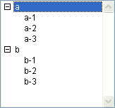

<!--REF #_command_.SELECT LIST ITEMS BY POSITION.Syntax-->**SELECT LIST ITEMS BY POSITION** ( {* ;} *list* ; *itemPos* {; *positionsArray*} )<!-- END REF-->
<!--REF #_command_.SELECT LIST ITEMS BY POSITION.Params-->
| 引数 | 型 |  | 説明 |
| --- | --- | --- | --- |
| * | 演算子 | &srarr; | 指定時, listはオブジェクト名 (文字列) 省略時, listはリスト参照番号 |
| list | Integer, Text | &srarr; | リスト参照番号 (* 省略時), または リストオブジェクト名 (* 指定時) |
| itemPos | Integer | &srarr; | 展開/折りたたまれたリスト中の項目位置 |
| positionsArray | Integer array | &srarr; | 展開/折りたたまれたリスト中の項目位置配列 |

<!-- END REF-->

#### 説明 

<!--REF #_command_.SELECT LIST ITEMS BY POSITION.Summary-->SELECT LIST ITEMS BY POSITION コマンドは、*list*に渡された参照番号のリストにおいて、*itemPos*ならびにオプションとして*positionsArray*に渡された位置にある項目を選択します。<!-- END REF-->

オプションの第一引数 *\** を渡すと、*list* 引数はフォーム上のリストオブジェクトに対応するオブジェクト名 (文字列) です。この引数を渡さない場合、*list* 引数は階層リスト参照 ([ListRef](# "階層リストへの参照")) です。リストオブジェクトを一つしか使わない場合、両方のシンタックスを使用できます。他方フォーム上に同じ階層リストを参照する複数のオブジェクトがある場合、それぞれのオブジェクトが個別に展開/折りたたみ状態をもつので、オブジェクト名に基づくシンタックスを使用しなければなりません。

**Note:** オブジェクト名に @ 文字を使用することで、名前に対応するオブジェクトが複数検索された場合、SELECT LIST ITEMS BY POSITION コマンドは最初に見つけたオブジェクトを処理の対象とします。

項目の位置は常に、リストとそのサブリストの展開や折りたたみの現在の状態を使用して表わされます。位置の値として、1から[Count list items](count-list-items.md "Count list items")によって返される値までの数値を渡します。この範囲外の値を渡すと、項目は選択されません。

引数*positionsArray*を渡さない場合、引数*itemPos*は選択する項目の位置を示します。

オプションの引数*positionsArray*を使用すると、*list*内の複数の項目を同時に選択することができます。*positionsArray*には必ず配列を渡し、その各要素は選択する項目の位置を示します。  
この引数を渡すと、*itemPos*引数に指定した項目が、選択された項目中そのリストの新しいカレント項目になります。この項目は、配列で定義した一連の項目に含まれていない可能性もあります。カレント項目とは、具体的に言うと、[EDIT ITEM](edit-item.md "EDIT ITEM")コマンドを使用した場合に編集モードに移行される項目のことです。

**Note:** 階層リスト内で複数のリスト項目を同時に選択するには（手動、あるいはプログラムから）、そのリストに対して複数選択可プロパティを有効に設定しておかなくてはなりません。このプロパティの設定は、[SET LIST PROPERTIES](set-list-properties.md "SET LIST PROPERTIES")コマンドを使用して行います。

#### 例題 

アプリケーションモードで以下のように表示される階層リスト*hList*があります:



以下のコードを実行すると: 

```4d
 SELECT LIST ITEMS BY POSITION(hList;Count list items(hList))
```

表示されているリスト項目の最後の項目が選択されます:


以下のコードを実行すると: 

```4d
 SET LIST PROPERTIES(hList;0;0;18;0;1)
  //It is imperative to pass 1 as the last parameter in order to allow multiple selections
 ARRAY LONGINT($arr;3)
 $arr{1}:=2
 $arr{2}:=3
 $arr{3}:=5
 SELECT LIST ITEMS BY POSITION(hList;3;$arr)
  //The 3rd item is designated as the current item
```

.. 2,3,5番目の項目が選択されます: 


#### 参照 

[EDIT ITEM](edit-item.md)  
[SELECT LIST ITEMS BY REFERENCE](select-list-items-by-reference.md)  
[Selected list items](selected-list-items.md)  