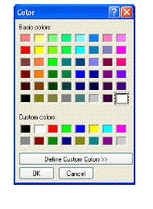

<!--REF #_command_.Select RGB Color.Syntax-->**Select RGB Color** {( *defaultColor* {; *message*} )} -> 戻り値<!-- END REF-->
<!--REF #_command_.Select RGB Color.Params-->
| 引数 | 型 |  | 説明 |
| --- | --- | --- | --- |
| defaultColor | 倍長整数 | &#x1F852; | 事前に選択されたRGBカラー |
| message | 文字 | &#x1F852; | 選択ウィンドウのタイトル |
| 戻り値 | 倍長整数 | &#x1F850; | RGBカラー |

<!-- END REF-->

#### 説明 

<!--REF #_command_.Select RGB Color.Summary-->**Select RGB Color**コマンドはシステムカラー選択ウィンドウを表示し、ユーザによって選択された色のRGB値を返します。<!-- END REF-->

システムカラー選択ウィンドウは以下のように表示されます。

| **Macintosh**                                | **Windows**                                 |
| -------------------------------------------- | ------------------------------------------- |
|  |  |

オプションの引数*defaultColor* を使用して、色を事前に選択できます。例えばこの引数を使用して、ユーザーが最後に設定した色をデフォルトで復元することができます。RGBのフォーマットカラーの値をこの引数に渡します ([OBJECT SET RGB COLORS](object-set-rgb-colors.md)コマンドの説明参照)。*SET RGB COLORS*テーマにある定数の一つを使用できます。  
引数*defaultColor*を省略したり0を渡すと、ダイアログボックスが開いたときに黒色が選択されます。

オプションの引数*message*を使用して、システムウィンドウのタイトルをカスタマイズできます。この引数が省略されると、タイトル"カラー" がデフォルトで表示されます。

このダイアログボックスを受け入れた後の動作はプラットフォームにより異なります:

* Windowsではユーザーが**OK**をクリックすると、コマンドから選択された色がRGBフォーマットで返され、OKシステム変数が1に設定されます。ユーザーがダイアログボックスをキャンセルするとコマンドは-1を返し、システム変数OKに0が設定されます。
* Mac OSではクローズボックスをクリックするか**Esc**キーを押してダイアログボックスを閉じます。ダイアログ内でのユーザーの操作に関わらず、いずれの場合もシステム変数OKは1に設定されます。コマンドは選択された色をRGBフォーマットで返します。ユーザーがカラーを選択しなかった場合、返される値は*defaultColor*が渡されていればその値、渡されていなければ0です。

**注:** サーバーマシンまたはWebプロセス内では、このコマンドを使用しないでください。

#### 参照 

[OBJECT SET RGB COLORS](object-set-rgb-colors.md)  