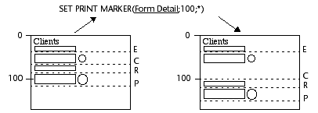
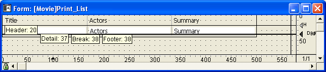
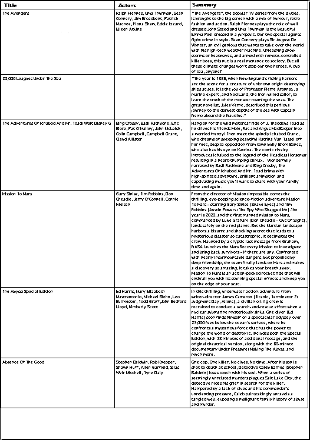

<!--REF #_command_.SET PRINT MARKER.Syntax-->**SET PRINT MARKER** ( *markNum* ; *position* {; *} )<!-- END REF-->
<!--REF #_command_.SET PRINT MARKER.Params-->
| 引数 | 型 |  | 説明 |
| --- | --- | --- | --- |
| markNum | Integer | &#8594;  | マーカ番号 |
| position | Integer | &#8594;  | マーカの新しい位置 |
| * | 演算子 | &#8594;  | 指定時 = 後続のマーカを移動する 省略時 = 後続のマーカを移動しない |

<!-- END REF-->

#### 説明 

<!--REF #_command_.SET PRINT MARKER.Summary-->SET PRINT MARKER コマンドを使用し、印刷時にマーカ位置を指定することができます。<!-- END REF-->このコマンドを[Get print marker](get-print-marker.md "Get print marker")、[OBJECT MOVE](object-move.md "OBJECT MOVE")、[Print form](../commands/print-form.md "Print form")コマンドと組み合わせて使用することにより、印刷エリアのサイズを調節することができます。

SET PRINT MARKERは次の2つの状況において使用可能です:

* [PRINT SELECTION](print-selection.md "PRINT SELECTION")および[PRINT RECORD](print-record.md "PRINT RECORD")コマンドのコンテキストでのOn headerフォームイベント中。
* [Print form](../commands/print-form.md "Print form")コマンドのコンテキストでのOn Printing Detailフォームイベント中。この処理はカスタマイズされたレポートの印刷を容易にします (例を参照)。

コマンドの有効範囲は印刷に限定され、画面上には変更が表示されません。フォームに対して行った変更は保存されません。

*markNum*引数には、テーマ内の定数のいずれかを渡します:

| 定数            | 型    | 値   |
| ------------- | ---- | --- |
| Form break0   | 倍長整数 | 300 |
| Form break1   | 倍長整数 | 301 |
| Form break2   | 倍長整数 | 302 |
| Form break3   | 倍長整数 | 303 |
| Form break4   | 倍長整数 | 304 |
| Form break5   | 倍長整数 | 305 |
| Form break6   | 倍長整数 | 306 |
| Form break7   | 倍長整数 | 307 |
| Form break8   | 倍長整数 | 308 |
| Form break9   | 倍長整数 | 309 |
| Form detail   | 倍長整数 | 0   |
| Form footer   | 倍長整数 | 100 |
| Form header   | 倍長整数 | 200 |
| Form header1  | 倍長整数 | 201 |
| Form header10 | 倍長整数 | 210 |
| Form header2  | 倍長整数 | 202 |
| Form header3  | 倍長整数 | 203 |
| Form header4  | 倍長整数 | 204 |
| Form header5  | 倍長整数 | 205 |
| Form header6  | 倍長整数 | 206 |
| Form header7  | 倍長整数 | 207 |
| Form header8  | 倍長整数 | 208 |
| Form header9  | 倍長整数 | 209 |

*position*には、新しい位置をピクセル単位で渡します。

オプション引数 *\** を渡すと、このコマンドの実行時に、*markNum*で指定したマーカより下側に位置するすべてのマーカが、指定したマーカと同じピクセル数だけ、同じ方向へ移動します。

**警告:** このマーカより下側にあるエリア内のオブジェクトもすべて移動します。  
引数 \* を使用すると、後続の各マーカの最初の位置より下側に*markNum*で指定したマーカを配置することができます。これら後続のマーカも同時に移動します。



**Notes:**

* このコマンドで変更できるのは、既存のマーカ位置だけです。マーカを追加することはできません。フォームに存在しないマーカを指定した場合、コマンドは何も行いません。
* デザインモードにおける印刷用マーカの仕組みは変わりません。つまり、あるマーカは、それより上にあるマーカを飛び越えて移動したり、後続のマーカよりも下側に移動することはできません（引数 *\** を使用しない場合）。

#### 例題 

この例は、3つのカラムがあるレポートを作成します。各行の高さは、フィールド内容に応じて実行中に計算されます。  
印刷に使用する出力フォームは次の通りです:



このフォームに対してOn Printing Detailフォームイベントが選択されています（印刷されるエリアに関係なく、[Print form](../commands/print-form.md "Print form") コマンドはこのタイプのフォームイベントだけを生成する点に留意してください）。  
レコードごとに、(多くの内容を保持する) “Actors”または“Summary”カラムの内容に応じて行の高さを調整しなくてはなりません。目的とする結果を次に示します:



印刷用のプロジェクトメソッドは次の通りです:

```4d
 var vLprint_height;$vLheight;vLprinted_height : Integer
 C_STRING(31;vSprint_area)
 PAGE SETUP([Film];"Print_List3")
 GET PRINTABLE AREA(vLprint_height)
 vLprinted_height:=0
 ALL RECORDS([Film])
 
 vSprint_area:="Header" //ヘッダエリアの印刷
 $vLheight:=Print form([Film];"Print_List3";Form header)
 $vLheight:=21 //固定高
 vLprinted_height:=vLprinted_height+$vLheight
 
 While(Not(End selection([Film])))
    vSprint_area:="Detail" //詳細エリアの印刷
    $vLheight:=Print form([Film];"Print_List3";Form detail)
  //詳細の計算はフォームメソッドで実行
    vLprinted_height:=vLprinted_height+$vLheight
    If(OK=0) //CANCEL がフォームメソッドで実行された
       PAGE BREAK
       vLprinted_height:=0
       vSprint_area:="Header" //ヘッダエリアの再印刷
       $vLheight:=Print form([Film];"Print_List3";Form header)
       $vLheight:=21
       vLprinted_height:=vLprinted_height+$vLheight
       vSprint_area:="Detail"
       $vLheight:=Print form([Film];"Print_List3";Form detail)
       vLprinted_height:=vLprinted_height+$vLheight
    End if
    NEXT RECORD([Film])
 End while
 PAGE BREAK //最後のページの印刷
```

Print\_List3のフォームメソッド:

```4d
 var $l;$t;$r;$b;$fixed_wdth;$exact_hght;$l1;$t1;$r1;$b1 : Integer
 var $final_pos;$i : Integer
 var $detail_pos;$header_pos;$hght_to_print;$hght_remaining : Integer
 
 Case of
    :(vSprint_area="Detail") //詳細印刷実行中
       OBJECT GET COORDINATES([Film]Actors;$l;$t;$r;$b)
       $fixed_wdth:=$r-$l  // Actors テキストフィールドサイズの計算
       $exact_hght:=$b-$t
       OBJECT GET BEST SIZE([Film]Actors;$wdth;$hght;$fixed_wdth)
  //内容に基づく最適なフィールドのサイズ
       $movement:=$hght-$exact_hght
 
       OBJECT GET COORDINATES([Film]Summary;$l1;$t1;$r1;$b1)
       $fixed_wdth1:=$r1-$l1  //Summaryテキストフィールドサイズの計算
       $exact_hght1:=$b1-$t1
       OBJECT GET BEST SIZE([Film]Summary;$wdth1;$hght1;$fixed_wdth1)
  //内容に基づく最適なフィールドのサイズ
       $movement1:=$hght1-$exact_hght1
       If($movement1>$movement)
  //最も高いフィールドの取得
          $movement:=$movement1
       End if
 
       If($movement>0)
          $position:=Get print marker(Form detail)
          $final_pos:=$position+$movement
  //詳細マーカとそれより下のオブジェクトを移動
          SET PRINT MARKER(Form detail;$final_pos;*)
  //テキストエリアのサイズ変更
          OBJECT MOVE([Film]Actors;$l;$t;$r;$hght+$t;*)
          OBJECT MOVE([Film]Summary;$l1;$t1;$r1;$hght1+$t1;*)
 
  //分離線のリサイズ
          OBJECT GET COORDINATES(*;"H1Line";$l;$t;$r;$b)
          OBJECT MOVE(*;"H1Line";$l;$final_pos-1;$r;$final_pos;*)
          For($i;1;4;1)
             OBJECT GET COORDINATES(*;"VLine"+String($i);$l;$t;$r;$b)
             OBJECT MOVE(*;"VLine"+String($i);$l;$t;$r;$final_pos;*)
          End for
       End if
 
  //利用可能なスペースの計算
       $detail_pos:=Get print marker(Form detail)
       $header_pos:=Get print marker(Form header)
       $hght_to_print:=$detail_pos-$header_pos
       $hght_remaining:=vLprint_height-vLprinted_height
       If($hght_remaining<$hght_to_print) //Insufficient height
          CANCEL //次のページに移動
       End if
 End case
```

#### 参照 

[Get print marker](get-print-marker.md)  
[OBJECT GET BEST SIZE](object-get-best-size.md)  
[OBJECT GET COORDINATES](object-get-coordinates.md)  
[OBJECT MOVE](object-move.md)  
[PAGE BREAK](page-break.md)  
[Print form](../commands/print-form.md)  
[PRINT RECORD](print-record.md)  
[PRINT SELECTION](print-selection.md)  

#### プロパティ
|  |  |
| --- | --- |
| コマンド番号 | 709 |
| スレッドセーフである | &check; |
| サーバー上での使用は不可 ||


