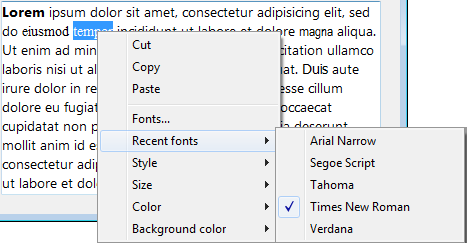

<!--REF #_command_.SET RECENT FONTS.Syntax-->**SET RECENT FONTS** ( *fontsArray* )<!-- END REF-->
<!--REF #_command_.SET RECENT FONTS.Params-->
| 引数 | 型 |  | 説明 |
| --- | --- | --- | --- |
| fontsArray | Text array | &#8594;  | フォント名の配列 |

<!-- END REF-->

*このコマンドはスレッドセーフではないため、プリエンプティブなコードには使えません。*


#### 説明 

<!--REF #_command_.SET RECENT FONTS.Summary-->**SET RECENT FONTS**コマンドは、コンテキストメニュー内の"最近使用したフォント"の中に表示されるフォントの一覧を変更します。<!-- END REF--> 

このメニューはセッション中に最近選択されたフォントの名前を表示します。これは特に *プログラミングに関する注意* エリアの中で使用されます。

#### 例題 

最近使用したフォントの中にフォントを追加したい場合を考えます。


以下のコードを実行します。

```4d
 ARRAY TEXT($arrRecent;0)
 FONT LIST($arrRecent;2)
 APPEND TO ARRAY($arrRecent;"Segoe Script")
 APPEND TO ARRAY($arrRecent)
```

メニューの中身は以下の様になります。



#### 参照 

[FONT LIST](font-list.md)  