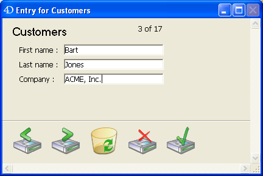
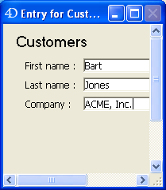

<!--REF #_command_.SET WINDOW RECT.Syntax-->**SET WINDOW RECT** ( *left* ; *top* ; *right* ; *bottom* {; *window*}{; *} )<!-- END REF-->
<!--REF #_command_.SET WINDOW RECT.Params-->
| 引数 | 型 |  | 説明 |
| --- | --- | --- | --- |
| left | Integer | &#8594;  | ウィンドウ内容領域のグローバル左座標 |
| top | Integer | &#8594;  | ウィンドウ内容領域のグローバル上座標 |
| right | Integer | &#8594;  | ウィンドウ内容領域のグローバル右座標 |
| bottom | Integer | &#8594;  | ウィンドウ内容領域のグローバル下座標 |
| window | Integer | &#8594;  | ウィンドウ参照番号, または省略時カレントプロセスの最前面ウィンドウ |
| * | 演算子 | &#8594;  | 省略時 (デフォルト) = ウィンドウを最前面にする指定時 = ウィンドウの並びレベルを変更しない |

<!-- END REF-->

#### 説明 

<!--REF #_command_.SET WINDOW RECT.Summary-->**SET WINDOW RECT**コマンドは*window*に渡した参照番号のウィンドウのグローバル座標を変更します。<!-- END REF-->ウィンドウが存在しない場合、コマンドはなにも行いません。

*window* 引数を省略すると、**SET WINDOW RECT**はカレントプロセスの最前面ウィンドウに適用されます。

このコマンドは、渡された新座標に基づき、ウィンドウをリサイズして移動します。

座標は、アプリケーションウィンドウのコンテンツエリア(MDI モードのWindows) またはメインスクリーン(macOS とSDI モードのWindows) の左上隅に対する相対座標で表します。座標はウィンドウの内容領域に対応する四角を表します (タイトルバーと枠線を除く)。

**警告:** このコマンドを使用すると、ウィンドウをメインウィンドウ (Windows) やスクリーン (Macintosh) の外に動かすことができてしまうことに注意してください。これを避けるには[Screen width](screen-width.md)や[Screen height](screen-height.md)などのコマンドを使用してウィンドウの新しい座標を検証します。

このコマンドを実行するとデフォルトで自動的に、*window* 引数で指定されたウィンドウが最前面に移動されます (*window*引数が使用されている場合)。最後の引数として *\** を渡すとこの動作を無効にできます。この場合コマンドはウィンドウの元の順番 (z座標) を変更しません。

このコマンドはフォームオブジェクトには影響しません。ウィンドウに表示されているフォーム中のフォームオブジェクトは、 (プロパティ設定にかかわらず) このコマンドにより移動やリサイズはされません。ウィンドウのみが更新されます。オブジェクトのリサイズプロパティを考慮に入れたフォームウィンドウのサイズ変更を行うには[RESIZE FORM WINDOW](resize-form-window.md)コマンドを使用します。

#### 例題 1 

[WINDOW LIST](window-list.md)コマンドの例題参照

#### 例題 2 

以下のウィンドウがあるとき:



以下のコードを実行すると:

```4d
 SET WINDOW RECT(100;100;300;300)
```

以下のように表示されます:



#### 参照 

[CONVERT COORDINATES](convert-coordinates.md)  
[DRAG WINDOW](drag-window.md)  
[GET WINDOW RECT](get-window-rect.md)  
[RESIZE FORM WINDOW](resize-form-window.md)  

#### プロパティ
|  |  |
| --- | --- |
| コマンド番号 | 444 |
| スレッドセーフである | &check; |
| サーバー上での使用は不可 ||


