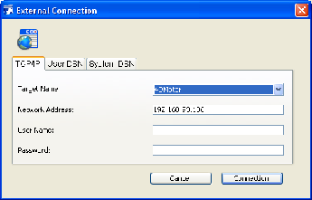

<!--REF #_command_.SQL LOGIN.Syntax-->**SQL LOGIN** {( *dataEntry* ; *userName* ; *password* ; * )}<!-- END REF-->
<!--REF #_command_.SQL LOGIN.Params-->
| 引数 | 型 |  | 説明 |
| --- | --- | --- | --- |
| dataEntry | Text | &#8594;  | 外部データベース名、または<br/>外部データソースのIPアドレス、または<br/>ODBCマネジャーのデータソース名、または<br/>""で選択ダイアログボックスの表示 |
| userName | Text | &#8594;  | データソースに登録されているユーザー名 |
| password | Text | &#8594;  | データソースに登録されているパスワード |
| * | 演算子 | &#8594;  | Begin SQL/End SQLへ適用される 省略した場合、適用しない(ローカルデータベース)、 渡す場合、適用する |

<!-- END REF-->

#### 説明 

<!--REF #_command_.SQL LOGIN.Summary-->**SQL LOGIN**コマンドを使用すると、*dataEntry*引数で指定されたSQLデータソースへ接続することができます。<!-- END REF-->このコマンドは、カレントプロセスでこのコマンドの後に実行される以下のSQLクエリの対象を指定します:

* [SQL EXECUTE](sql-execute.md)コマンド経由
* Begin SQL / End SQLタグ内に記述されているコード経由 (\* 引数が渡された場合)

SQLデータソースは次のいずれかです:

* 直接アクセスする外部4D Serverデータベース
* 外部ODBCソース
* ローカル4Dデータベース (内部データベース)

*dataEntry*には次の値のいずれかを渡します: IPアドレス、4Dデータベース公開名、ODBCデータソース名、空の文字列、またはSQL\_INTERNAL定数。

* **IPアドレス**  
シンタックス: **IP:<IPAddress>{:<TCPPort>}{:ssl}**  
SQLクライアントは指定されたIPアドレスのコンピュータ上で実行される4D Serverデータベースに直接接続します。対象のコンピュータ上ではSQLサーバーが起動していなければなりません。TCPポートの数値を渡さない場合、デフォルトのポート (19812) が使用されます。SQLサーバー側でSQL公開ポートが変更されている場合、IPアドレスの後にポート番号を指定しなければなりません。SQLサーバー側では、データベース設定の "SQL" ページで、SQLサーバー用のTCPポート番号を変更できます。  
例4と5を参照してください。  
接続先のSQLサーバーでTLSが有効にされている場合 (データベース設定で設定可能)、サーバーで正しくリクエストを処理するために、IPアドレスとTCPポート番号(使用する際には必須)の後にポート番号および":ssl"キーワードを追加しなければなりません (例題6参照)。
* **4Dデータベース公開名**  
シンタックス: **4D:<Publication\_Name>**  
コマンドは、ネットワーク上で指定された名前に対応する公開名の4D Serverのデータベースに直接接続します。データベースのネットワーク上の公開名は、データベース設定の"Client-Server" ページで設定されています。  
例7を参照してください。  
**Note:** 接続する (4Dデータベースを公開する) 4D SQLサーバのTCPポート番号と、4DアプリケーションのSQLサーバ用のTCPポート番号は一致しなければなりません。
* **有効なODBCデータソース名**  
シンタックス: **ODBC:<My\_DSN>** または **<My\_DSN>**  
*dataEntry*引数に、ODBC Driverマネージャで設定したデータソースの名前を渡します。  
**Notes:**  
   * 4Dの以前のバージョンとの互換性のため、接頭辞"ODBC:" を省略することも可能ですが、コードの読みやすさの理由から、接頭辞を使用することをお勧めします。例2を参照してください。  
   * Windows環境下では、データソース名は大文字・小文字を区別します。例えば、データソースが"4D\_v16"と定義されていた場合、"4D\_V16"という値を渡しても失敗します。  
   * WindowsとMac環境下では、接頭辞"ODBC:"は大文字で入力しなければなりません。"odbc:"を渡した場合、接続は失敗します。
* **空の文字列**  
シンタックス: **""**  
コマンドは接続ダイアログボックスを表示します。接続するデータソースは手動で入力できます。  
    
  
    
このダイアログボックスには複数のページがあります。TCP/IPページには次の要素があります。  
    
   * **ターゲット名**: このメニューは2つのリストから構成されています。  
         * 直接接続で最近開いたデータベースのリスト。このリストを更新するメカニズムは、4Dアプリケーションと同じです。ただし4DLinkファイルを格納するフォルダは"Favorites vXX"ではなく"Favorites SQL vXX" という名前です。  
         * SQLサーバが開始されていて、そのSQL公開ポート番号が一致する4D Serverアプリケーションのリスト。このリストは、*dataEntry*引数を渡さずに**SQL LOGIN**コマンドを新たに呼び出す度に更新されます。データベースの名前の前に"^" 記号が付いている場合、安全なSSLモードを通して接続が行われたことを意味します。  
   * **ネットワークアドレス**: このエリアはターゲット名で選択したデータベースのアドレスと、必要ならTCPポート番号を表示します。このエリアにIPアドレスを入力して接続ボタ ンを押して、対象の4D Serverデータベースに続することもできます。IPアドレスの後ろにコロン (:)を置いて、TCPポート番号を指定することも可能です。アドレスの後ろにコロン(:) を付けてポートの数値を入力します。例: 192.168.93.105:19855  
   * **ユーザ名**と**パスワード**: これらのエリアを使用して、接続認証情報を入力します。  
   * **ユーザDSN**と**システムDSN** ページは、コンピュータのODBC Driverマネージャで指定されているシステムおよびユーザODBCデータソースのリストそれぞれ表示します。これらのページでデータソースを選択したり、認証情報を入力したりして、外部ODBCデータソースに接続できます。  
    
接続が確立されると、OKシステム変数が1に設定されます。そうでなければ0に設定され、エラーが生成されます。[ON ERR CALL](on-err-call.md)コマンドでインストールされているエラー処理メソッドでこのエラーをとらえることができます。
* **SQL\_INTERNAL定数**  
シンタックス: SQL\_INTERNAL  
コマンドは、続くSQLクエリを内部4Dデータベースに転送します。
**警告:** *dataEntry* 引数で使用される接頭辞 (IP, ODBC, 4D) は大文字でなければなりません。  
  
*userName*には、外部データソースへの接続が許可されたユーザの名前を渡します。例えば、Oracle(R)では、ユーザ名は“Scott”かもしれません。

*password*には、外部データソースへの接続が許可されたユーザのパスワードを渡します。例えば、 Oracle(R)では、パスワードは“tiger”かもしれません。

**Note:** 直接接続の場合、*userName*と*password*引数に空の文字列を渡すと、4Dのパスワードシステムが対象データベースで有効になっていない場合のみ接続が受け入れられます。そうでなければ接続は拒否されます。

オプションの *\** 引数を使用して、Begin SQL / End SQL タグ内で実行されるSQLコードのターゲットを変更できます。この引数を渡さない場合、Begin SQL / End SQLタグ内に設定されているコードは、**SQL LOGIN**コマンドで指定されている設定を無視して、4Dの内部SQLエンジンに送られます。この引数を渡すと、Begin SQL / End SQLタグ内で実行されるSQLコードは、*dataEntry* 引数で指定されているソースへと送られます。

接続を終了してメモリを解放するには、[SQL LOGOUT](sql-logout.md)コマンドを実行するだけです。続くすべてのSQLクエリは、内部4D SQLデータベースへと送られます。  
現在の接続を明示的に終了しないで**SQL LOGIN**を再び呼び出すと、接続は自動的に終了します。

**注:** **SQL LOGIN**による外部接続の試みに失敗した場合、内部4Dデータベースが自動でカレントデータソースとなります。

これらの引数はオプションです。引数をまったく渡さない場合、コマンドはODBCログインダイアログボックスを開き、外部データソースを選択することができます。

このコマンドのスコープはプロセスです。つまり、異なる2つの接続を行いたい場合、2つのプロセスを作成してそれぞれのプロセス内で各接続を実行しなくてはなりません。

**警告:** 以下の状況においては、ODBC接続を開くことは不可能です。これらの設定ではアプリケーションのブロッキングにつながります:

* 実行中のアプリから自身へのODBC経由の接続
* 標準のクライアント/サーバー接続がすでに開いている4Dアプリケーションと4D Server間でのODBC経由の接続

#### 例題 1 

この文は、ODBCマネージャダイアログボックスを表示します: 

```4d
 SQL LOGIN
```

#### 例題 2 

ODBC プロトコル経由で外部データソース"MyOracle" と接続。[SQL EXECUTE](sql-execute.md)コマンドを用いて実行されたSQLクエリとBegin SQL / End SQLタグ内に収められているクエリは、この接続に送られます。

```4d
 SQL LOGIN("ODBC:MyOracle";"Scott";"tiger";*)
```

#### 例題 3 

4Dの内部SQLカーネルに接続します:

```4d
 SQL LOGIN(SQL_INTERNAL;$user;$password)
```

#### 例題 4 

デフォルトのTCPポートで接続を受け付ける、IPアドレス192.168.45.34のコンピュータで実行される4D Serverアプリケーションとの直接接続を開きます。[SQL EXECUTE](sql-execute.md)コマンド経由で実行されるSQLクエリはこの接続に送られます。Begin SQL / End SQLタグ内に収められているクエリはこの接続に送られません。  

```4d
 SQL LOGIN("IP:192.168.45.34";"John";"azerty")
```

#### 例題 5 

TCPポート20150で接続を待ち受ける、IPアドレス192.168.45.34のコンピュータで実行される4D Serverアプリケーションとの直接接続を開きます。[SQL EXECUTE](sql-execute.md)コマンド経由で実行されるSQLクエリとBegin SQL / End SQLタグ内に収められているクエリは、この接続に送られます。  
  
```4d
 SQL LOGIN("IP:192.168.45.34:20150";"John";"azerty";*)
```

#### 例題 6 

IPアドレス192.168.45.34マシン、およびデフォルトのTCPポートで動作する4D ServerアプリケーションにTLS で直接接続を開きます。4D ServerアプリケーションのSQLサーバー設定でTLS が有効にされています:

```4d
 SQL LOGIN("IP:192.168.45.34:19812:ssl";"Admin";"sd156") // IPアドレスの後ろにTCPポート番号と":ssl"が追加されていることに留意してください。
```

#### 例題 7 

IPv6アドレス 2a01:e35:2e41:c960:dc39:3eb0:f29b:3747のマシン、およびTCPポート20150で動作する4D Serverアプリケーションに直接接続を開きます。[SQL EXECUTE](sql-execute.md) コマンドによって実行される SQL クエリはこの接続にリダイレクトされます。[Begin SQL](begin-sql.md)/[End SQL](end-sql.md) タグ内のクエリはリダイレクトされません。

```4d
 SQL LOGIN("IP:[2a01:e35:2e41:c960:dc39:3eb0:f29b:3747]:20150";"John";"qwerty")
```

#### 例題 8 

ロー カルのネットワーク上で公開名"Accounts\_DB"のデータベースを公開する4D Serverアプリケーションとの直接接続を開きます。両方のデータベースのSQLサーバ用のTCPポート (環境設定のSQL/設定ページで設定) は一致していなければなりません (デフォルトで19812)。[SQL EXECUTE](sql-execute.md)コマンド 経由で実行されるSQLクエリはこの接続に送られます。Begin SQL / End SQLタグ内に収められているクエリはこの接続に送られません。  
  
```4d
 SQL LOGIN("4D:Accounts_DB";"John";"azerty")
```

#### 例題 9 

**SQL LOGIN**コマンドによる可能な接続を以下の例で表します。  
  
```4d
 ARRAY TEXT(aNames;0)
 ARRAY LONGINT(aAges;0)
 SQL LOGIN("ODBC:MyORACLE";"Marc";"azerty")
 If(OK=1)
  // 次のクエリは外部のOracleデータベースへ送られます。
    SQL EXECUTE("SELECT Name, Age FROM PERSONS";aNames;aAges)
  //次のクエリはローカルの4Dデータベースへ送られます。
    Begin SQL
       SELECT Name, Age
       FROM PERSONS
       INTO :aNames, :aAges;
    End SQL
  //次のSQL LOGINコマンドを使用して現在の外部ORACLEデータベースとの接続を終了します。
  //そして新たに外部MySQLデータベースと接続します。
    SQL LOGIN("ODBC:MySQL";"Jean";"qwerty";*)
    If(OK=1)
  //次のクエリは外部MySQLデータベースへ送られます。
       SQL EXECUTE("SELECT Name, Age FROM PERSONS";aNames;aAges)
  //次のクエリもまた外部MySQLデータベースへ送られます。
       Begin SQL
          SELECT Name, Age
          FROM PERSONS
          INTO :aNames, :aAges;
       End SQL
       SQL LOGOUT
  //次のクエリは4Dのローカルのデータベースへ送られます。
       Begin SQL
          SELECT Name, Age
          FROM PERSONS
          INTO :aNames, :aAges;
       End SQL
    End if
 End if
```

#### システム変数およびセット 

接続に成功すると、システム変数OKは1に、そうでなければ0に設定されます。

#### 参照 

[Begin SQL](begin-sql.md)  
[End SQL](end-sql.md)  
[SQL LOGOUT](sql-logout.md)  

#### プロパティ
|  |  |
| --- | --- |
| コマンド番号 | 817 |
| スレッドセーフである | &check; |
| システム変数を更新する | OK |
| サーバー上での使用は不可 ||


