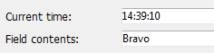
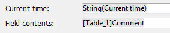

<!--REF #_command_.ST SET OPTIONS.Syntax-->**ST SET OPTIONS** ( {* ;} *object* ; *option* ; *value* {; *option2* ; *value2* ; ... ; *optionN* ; *valueN*} )<!-- END REF-->
<!--REF #_command_.ST SET OPTIONS.Params-->
| 引数 | 型 |  | 説明 |
| --- | --- | --- | --- |
| * | 演算子 | &#8594;  | 指定時: object はオブジェクト名(文字列)<br/>省略時: object は変数またはフィールド |
| object | any | &#8594;  | オブジェクト名( * 指定時)、<br/>または変数やフィールド( * 省略時) |
| option | Integer | &#8594;  | 設定したいオプション |
| value | Integer | &#8594;  | オプションの新しい値 |

<!-- END REF-->

#### 説明 

<!--REF #_command_.ST SET OPTIONS.Summary-->**ST SET OPTIONS**コマンドは、*object* 引数で指定されたスタイル付テキストフィールドまたはテキスト変数に関する様々なオプションを変更することができます。<!-- END REF-->

任意の *\** 演算子を渡した場合、 *object* 引数でオブジェクト名を文字列で指定します。省略時には *object* 引数でフィールドまたは変数を指定します。

修正したいオプションを指定する値を *option* 引数に、新しく設定したい値を *value* に渡します。

*option* 引数は、"*Multistyle Text*"テーマ内にある以下の定数をサポートしています: 

| 定数                          | 型    | 値 | コメント                                            |
| --------------------------- | ---- | - | ----------------------------------------------- |
| ST Expressions display mode | 倍長整数 | 1 | *value* 引数にはST ValuesまたはST Referencesのどちらかが入ります |

*value* 引数には、以下の定数のどれか一つをわたす事ができます:

| 定数            | 型    | 値 | コメント               |
| ------------- | ---- | - | ------------------ |
| ST References | 倍長整数 | 1 | 式のソースの文字列を表示します。   |
| ST Values     | 倍長整数 | 0 | 4D式の、計算された値を表示します。 |

値の表示:



ソースの表示:



#### 例題 

以下のコードは、エリアの表示モードを切り替えます:

```4d
 ST GET OPTIONS(*;"StyledText_t";ST Expressions display mode;$exprValue)
 If($exprValue=1)
    ST SET OPTIONS(*;"StyledText_t";ST Expressions display mode;ST Values)
 Else
    ST SET OPTIONS(*;"StyledText_t";ST Expressions display mode;ST References)
 End if
```

#### 参照 

[ST GET OPTIONS](st-get-options.md)  

#### プロパティ

|  |  |
| --- | --- |
| コマンド番号 | 1289 |
| スレッドセーフである | &cross; |


