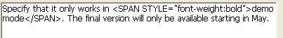
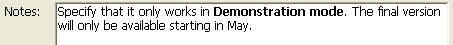
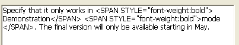

<!--REF #_command_.ST SET TEXT.Syntax-->**ST SET TEXT** ( {* ;} *object* ; *newText* {; *startSel* {; *endSel*}} )<!-- END REF-->
<!--REF #_command_.ST SET TEXT.Params-->
| 引数 | 型 |  | 説明 |
| --- | --- | --- | --- |
| * | 演算子 | &#8594;  | 指定時: objectはオブジェクト名 (文字) <br/>省略時: objectは変数またはフィールド |
| object | any | &#8594;  | オブジェクト名 (* 指定時) または <br/>フィールドまたは変数 (* 省略時) |
| newText | Text | &#8594;  | 挿入するテキスト |
| startSel | Integer | &#8594;  | テキスト選択開始位置 |
| endSel | Integer | &#8594;  | テキスト選択終了位置 |

<!-- END REF-->

*このコマンドはスレッドセーフではないため、プリエンプティブなコードには使えません。*


#### 説明 

<!--REF #_command_.ST SET TEXT.Summary-->**ST SET TEXT** コマンドは*object*引数で指定されたスタイル付きのフィールドや変数に、 *newText*引数で渡されたテキストを挿入します。<!-- END REF--> このコマンドは*object*引数のプレーンテキストにのみ適用され、含まれるスタイルタグは更新しません。このコマンドはスクリーンに表示されているスタ イル付きテキストをプログラムで変更するために使用できます。 

##### 

オプションの *\** 引数を渡した場合、*object*引数にはオブジェクト名 (文字列) を渡します。コマンド実行時にオブジェクトにフォーカスがある場合、コマンドは編集中のオブジェクトにのみ適用され、(フィールドや変数などの) データソースには適用されません。変更がソース (およびこの同じソースを使用する他のオブジェクト) に転送されるのは、フォーカスが外れるか**Enter**キーが押されて、オブジェクトへの編集が有効化された場合のみです。オブジェクトにフォーカスがない場合、コマンドは直接データソースに適用され、変更は即座に同じソースを使用する他のオブジェクトに転送されます。  
*\** 引数を省略した場合、*object* 引数にはフィールドや変数を指定します。この場合文字列ではなくフィールドまたは変数への参照を渡します。コマンドは直接データソースに適用され、変更は即座に同じソースを使用する他のオブジェクトに転送されます。

##### 

*newText*には挿入するテキストを渡します。**ST SET TEXT**コ マンドは<SPAN>型のタグを含むリッチ (マルチスタイル) テキスト挿入するために使用します。他のすべてのケース、特に<や>、&を含むプレーンテキストの場合、 [ST SET PLAIN TEXT](st-set-plain-text.md) コマンドを使用しなければなりません。**ST SET TEXT**コマンドに < や >、& を含むプレーンテキストを渡すと、コマンドは何も行いません。これは"a>b"のようなテキストをエンコードしないでリッチテキストに挿入すると、 内部的な<SPAN>タグの解析が妨げられるからです。この場合">"文字は"&gt;"にエンコードされなければな りません。これは[ST SET PLAIN TEXT](st-set-plain-text.md)により自動で行われます (このコマンドの例題参照)。

オプションの*startSel*と*endSel*引数を使用して、*object*中のテキストを選択できます。*startSel*と*endSel*の値はプレーンテキストの選択に使用され、テキスト中のスタイルタグは無視されます。このコマンドの動作はオプションの*startSel*と*endSel*引数に基づき変わります:

* *startSel*と*endSel*を省略すると、**ST SET TEXT**は*object*のすべてのテキストを*newText*で置き換えます。
* *startSel*のみを渡した場合、または*startSel*と*endSel*が同じ場合、**ST SET TEXT**は*newText*テキストを*object*の*startSel*の位置に挿入します。
* *startSel*と*endSel*両方渡した場合、**ST SET TEXT**はこれらの引数で指定されたプレーンテキストを*newText*テキストで置き換えます。
* *endSel*に0をセットすることで、自動的にテキストの最後を指定(*startSel*に1をセットすることでテキストの最初を指定)できます。

4D では、選択範囲を自動的に指定するために *startSel* 引数と *endSel* 引数に渡す定数を提供しています。これらの定数は "*Multistyle Text*" テーマ内にあります。

| 定数                 | 型    | 値      | コメント                                      |
| ------------------ | ---- | ------ | ----------------------------------------- |
| ST End highlight   | 倍長整数 | \-1001 | オブジェクト内のカレントのテキストセレクションの最後の文字を指定します(\*)   |
| ST End text        | 倍長整数 | 0      | オブジェクトに含まれるテキストの最後の文字を指定します。              |
| ST Start highlight | 倍長整数 | \-1000 | オブジェクト内のテキストのカレントセレクションの最初の文字をを指定します (\*) |
| ST Start text      | 倍長整数 | 1      | オブジェクト内に含まれるテキストの最初の文字を指定します。             |

(\*) この定数を使用する際には、 *object* 引数にオブジェクト名を渡す必要があります。フィールドへの参照または変数を渡した場合、コマンドはオブジェクト内の全てのテキストに適用されます。

**注:** もし *startSel* 引数が *endSel* 引数より大きい場合、コマンドは何も行わず、OK変数は0に設定されます。(ただし *endSel* が0である場合を除く)

#### システム変数およびセット 

このコマンド実行後、エラーがなければOKシステム変数に1が設定されます。そうでなければ0が設定されます。これは特にスタイルタグが正しく評価できなかった場合に発生します (正しくない、あるいは失われたタグ)。  

エラーの場合、変数は変更されません。テキストが評価される際に変数にエラーが発生すると、4Dはテキストをプレーンテキストに変換します。結果、"<"、">"、"&"文字はHTML実体参照に変換されます。

#### 例題 1 

リッチテキストエリア中でユーザーが選択したテキストを変数の内容で置き換えます。

選択されたテキストは以下の通りです:


フィールドには以下のテキストが格納されています:



以下のコードを実行すると:

```4d
 vtempo:="Demonstration"
 GET HIGHLIGHT([Products]Notes;vStart;vEnd)
 ST SET TEXT([Products]Notes;vtemp;vStart;vEnd)
```

フィールドの表示およびその内容は以下のようになります:

 



#### 例題 2 

[ST SET PLAIN TEXT](st-set-plain-text.md)コマンドの例題を参照してください

#### 参照 

[ST Get plain text](st-get-plain-text.md)  
[ST Get text](st-get-text.md)  
[ST SET PLAIN TEXT](st-set-plain-text.md)  