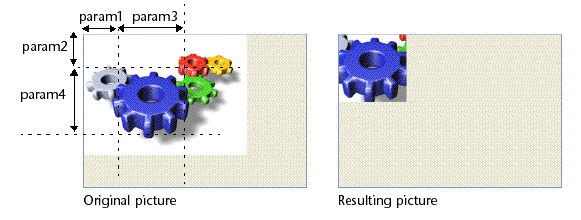

<!--REF #_command_.TRANSFORM PICTURE.Syntax-->**TRANSFORM PICTURE** ( *picture* ; *operator* {; *param1* {; *param2* {; *param3* {; *param4*}}}} )<!-- END REF-->
<!--REF #_command_.TRANSFORM PICTURE.Params-->
| 引数 | 型 |  | 説明 |
| --- | --- | --- | --- |
| picture | Picture | &#8594;  | 変換するソースピクチャ |
| &#8592; | 変換した結果のピクチャ |
| operator | Integer | &#8594;  | 行う変換のタイプ |
| param1 | Real | &#8594;  | 変換パラメタ |
| param2 | Real | &#8594;  | 変換パラメタ |
| param3 | Real | &#8594;  | 変換パラメタ |
| param4 | Real | &#8594;  | 変換パラメタ |

<!-- END REF-->

#### 説明 

<!--REF #_command_.TRANSFORM PICTURE.Summary-->TRANSFORM PICTURE コマンドは、*picture*引数に渡したピクチャに、*operator*タイプの変換を適用するために使用します。<!-- END REF-->このコマンドはピクチャ変換演算子 (+/ 等, [C\_BOOLEAN](c-boolean.md) の節参照) で提供される機能を拡張します。これらの演算子は4D でも利用可能です。

コマンド実行後、ソース*picture*は 直接更新されます。一部の操作は可逆的で、反対の処理を行うか“Reset”処理を行うことで元に戻すことができます。例えば、1%に縮小されたピクチャ は後で100倍することで、変換されることなく元のサイズに戻せます。変換は元のピクチャタイプを変更しません。例えばベクタピクチャは変換後もベクタピ クチャです。 

*operator*には実行する処理を示す数値を渡し、*param*には処理に必要なパラメタを渡します。必要なパラメタの数は処理により異なります。 "*Picture Transformation*" テーマの定数を*operator*に指定できます。処理とパラメタの説明は以下のとおりです:

| **operator (値)**         | param1 | param2 | param3 | param4 | 値    | キャンセル可 |
| ------------------------ | ------ | ------ | ------ | ------ | ---- | ------ |
| Reset (0)                | \-     | \-     | \-     | \-     | \-   |        |
| Scale (1)                | 幅      | 高さ     | \-     | \-     | 係数   | 可能     |
| Translate (2)            | X軸     | Y軸     | \-     | ピクセル   | 可能   |        |
| Flip horizontally (3)    | \-     | \-     | \-     | \-     | \-   | 可能     |
| Flip vertically (4)      | \-     | \-     | \-     | \-     | \-   | 可能     |
| Crop (100)               | X座標    | Y座標    | 幅      | 高さ     | ピクセル | 不可     |
| Fade to grey scale (101) | \-     | \-     | \-     | \-     | \-   | 不可     |
| Transparency (102)       | RGBカラー | \-     | \-     | \-     | 16進数 | 不可     |

* Reset: ピクチャに対して実行されたすべてのマトリクス処理 (scale, flip等) が取り消されます。
* Scale: *param1*と*param2*に渡された値に基づき、ピクチャは水平および垂直方向にサイズ変更されます。これらの値は係数です。例えば幅を50%拡げるには*param1*に1.5を渡します。高さを50%縮めるには*param2*に0.5を渡します。
* Translate: ピクチャは水平方向に*param1*ピクセル、垂直方向に*param2*ピクセル移動されます。右方向あるいは下方向に移動するには正数を、左方向あるいは上方向に移動するには負数を渡します。
* Flip horizontallyとFlip vertically: 元のピクチャは反転されます。事前に実行された移動は考慮されません。
* Crop: ピクチャは、*param1*と*param2*座標 (ピクセル) を開始位置として、切り取られます。新しいピクチャの幅と高さを*param3*と*param4*で指定します。この処理は取り消すことができません。
* Fade to grey scale: ピクチャはグレースケールに変更されます。引数は必要ありません。この処理は取り消すことができません。
* Transparency: *param1* に渡したカラーに基づいてピクチャに対して透明マスクが適用されます。例えば、*param1* に0x00FFFFFF (白)を 渡すと、オリジナルのピクチャ内の全ての白いピクセルは変換されたピクチャでは透明になります。このオペレーションはビットマップもしくはベクターのピクチャーに対して適用する事ができます。デフォルトでは、*param1* 引数を省略した場合には白(0x00FFFFFF)がターゲットカラーとして設定されます。この機能は、廃止されたPICTフォーマットのピクチャから変換されたピクチャでの透明度を扱うために特別に設計されたものですが、どんなタイプのピクチャに対しても使用する事ができます。この変換は取り消す事ができません。

#### 例題 1 

ピクチャの白い部分を透過にしたい場合を考えます。このためには、以下のコードを使用します:

```4d
 TRANSFORM PICTURE(Pict1;Transparency;0x00FFFFFF) //0x00FFFFFF は白のカラーコード
```

結果は以下の様になります:


#### 例題 2 

以下はピクチャ切り取りを行う例題です (ピクチャはフォーム上で “トランケート (中央あわせなし)” フォーマットで表示されています): 

```4d
 TRANSFORM PICTURE($vpGears;Crop;50;50;100;100)
```



#### 参照 

[COMBINE PICTURES](combine-pictures.md)  

#### プロパティ

|  |  |
| --- | --- |
| コマンド番号 | 988 |
| スレッドセーフである | &check; |


