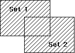

<!--REF #_command_.UNION.Syntax-->**UNION** ( *set1* ; *set2* ; *resultSet* )<!-- END REF-->
<!--REF #_command_.UNION.Params-->
| 引数 | 型 |  | 説明 |
| --- | --- | --- | --- |
| set1 | Text | &#8594;  | 最初のセット |
| set2 | Text | &#8594;  | 2番目のセット |
| resultSet | Text | &#8594;  | 結果のセット<br/>Resulting set |

<!-- END REF-->

#### 説明 

<!--REF #_command_.UNION.Summary-->コマンドは、*set1*と*set2*のすべてのレコードを含むセットを作成します。<!-- END REF-->下表に、UNIONコマンドの処理で考えられるすべての組み合わせを示します。

| **Set1** | Set2 | Result Set |
| -------- | ---- | ---------- |
| Yes      | No   | Yes        |
| Yes      | Yes  | Yes        |
| No       | Yes  | Yes        |
| No       | No   | No         |

以下の図に、集合結合演算の処理結果を図で示します。塗りつぶした箇所が結果セットの部分です。



*resultSet*は、UNIONコマンドで作成されます。*resultSet*と同じ名前のセット (*set1*と*set2*も含めて) がすでに存在する場合には、*resultSet*に置き換えられます。*set1*と*set2*は同じテーブルに属していなければなりません。*resultSet*も*set1*、*set2*と同じテーブルに属します。*resultSet*のカレントレコ－ドは、Set1からのカレントレコ－ドです。

**4D Server:** クライアント/サーバモードにおいて、セットはタイプ (インタープロセス、プロセスおよびローカル) およびそれらがどこで作成されたか (サーバまたはクライアント) によって、アクセス可能かどうかが決定されます。UNIONでは3つのセットが同じマシン上でアクセスできる必要があります。詳細は4D Server Referenceマニュアルの*4D Server: セットと命名セレクション*に関する説明を参照してください。 

#### 例題 

この例題では優良顧客のセットにレコードを追加します。二行目のコードでレコードはスクリーンに表示されます。レコードが表示されたのち、優良顧客のセットがディスクからロードされ、ユーザが選択したレコード (セット名 “UserSet”) がそのセットに追加されます。最後に新しいセットがディスクに保存されます:

```4d
 ALL RECORDS([Customers]) //全ての顧客を選択
 DISPLAY SELECTION([Customers]) //全ての顧客をリスト表示
 LOAD SET("$Best";$Path) // 優良顧客セットをロード
 UNION("$Best";"UserSet";"$Best") //任意に選択した顧客をセットに追加する
 SAVE SET("$Best";$Path) // "お得意様" セットをディスクに保存する
```

#### 参照 

[DIFFERENCE](difference.md)  
[INTERSECTION](intersection.md)  

#### プロパティ

|  |  |
| --- | --- |
| コマンド番号 | 120 |
| スレッドセーフである | &check; |


