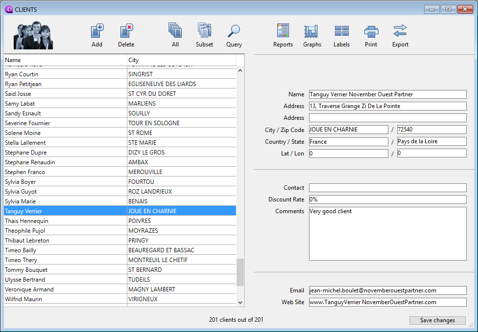

<!--REF #_command_.DIALOG.Syntax-->**DIALOG** ( {*aTable* ;} *form* {; *formData*}{; *} )<!-- END REF-->

<!--REF #_command_.DIALOG.Params-->

| 引数       | 型            |   | 説明                                                                                                                                                          |
| -------- | ------------ | - | ----------------------------------------------------------------------------------------------------------------------------------------------------------- |
| aTable   | Table        | → | フォームの属するテーブルまたは 省略した場合はデフォルトテーブルまたは プロジェクトフォームを使用                                                                                                           |
| form     | Text, Object | → | プロジェクトフォームまたはテーブルフォームのフォーム名(文字列)、&#xA;あるいはフォームを定義した.jsonファイルへのPOSIXパス(文字列)、&#xA;あるいは開くフォームを定義したオブジェクト |
| formData | Object       | → | フォームに関連づけるデータ                                                                                                                                               |
| \*       | 演算子          | → | 同じプロセスを使用                                                                                                                                                   |

<!-- END REF-->

*このコマンドはスレッドセーフではないので、プリエンプティブなコードでは使用できません。*

#### 説明

<!--REF #_command_.DIALOG.Summary-->The **DIALOG** command presents the *form* to the user, along with *formData* parameter(s) (optional).<!-- END REF--> 

このコマンドは、フォームを基にした、カスタマイズされた高度なユーザーインターフェースで動作するように設計されています。 これを使用してデータベースや他の場所からの情報を表示したり、あるいはデータ入力機能を提供することができます。 このコマンドは、フォームを基にした、カスタマイズされた高度なユーザーインターフェースで動作するように設計されています。 これを使用してデータベースや他の場所からの情報を表示したり、あるいはデータ入力機能を提供することができます。 [ADD RECORD](../commands-legacy/add-record.md) や [MODIFY RECORD](../commands-legacy/modify-record.md) とは異なり、**DIALOG** コマンドは、フォームとそのコンテンツ、内容、評価ボタンなどに対して、完全にコントロールすることができます。

このコマンドは通常、次の例にあるように、洗練されたフォームを表示するために[Open form window](../commands-legacy/open-form-window.md) コマンドと一緒に呼び出されます:



表示や取得しなければならない情報が複雑で、[ALERT](../commands-legacy/alert.md)、 [CONFIRM](../commands-legacy/confirm.md) または [Request](../commands-legacy/request.md) などのコマンドで処理しきれない場合、**DIALOG** を代わりに使用して置き換えることができます。

*form* 引数には、以下のいづれかを渡すことができます:

- 使用するフォーム名(プロジェクトフォームあるいはテーブルフォーム)
- 使用するフォームの詳細を格納している有効な.josn ファイルへのパス(POSIX シンタックス)
- 使用するフォームの詳細を格納しているオブジェクト

オプションとして、*form* 引数で指定したフォームに"form data" オブジェクトを使用して引数を渡すことができます。 form data オブジェクト内のプロパティであればどれも[Form](form.md) コマンドを使用することでフォームコンテキストから利用可能になります。 For example, if you use a form data object containing {"version";"12"}, you will be able to get or set the value of the "version" property in the form by calling:
例えば、{"version","12"} というプロパティを格納するform data オブジェクトを使用した場合、以下のように呼び出しをすることで"version" プロパティの値を取得したり設定することが可能です:

```4d
 $v:=Form.version //"12"
 Form.version:=13
```

"form data" オブジェクトに値を入れるためには、以下の2つの方法があります:

- *formData* 引数を使用する方法。 *formData* 引数を使用する方法。 *formData* 引数を使用する方法。 *formData* 引数を使用する方法。 *formData* 引数を使用する方法。 *formData* 引数を使用する方法。 *formData* 引数を使用する方法。 *formData* に対してローカル変数を使用することで、呼び出しコンテキストに関係なく、安全にフォームに引数を渡すことができます。 特に、同じフォームが同じプロセスないで他の場所から呼び出された場合、[Form](form.md).myProperty と呼び出すだけで、常にその特定の値にアクセスすることができます。 さらに、オブジェクトは参照によって渡されるため、ユーザーがプロパティの値をフォーム内で変更した場合、その値は自動的にオブジェクト自身内に保存されます。 特に、同じフォームが同じプロセスないで他の場所から呼び出された場合、[Form](form.md).myProperty と呼び出すだけで、常にその特定の値にアクセスすることができます。 さらに、オブジェクトは参照によって渡されるため、ユーザーがプロパティの値をフォーム内で変更した場合、その値は自動的にオブジェクト自身内に保存されます。 特に、同じフォームが同じプロセスないで他の場所から呼び出された場合、[Form](form.md).myProperty と呼び出すだけで、常にその特定の値にアクセスすることができます。 さらに、オブジェクトは参照によって渡されるため、ユーザーがプロパティの値をフォーム内で変更した場合、その値は自動的にオブジェクト自身内に保存されます。 特に、同じフォームが同じプロセスないで他の場所から呼び出された場合、[Form](form.md).myProperty と呼び出すだけで、常にその特定の値にアクセスすることができます。 さらに、オブジェクトは参照によって渡されるため、ユーザーがプロパティの値をフォーム内で変更した場合、その値は自動的にオブジェクト自身内に保存されます。 特に、同じフォームが同じプロセスないで他の場所から呼び出された場合、[Form](form.md).myProperty と呼び出すだけで、常にその特定の値にアクセスすることができます。 さらに、オブジェクトは参照によって渡されるため、ユーザーがプロパティの値をフォーム内で変更した場合、その値は自動的にオブジェクト自身内に保存されます。 特に、同じフォームが同じプロセスないで他の場所から呼び出された場合、[Form](form.md).myProperty と呼び出すだけで、常にその特定の値にアクセスすることができます。 さらに、オブジェクトは参照によって渡されるため、ユーザーがプロパティの値をフォーム内で変更した場合、その値は自動的にオブジェクト自身内に保存されます。 特に、同じフォームが同じプロセスないで他の場所から呼び出された場合、[Form](form.md).myProperty と呼び出すだけで、常にその特定の値にアクセスすることができます。 さらに、オブジェクトは参照によって渡されるため、ユーザーがプロパティの値をフォーム内で変更した場合、その値は自動的にオブジェクト自身内に保存されます。

- [ユーザークラスをフォームに割り当てる](../FormEditor/properties_FormProperties.md#form-class)ことで、4D はフォームがロードされる際に自動的にこのクラスのオブジェクトをインスタンス化します。 オブジェクトプロパティおよび関数は[Form](form.md) から返されるオブジェクト内で自動的に利用可能になります。 例えば、`Form.myFunction()` と書くことができます。 オブジェクトプロパティおよび関数は[Form](form.md) から返されるオブジェクト内で自動的に利用可能になります。 例えば、`Form.myFunction()` と書くことができます。 オブジェクトプロパティおよび関数は[Form](form.md) から返されるオブジェクト内で自動的に利用可能になります。 例えば、`Form.myFunction()` と書くことができます。 オブジェクトプロパティおよび関数は[Form](form.md) から返されるオブジェクト内で自動的に利用可能になります。 例えば、`Form.myFunction()` と書くことができます。 オブジェクトプロパティおよび関数は[Form](form.md) から返されるオブジェクト内で自動的に利用可能になります。 例えば、`Form.myFunction()` と書くことができます。 オブジェクトプロパティおよび関数は[Form](form.md) から返されるオブジェクト内で自動的に利用可能になります。 例えば、`Form.myFunction()` と書くことができます。 オブジェクトプロパティおよび関数は[Form](form.md) から返されるオブジェクト内で自動的に利用可能になります。 例えば、`Form.myFunction()` と書くことができます。 オブジェクトプロパティおよび関数は[Form](form.md) から返されるオブジェクト内で自動的に利用可能になります。 例えば、`Form.myFunction()` と書くことができます。 オブジェクトプロパティおよび関数は[Form](form.md) から返されるオブジェクト内で自動的に利用可能になります。 例えば、`Form.myFunction()` と書くことができます。

:::note

- *formData* 引数の方がform クラスより優先されます(*formData* 引数が渡された場合、クラスオブジェクトはインスタンス化されません)。
- *formData* 引数を渡さなかった場合(または未定義のオブジェクトを渡した場合) でフォームにユーザークラスが何も割り当てられていなかった場合、**DIALOG** コマンドは新しい空のオブジェクトを作成して*form* にバインドします。

:::

ダイアログは(ak accept 標準アクション、Enter キー、または[ACCEPT](../commands-legacy/accept.md) コマンドによってトリガーされた)"accept" アクション、または(ak cancel 標準アクション、Escape キー、または[CANCEL](../commands-legacy/cancel.md) コマンドによってトリガーされた)"cancel" アクションによって閉じられます。 accept アクションはOK システム変数を1に設定する一方、cancel アクションはOK を0に設定します。 accept アクションはOK システム変数を1に設定する一方、cancel アクションはOK を0に設定します。 accept アクションはOK システム変数を1に設定する一方、cancel アクションはOK を0に設定します。 accept アクションはOK システム変数を1に設定する一方、cancel アクションはOK を0に設定します。 accept アクションはOK システム変数を1に設定する一方、cancel アクションはOK を0に設定します。 accept アクションはOK システム変数を1に設定する一方、cancel アクションはOK を0に設定します。 accept アクションはOK システム変数を1に設定する一方、cancel アクションはOK を0に設定します。 accept アクションはOK システム変数を1に設定する一方、cancel アクションはOK を0に設定します。 accept アクションはOK システム変数を1に設定する一方、cancel アクションはOK を0に設定します。

ただし、評価することは保存と同等ではないという点に注意して下さい。
ダイアログにフィールドが含まれる場合、変更されたデータを保存するためには[SAVE RECORD](../commands-legacy/save-record.md) コマンドを明示的に呼び出さなければいけません。

オプションの\*\*\* 引数を渡すと、フォームはカレントプロセスで最後に開かれたウィンドウにロードされ、フォームをスクリーン上でアクティブにしたままこのコマンドは実行を終了します。\
オプションの\*\*\* 引数を渡すと、フォームはカレントプロセスで最後に開かれたウィンドウにロードされ、フォームをスクリーン上でアクティブにしたままこのコマンドは実行を終了します。\
このフォームはユーザーアクションに対し通常通り反応し、標準アクションまたはフォームに関連する4Dコード (オブジェクトメソッドやフォームメソッド) が [CANCEL](../commands-legacy/cancel.md) や [ACCEPT](../commands-legacy/accept.md) コマンドを呼び出すと閉じられます。 カレントプロセスが終了すると、この方法で作成されたフォームは、[CANCEL](../commands-legacy/cancel.md) コマンドが呼ばれたかのように自動で閉じられます。 この開き方では別にプロセスを開始する必要がないため、ドキュメントと一緒にフローティングパレットを表示するなどの場合に便利です。 カレントプロセスが終了すると、この方法で作成されたフォームは、[CANCEL](../commands-legacy/cancel.md) コマンドが呼ばれたかのように自動で閉じられます。 この開き方では別にプロセスを開始する必要がないため、ドキュメントと一緒にフローティングパレットを表示するなどの場合に便利です。

**注:**

- **DIALOG**(form;\*) シンタックスと[CALL FORM](../commands-legacy/call-form.md) コマンドを組み合わせることによってフォーム間で通信をすることができます。
- **DIALOG**(form;\*) ステートメントの前に、あらかじめウィンドウが作成されている必要があります。 プロセスのカレントダイアログウィンドウや、各プロセスにデフォルトで作成されるウィンドウは使用できません。 でなければ、エラー -9909 が生成されます。 プロセスのカレントダイアログウィンドウや、各プロセスにデフォルトで作成されるウィンドウは使用できません。 でなければ、エラー -9909 が生成されます。
- オプションの *\** 引数を使用する場合、標準アクションまたは[CANCEL](../commands-legacy/cancel.md) コマンドや[ACCEPT](../commands-legacy/accept.md) コマンドを呼び出すと、ウィンドウは自動的に閉じられます。 ウィンドウ自身の終了を管理する必要はありません。 ウィンドウ自身の終了を管理する必要はありません。 ウィンドウ自身の終了を管理する必要はありません。 ウィンドウ自身の終了を管理する必要はありません。

#### 例題 1

以下の例題はツールパレットを作成するために使用できます:

```4d
  //ツールパレットを表示
 $palette_window:=Open form window("tools";Palette form window)
 DIALOG("tools";*) //即座にコントロールを返す
  //メインのドキュメントを表示
 $document_window:=Open form window("doc";Plain form window)
 DIALOG("doc")
```

#### 例題 2

人物のレコードを表示しているフォームにおいて、"Check children" ボタンを押すとその人物の子供の名前と年齢を検証あるいは変更するダイアログが開く場合を考えます:


**注:** "Children" オブジェクトフィールドはこの例題においての構造を示すために表示されているだけです。

検証フォームにおいて、[Form](form.md) オブジェクトプロパティを変数へと割り当てているものとします:


"Check children" ボタンの中身のコードは以下のようになります:

```4d
 var $win;$n;$i : Integer
 var $save : Boolean
 ARRAY OBJECT($children;0)
 OB GET ARRAY([Person]Children;"children";$children) //children コレクションを取得
 $save:=False //save 変数を初期化
 
 $n:=Size of array($children)
 If($n>0)
    $win:=Open form window("Edit_Children";Movable form dialog box)
    SET WINDOW TITLE("Check children for "+[Person]Name)
    For($i;1;$n) // それぞれの子供に対して
       DIALOG("Edit_Children";$children{$i}) //値が入ったダイアログを表示
       If(OK=1) // ユーザーがOK をクリックした
          $save:=True
       End if
    End for
    If($save=True)
       [Person]Children:=[Person]Children // 強制的にオブジェクトフィールドを更新
    End if
    CLOSE WINDOW($win)
 Else
    ALERT("No child to check.")
 End if
```

フォームはそれぞれの子供についての情報を表示します:


値が変更されてOKボタンがクリックされた場合、フィールドは更新されます(その後、親のレコードも保存される必要があります)。

#### 例題 3

以下の例では、.json フォームへのパスを使用して従業員リスト内のレコードを表示する場合を考えます:

```4d
 Open form window("/RESOURCES/OutputPersonnel.json";Plain form window)
 ALL RECORDS([Personnel])
 DIALOG("/RESOURCES/OutputPersonnel.json";*)
```

表示は以下のようになります:


#### 例題 4

以下の例では.json ファイルをオブジェクトとして使用していくつかのプロパティを変更する場合を考えます:

```4d
 var $form : Object
 $form:=JSON Parse(Document to text(Get 4D folder(Current resources folder)+"OutputPersonnel.json"))
 $form.windowTitle:="The Avengers"
 $form.pages[1].objects.logo.picture:="/RESOURCES/Images/Avengers.png"
 $form.pages[1].objects.myListBox.borderStyle:="double"
 Open form window($form;Plain form window)
 DIALOG($form;*)
```

変更されたフォームが、新しいタイトル、ロゴ、そして境界線とともに表示されます:


#### システム変数およびセット

**DIALOG** の呼び出し後ダイアログが受け入れられればOK に1 が、キャンセルされれば0 が設定されます。

#### 参照

[ACCEPT](../commands-legacy/accept.md)\
[ADD RECORD](../commands-legacy/add-record.md)\
[CALL FORM](../commands-legacy/call-form.md)\
[CANCEL](../commands-legacy/cancel.md)\
[Form](form.md)\
[Open window](../commands-legacy/open-window.md)

#### プロパティ

|            |                                                             |
| ---------- | ----------------------------------------------------------- |
| コマンド番号     | 40                                                          |
| スレッドセーフである | &amp;amp;amp;amp;amp;amp;amp;amp;cross; |
| 更新するシステム変数 | OK, error                                                   |
