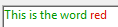

|                                                                                                         |
| ------------------------------------------------------------------------------------------------------- |
| [<!-- INCLUDE #_command_.ST COMPUTE EXPRESSIONS.Syntax -->](../../commands/st-compute-expressions)<br/> |
| [<!-- INCLUDE #_command_.ST FREEZE EXPRESSIONS.Syntax -->](../../commands/st-freeze-expressions)<br/>   |
| [<!-- INCLUDE #_command_.ST GET ATTRIBUTES.Syntax -->](../../commands/st-get-attributes)<br/>           |
| [<!-- INCLUDE #_command_.ST Get content type.Syntax -->](../../commands/st-get-content-type)<br/>       |
| [<!-- INCLUDE #_command_.ST Get expression.Syntax -->](../../commands/st-get-expression)<br/>           |
| [<!-- INCLUDE #_command_.ST GET OPTIONS.Syntax -->](../../commands/st-get-options)<br/>                 |
| [<!-- INCLUDE #_command_.ST Get plain text.Syntax -->](../../commands/st-get-plain-text)<br/>           |
| [<!-- INCLUDE #_command_.ST Get text.Syntax -->](../../commands/st-get-text)<br/>                       |
| [<!-- INCLUDE #_command_.ST GET URL.Syntax -->](../../commands/st-get-url)<br/>                         |
| [<!-- INCLUDE #_command_.ST INSERT EXPRESSION.Syntax -->](../../commands/st-insert-expression)<br/>     |
| [<!-- INCLUDE #_command_.ST INSERT URL.Syntax -->](../../commands/st-insert-url)<br/>                   |
| [<!-- INCLUDE #_command_.ST SET ATTRIBUTES.Syntax -->](../../commands/st-set-attributes)<br/>           |
| [<!-- INCLUDE #_command_.ST SET OPTIONS.Syntax -->](../../commands/st-set-options)<br/>                 |
| [<!-- INCLUDE #_command_.ST SET PLAIN TEXT.Syntax -->](../../commands/st-set-plain-text)<br/>           |
| [<!-- INCLUDE #_command_.ST SET TEXT.Syntax -->](../../commands/st-set-text)<br/>                       |

## テキスト管理コマンドの使い方

### ユーザーインターフェース

テキストオブジェクトをプログラミングで操作するために使用されるコマンドは、テキストに埋め込まれたスタイルタグを考慮しません。 これらは表示されるテキストに対してのみ動作します。 これは以下のコマンドに対して関係します:

- [ユーザーインターフェース](./User_Interface.md) テーマコマンド
- [`HIGHLIGHT TEXT`](../../commands/highlight-text)
- [`GET HIGHLIGHT`](../../commands/get-highlight)

これらのコマンドを文字列を操作するコマンドと組み合わせて使用した場合、[`ST Get plain text`](../../commands/st-get-plain-text) コマンドを使用して書式設定文字列を除去する必要があります:

```4d
 HIGHLIGHT TEXT([Products]Notes;1;Length(ST Get plain text([Products]Notes))+1)
```

### オブジェクト (フォーム)

オブジェクトのスタイルを変更するのに使用されるコマンド([`OBJECT SET FONT`](../../commands/object-set-font) など)は選択範囲ではなく、オブジェクト全体に対して適用されます。

コマンドが実行された時にオブジェクトにフォーカスが入っていなければ、その変更はオブジェクト(テキストエリア)とそれに割り当てられた変数の両方に同時に適用されます。 オブジェクトにフォーカスが入っている場合、変更はオブジェクトに対しては適用されますが、割り当てられた変数には適用されません。 その後、オブジェクトがフォーカスを失ったとき、変数に対しても変更が適用されます。 テキストエリアに対するプログラムを行う際は、この原則を忘れないでください。

:::note

[**デフォルトスタイルタグを格納**](../../FormObjects/properties_Text.md#デフォルトスタイルタグを格納) がオブジェクトに対して選択されている場合にこれらのコマンドを使用すると、オブジェクトに保存されているタグが更新されます。

:::

またデフォルトのプロパティもこれらのコマンドの影響を受けるという点に注意してください(またデフォルトタグによって保存されたあらゆるプロパティも同様です)。 カスタムのスタイルタグはそのままの状態を維持します。 例えば、以下の様なマルチスタイルエリアにデフォルトのタグが保存されていた場合を考えます:



このエリアのプレーンテキストは以下のようになります:

```html
<span style="text-align:left;font-family:'Segoe UI';font-size:9pt;color:#009900">This is the word <span style="color:#D81E05">red</span></span>
```

以下のコードを実行した場合:

```4d
OBJECT SET COLOR(*;"myArea";-(Blue+(256*Yellow)))
```

赤の文字カラーはそのまま残ります:


コードは以下の様になります:

```html
<span style="text-align:left;font-family:'Segoe UI';font-size:9pt;color:#0000FF">This is the word <span style="color:#D81E05">red</span></span>
```

これには以下のコマンドが適用されます:

- [`OBJECT SET RGB COLORS`](../../commands/object-set-rgb-colors)
- [`OBJECT SET FONT`](../../commands/object-set-font)
- [`OBJECT SET FONT STYLE`](../../commands/object-set-font-style)
- [`OBJECT SET FONT SIZE`](../../commands/object-set-font-size)

マルチスタイルエリアのコンテキストにおいては、これらのコマンドはデフォルトのスタイルを設定するためだけに使用されるべきです。 データベースの実行中にスタイルを管理するためには、"スタイル付きテキスト" テーマ内のコマンドを使用することが推奨されます。

### Get edited text

[`Get edited text`](../../commands/get-edited-text) コマンドがリッチテキストエリアで使用されると、コマンドはあらゆるスタイルタグを含む現在のエリアのテキストを返します。

編集されている"生の"テキスト(タグなしのテキスト) を取り出すには、[`ST Get plain text`](../../commands/st-get-plain-text) コマンドを使用しなければなりません:

```4d
ST Get plain text(Get edited text)
```

### クエリおよび並び替えコマンド

マルチスタイルオブジェクトに対して行われるクエリや並び替えは、オブジェクトに保存されたスタイルタグを考慮に入れます。 単語中でスタイルの変更が行われた場合、その単語の検索は失敗します。

有効な検索や並び替えを行うには、[`ST Get plain text`](../../commands/st-get-plain-text) コマンドを使用します。 例:

```4d
QUERY BY FORMULA([MyTable];ST Get plain text([MyTable]MyFieldStyle)="very well")
```

