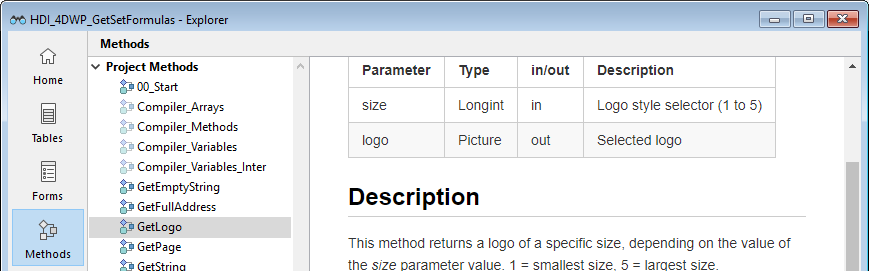

---
id: method-get-comments
title: METHOD GET COMMENTS
slug: /commands/method-get-comments
displayed_sidebar: docs
---

<!--REF #_command_.METHOD GET COMMENTS.Syntax-->**METHOD GET COMMENTS** ( *path* : Text, Text array ; *comments* : Text, Text array {; *} )<!-- END REF-->
<!--REF #_command_.METHOD GET COMMENTS.Params-->
<div class="no-index">

| 引数 | 型 |  | 説明 |
| --- | --- | --- | --- |
| path | Text, Text配列 | &#8594; | メソッドパスを格納したテキストまたはテキスト配列 |
| comments | Text, Text配列 | &#8592; | メソッドのコメント |
| * | 演算子 | &#8594; | 指定時 = コンポーネントで実行されたとき、コマンドをホストデータベースに適用する (コンポーネントのコンテキスト以外ではこの引数は無視されます) |
</div>
<!-- END REF-->

<div class="no-index">
<details><summary>履歴</summary>

|リリース|内容|
|---|---|
|13|初出|

</details>
</div>

## 説明 

<!--REF #_command_.METHOD GET COMMENTS.Summary-->**METHOD GET COMMENTS**コマンドは*path*引数で指定したメソッドのドキュメンテーションを*comments*引数に返します。<!-- END REF-->

このコマンドを使用して取得することのできるドキュメンテーションは、4Dエクスプローラーのコメント欄で定義されたものです ([METHOD GET CODE](../commands/method-get-code)コマンドを使用して取得できるコード内のコメント行ではありません)。コメントはスタイル付きテキストです:

データベースのタイプによって格納されるものが異なります:

* プロジェクトデータベースではmarkdownテキスト
* バイナリーデータベースではスタイル付きテキスト



このドキュメンテーションは、トリガー、プロジェクトメソッド、フォームメソッド、データベースメソッド、クラスに対して生成することができます。

**注:** フォームとフォームメソッドは同じドキュメンテーションを共有します。

テキスト配列またはテキスト変数に基づく2つのシンタックスを使用できます:

```4d
 var tVpath : Text // テキスト変数
 var tVcomments : Text
 METHOD GET COMMENTS(tVpath;tVcomments) // 1つのメソッドのドキュメンテーション
```

```4d
 ARRAY TEXT(arrPaths;0) // テキスト配列
 ARRAY TEXT(arrComments;0)
 METHOD GET COMMENTS(arrPaths;arrComments) // 複数メソッドのドキュメンテーション
```

2つのシンタックスを混合して使用することはできません。

コマンドがコンポーネントから実行されると、デフォルトではコンポーネントメソッドに適用されます。*\** 引数を渡すとホストデータベースのメソッドに適用します。

## 参照 

[METHOD SET COMMENTS](../commands/method-set-comments)  

## プロパティ

|  |  |
| --- | --- |
| コマンド番号 | 1189 |
| スレッドセーフである | no |


