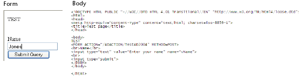

---
id: web-get-http-body
title: WEB GET HTTP BODY
slug: /commands/web-get-http-body
displayed_sidebar: docs
---

<!--REF #_command_.WEB GET HTTP BODY.Syntax-->**WEB GET HTTP BODY** ( *body* : Blob, Text )<!-- END REF-->
<!--REF #_command_.WEB GET HTTP BODY.Params-->
<div class="no-index">

| 引数 | 型 |  | 説明 |
| --- | --- | --- | --- |
| body | Blob, Text | &#8592; | HTTPリクエストのボディ |
</div>
<!-- END REF-->

<div class="no-index">
<details><summary>履歴</summary>

|リリース|内容|
|---|---|
|13|名称変更|
|2004|初出|

</details>
</div>

## 説明 

<!--REF #_command_.WEB GET HTTP BODY.Summary-->**WEB GET HTTP BODY**コマンドは、 処理中のHTTPリクエストのボディを返します。<!-- END REF--> HTTPボディは、処理や解析されることなく、そのままの状態で返されます。 

このコマンドはWebデータベースメソッド (*On Web Authenticationデータベースメソッド*、[On Web Connection](../commands/on-web-connection-database-method)) 、またはWebリクエスト処理メソッドで呼び出します。 

引数 *body* にはBLOBまたはテキストタイプの変数やフィールドを渡すことができます。一般的に、テキスト型引数の利用が推奨されます (*body*引数は2GBを上限としたテキストを受け取ることができます)。

例えばこのコマンドを使用して、リクエストのボディ内を検索することができます。また上級ユーザーは、4Dのデータベース内でWebDAVサーバーを設定することもできます。

## 例題 

4D Webサーバーに簡単なリクエストを送り、HTTPボディの内容をデバッガーで表示します。  
以下は4D Webサーバーに送られたフォームと対応するHTMLコードです。



次はTest4Dv11メソッドです。

```4d
 var $requestText : Text
 
 WEB GET HTTP BODY($requestText)
 WEB SEND FILE("page.html")
```

**注:** このメソッドのプロパティに"4DHTMLタグおよびURL (4DACTION) で利用可能"を指定します。 

フォームがWebサーバーに提出されると、変数$requestTextはHTTPリクエストボディのテキストを受け取ります。

## 参照 

[WEB GET BODY PART](../commands/web-get-body-part)  
[WEB GET HTTP HEADER](../commands/web-get-http-header)  

## プロパティ

|  |  |
| --- | --- |
| コマンド番号 | 814 |
| スレッドセーフである | yes |


