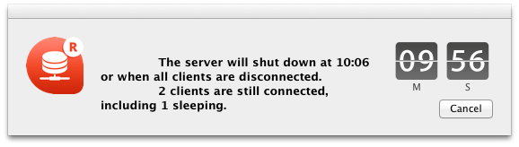
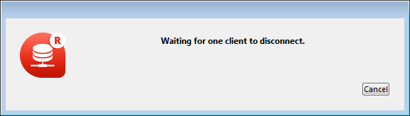
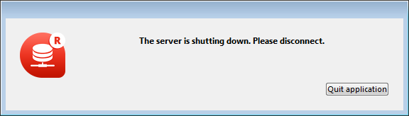

サーバを終了するには:

1. 4D Server の**ファイル**メニュー (Windows)または**4D Server** メニュー (macOS) から**終了**コマンドを選択

以下のダイアログがサーバマシン上で表示されます:

2. サーバを終了するまでの時間を分単位で入力するか、クライアントの接続解除オプションを選択する。

この作業を行うと、サーバへの新規接続は行えなくなります。

次のオプションから選択することができます:

- **サーバーから XX 分で切断する**

指定された時間後、サーバーは終了し、スリープモードに入っているクライアントも含めて全てのユーザーは切断されます。 以下のウィンドウがサーバー上に表示されます:

同じウィンドウがそれぞれのリモートの4D マシン上に表示されます。 このウィンドウは約20 秒ごとに繰り返し表示・あるいは更新され、終了を促します。 制限時間に達すると、クライアントマシンがまだ接続していた場合でもサーバーは終了します。

- **全てのクライアントが切断するのを待つ**

サーバーは、スリープモードに入っているものも含めて全てのクライアントが切断するまで終了するのをまちます。 このオプションは、例えば昼休み中のメンテナンス処理などには不向きな可能性があります。何故なら[スリープモード](../ServerWindow/users.md#managing-sleeping-users) に入っているクライアントがあることが容易に想像できるからです。

- **アクティブなクライアントが切断するのを待つ (スリープのクライアントは無視)**

サーバーはアクティブなクライアントが全て切断したあとに終了します(言い換えると、[スリープモード](../ServerWindow/users.md#managing-sleeping-users) に入っていない全てのクライアントマシンということです)。 このオプションを使用すると、スリープモードに入っているクライアントはどれも接続しているとは見なされません。 例えば昼休み中にメンテナンスオペレーションを実行したい場合などは、このオプションを使用して下さい。 このオプションが使用されているとき、スリープモードに入っているクライアントは復帰時に接続エラーが表示されます。

:::note

*スリープ中のクライアント* とは、サーバーマシンへの接続がアクティブである間に[スリープモード](../ServerWindow/users.md#managing-sleeping-users) へと切り替わったマシン上にあるリモートの4Dアプリケーションのことをさします。

:::

これらのオプションのいづれか一つを選択すると、以下のウィンドウが現れ、接続中のクライアント数を表示します:

それぞれの4Dクライアントマシンには、以下のウィンドウが表示されデフォルトのメッセージが表示されます:

4D Server のシャットダウンダイアログボックスにカスタムのメッセーイを入力していた場合、それぞれのクライアントマシンにはデフォルトメッセージの代わりにそれが表示されます。 例:

- **全てのクライアントを切断し終了**

サーバーは全てのプロセスと切断を終了し、数秒後に終了します。

:::note 注記

- いずれのケースも、終了ウィンドウを受け入れた際にサーバに接続しているクライアントがいない場合、4D Server はすぐに終了します。
- 4D Serverシャットダウンウィンドウで**キャンセル** をクリックすると、サーバシャットダウン処理はキャンセルされます。
- **データベースを閉じる...** メニューコマンドを使用する事で、4D Serverを終了する事なくデータベースを閉じる(かつクライアントから切断する)ことができます。

:::