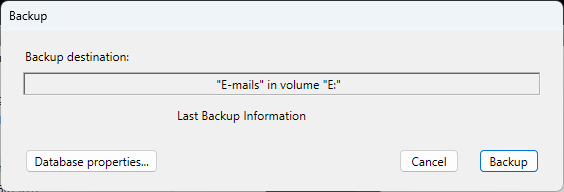

4D Server アプリケーションのインタフェースは以下のメニューで構成されています: **ファイル**、**編集**、**ウィンドウ**、**ヘルプ**。 macOS ではいくつかのコマンドは**4D Server** メニュー (アプリケーションメニュー) に置かれます。

## File

### 新規

この階層コマンドにはサブメニューがあり、サーバマシン上で[プロジェクト](../GettingStarted/creating.md#プロジェクトの作成) やデータファイルを新しく作成するために使用します。

### 開く.../最近使用したデータベースを開く

これらのコマンドを使用して[4D Serverでデータベース/プロジェクト](../Desktop/clientServer.md#リモートプロジェクトを開く) を開くことができます。 **最近使用したデータベース** コマンドは、4D Server が最近開いたことのあるデータベースを含むサブメニューを表示します。 このメニューをリセットするには、**メニュークリア** コマンドを選択します。

### プロジェクトを閉じる...

このコマンドは4D Serverを終了せずに、現在のプロジェクトを閉じます。 このコマンドを選択するとサーバ終了ダイアログが表示され、接続ユーザの[接続解除モード](../server/exit.md) を指定できます。

### ウィンドウを閉じる

このコマンドは4D Server アプリケーションの最前面にあるウィンドウを閉じます。

### すべてのウィンドウを閉じる

このコマンドは4D Serverアプリケーションのすべてのウィンドウを閉じます。 この場合、データベースが公開されていることを示す要素は**ファイル**メニューの**データベースを閉じる...** が有効化されているという点のみになるという点に注意してください。

### 現在のアプリケーションをサービスとして登録 / 現在のアプリケーションの登録解除 / すべてのサーバサービスの登録解除

(Windowsで利用可能) これらのコマンドを使用して[サービスとして登録するアプリケーション](./service.md) を管理します。

### データバッファをフラッシュ

このコマンドはキャッシュ中のデータを"強制的に" ディスクに保存します。 デフォルトで、4D Server は[データベース環境設定 (データベース/データ管理ページ) で指定された時間](../settings/database.md#データベースキャッシュ設定) が経過すると自動でキャッシュをフラッシュします。

### バックアップ

このコマンドを使用していつでもデータベースのバックアップを起動できます。 このコマンドを選択すると、以下のダイアログボックスが表示されます:

- **バックアップ** ボタンは、[データベース環境設定で設定された (バックアップするファイル、アーカイブの場所、保持するセット数などの) パラメタ](../settings/backup.md) を使用して、即座にバックアップを起動します。
- **環境設定** ボタンは[環境設定のバックアップテーマ](../settings/backup.md) を開き、現在のバックアップ設定を確認して、必要であれば編集できます。
- **キャンセル**ボタンはバックアップ処理を中断します。

### 復元...

このコマンドはファイルを開くダイアログを表示し、復元するアーカイブファイルを選択できます。

### 終了

このコマンドを使用して[4D Serverアプリケーションを閉じる](./exit.md) ことができます。

:::note

macOS では**終了**コマンドは**4D Server** メニュー (アプリケーションメニュー) 内にあります。

:::

## 編集

4D Serverの**編集**メニューは標準のコピー/ペーストコマンドや、**クリップボード表示**コマンド等を含みます。

このメニューには**環境設定...** (Windows 環境下) and **データベース設定** コマンドが含まれ、これらを使用することでアプリケーション内のそれに対応するダイアログボックスを表示することができます。 このダイアログボックスを使用して開発者の[設定](../Preferences/overview.md) や、プロジェクトの様々な[動作](../settings/overview.md) を定義できます。

:::note

macos では、**環境設定... \*\* コマンドは**4D Server\*\* メニュー (アプリケーションメニュー) 内にあります。

:::

**編集** メニューには**デバッガを無効化する** および **デバッガを開始時に有効化する** コマンドが含まれ、これによってコードのデバッギングを管理することができます:

### デバッガを無効化する

このオプションを選択すると、デバッガをリモート4D で有効化することができます。 このメニューコマンドは**デバッガを有効化する**となり、これによってデバッガをサーバーで起動できるようになります(リモート4D でまだ有効化していない場合)。

### デバッガを開始時に有効化する

(デフォルトで選択されています) このオプションはプロジェクトが開始された時に毎回自動でサーバーでデバッガを有効にします。 リモート4D でデバッガを常時有効化したい場合には、このオプションの選択を解除してください。

*警告*: のちにヘッドレスモードで起動されるサーバーにおいてこのオプションが選択されたままの場合、このサーバーではデバッガーは利用できません。

より詳細な情報については、[リモートマシンからのデバッギング](../Debugging/debugging-remote.md)を参照してください。

## ウィンドウ

**ウインドウ**メニューの上部にはワークスペースウィンドウを扱うための標準のコマンドがあります (これらのコマンドはプラットフォームより異なります)。

また4D Server 特有のウィンドウを表示するためのコマンドも含まれています:

### 管理

このコマンドは、もしそのウィンドウが閉じられていたり最小化されていれば、[4D Server 管理ウィンドウ](../ServerWindow/overview.md)  を表示します。

### プロジェクト依存関係

[依存関係マネージャー](../Project/components.md) を表示します。

### ランタイムエクスプローラー

このコマンドは4D Server のランタイムエクスプローラウィンドウを表示します。

ランタイムエクスプローラでは、データベースの様々なストラクチャ要素の状態を見たり、利用可能なリソースが正しく管理されているかをチェックできます。 ランタイムエクスプローラは特に開発時やデータベース解析中に便利です。

ランタイムエクスプローラには4ページあり、それぞれのページには**ウォッチ**、**プロセス**、**ブレーク**、**キャッチ** ボタンからアクセスできます。 ランタイム エクスプローラは4D と4D Server で同じ動作を行います。

### データエクスプローラーをブラウザで開く

[データエクスプローラー](../Admin/dataExplorer.md) をデフォルトのブラウザで表示します。

### Qodly Studio

サーバーマシン上で、[Qodly Studio インターフェース](https://developer.4d.com/qodly/4DQodlyPro/qodlyStudioInterface) をデフォルトのブラウザに表示します。

### Qodlyアプリケーションのプレビュー

サーバーマシンのデフォルトのブラウザ内でQodly アプリケーションのスタートページを表示します。 詳細な情報については[こちらの章](https://developer.4d.com/qodly/4DQodlyPro/gettingStarted#preview-qodly-application) を参照してください。

## ヘルプ

### Maintenance Security Center

このコマンドは[Maintenance and Security Center](../MSC/overview.md) (MSC)を開きます。ここにはデータベースの検証、解析、メンテナンス、バックアップ、圧縮を行うのに必要なすべてのツールが集められています。
このコマンドは4D Server がプロジェクトを開いていない時でも使用できます。この場合、このコマンドを"メンテナンスモード"でプロジェクトを開くために使用できます (選択すると標準のファイルを開くダイアログが表示され、開くデータベースを選択できます)。 メンテナンスモードは圧縮や破損したデータベースを開く際に使用されます。

### オンラインドキュメント

4D ドキュメントのホームページを開きます。

### ライセンス更新...

このコマンドは4D 環境で追加の[ライセンス](../Admin/licenses.md) をアクティベートするために使用するウィンドウを表示します。

### 4D Serverについて...

このコマンドは\*\*4D Server について... \*\* ウィンドウを表示します。
