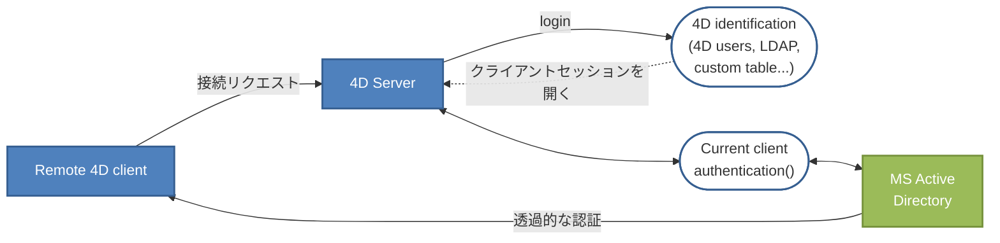

4D Serverでは、Windows上のクライアント/サーバーソリューションにSSO(*Single Sign On*)機能を実装することができます。

SSO を4D ソリューションに実装することにより、ユーザーはカンパニーのWindows ドメインにログインしていた場合に、パスワードを再入力する事なくWindows 上の4Dアプリケーションにアクセスできるようになります(Active Directory を使用)。 仕組みとしては、4D Server アプリケーションはActive Directory に認証を委任し、標準のメソッドを使用して4D ユーザーをデータベースにログインさせるための、Windows のセッションログインを取得します。

## 要件

SSO 機能を使用するためには以下の条件が必須となります:

- Windows 用の4D Server アプリケーションであること(4D のシングルユーザーアプリケーションはSSO をサポートしていません)
- [QUIC または ServerNet ネットワークレイヤー](../settings/client-server.md#network-layer) が有効化されていること。

## SSO機能の有効化

デフォルトでは、SSO 機能は4D Server では有効化されていません。 この機能を利用するためには、4D Server のデータベース設定ダイアログボックスの[CS/公開オプションページ](../settings/client-server.md#ドメインサーバーによるユーザーの認証) にある**ドメインサーバーによるユーザー認証**オプションをチェックする必要があります:


このオプションを有効にすると、4D はバックグラウンドで Windows ドメインサーバーの Active Directory に接続し、提供されている認証トークンを取得します。

このオプションはNTLM プロトコル経由の標準の認証を提供します。 4D はNTLM とケルベロスプロトコルをサポートしています。 使用されるプロトコルは[カレントの設定](#SSOのための必須要件) に応じて4D によって自動的に選択されます。 ケルベロスプロトコルを使用したい場合、追加のSPN フィールドに入力する必要があります(後述参照)。

### ケルベロスの有効化

ケルベロスを認証プロトコルとして使用したい場合、データベース設定ダイアログボックスの[C/Sの公開オプションページ内の\*\*サービスプリンシパル名(SPN)\*\*オプション](../settings/client-server.md#サービスプリンシパル名-spn) に入力をする必要があります:


このオプションはSPN をActive Directory 設定内で設定されているものと同じに宣言します。 サービスプリンシパル名とはサービスインスタンスの固有の識別子です。 SPN は、ケルベロス認証によってサービスインスタンスとサービスログインアカウントを関連づけるのに使用されます。 これによりクライアントがアカウント名を持っていなくても、サービスがアカウントを認証する事をリクエストできるようになります。 詳細な情報については、[MSDN ウェブサイトのSPN のページ](https://msdn.microsoft.com/en-us/library/windows/desktop/ms677949%28v=vs.85%29.aspx) を参照して下さい。

SPN 識別子は以下のパターンに従う必要があります:

- SPN がコンピューター属性である場合には、 "ServiceName/FQDN_user"
- SPN がユーザー属性である場合には "ServiceName/FQDN_computer"

このとき上記の略称の意味は以下の通りです:

- *ServiceName* はクライアントが認証しようとしているサービスの名前です。
- *Fully Qualified Domain Name* (FQDN) は、コンピューターとユーザーの両者に対し、Active Directory の3階層のうちどの位置にいるのかを指定するドメイン名です。

4D アプリケーションでは、SPN は以下のようにして設定することができます:

- 4D Server での使用に対しては、データベースストラクチャー設定[structure settings](../Project/architecture.md#sources) 内で設定できます。
- 配布のための使用については、[ユーザー設定](../Project/architecture.md#settings-ユーザーデータ) で設定できます。

## SSOの実装

SSO 機能が有効化されていると、4D Server でのユーザーセッションを開くのにWindows セッション証明書に基づいたユーザー認証を利用できるようになります。

SSO 機能はあくまで認証されたログインのみを提供し、そのログインは自力で4D の標準ログインメソッドに渡す必要があるという点に注意して下さい。 4D リモートアプリケーションがサーバーに接続しようとするとき、Active Directory で定義されたユーザーログインを返す[`Current client authentication`](../commands/current-client-authentication) コマンドを使用する必要があります。 それからこのログインを(ビルトインのユーザーとグループ、LDAP コマンド、あるいは他のカスタムの機構などを使用して)認証システムに渡すことで、お使いの4D アプリケーションのリモートユーザーへの適切なセッションを開く事ができます。

この原理は以下のような図にまとめる事ができます:



[`Current client authentication`](../commands/current-client-authentication) コマンドは[`On Server Open Connection`](../commands-legacy/on-server-open-connection-database-method.md) データベースメソッド内で呼び出される必要があります。これはリモートの4D が4D Server アプリケーションへの新しい接続を開くときに毎回呼び出されるものです。 認証が失敗した場合、 *$status* に非ヌル値を渡し接続を拒否する必要があります。

### Current client authenticationコマンドの使用

[`Current client authentication`](../commands/current-client-authentication) コマンドを呼び出すためには、以下のシンタックスを使用して下さい:

```4d
$login:=Current client authentication($domain;$protocol)
```

このとき上記の略称の意味は以下の通りです:

- *$login* はActive Directoryにログインするためにクライアントで使用されるID(テキスト値)です。 この値はプロジェクト内でユーザーを認識するために使用する必要があります。 ユーザーが正常に認証されていない場合、空の文字列が返され、エラーは返されません。
- *$domain* と\*$protocol\* は任意のテキスト引数です。 これらはコマンドによって入力され、これらの値によって接続を受け入れまたは拒否することができます:
  - *$domain* はActive Directory のドメイン名です
  - *$protocol* はユーザーを認証するのにWindowsが使用するプロトコル名です。

### SSOのための必須要件

4D Server はカレントのアーキテクチャーや設定によって、様々なSSO 設定を管理します。 認証に使用するプロトコル(NTLM または Kerberos) に加えて[`Current client authentication`](../commands/current-client-authentication) コマンドによって返される情報は、要件(以下参照)が満たされていた場合には、実際の設定によって変化します。 認証に実際に使用されるプロトコルは[`Current client authentication`](../commands/current-client-authentication) コマンドのprotocol 引数に返されます。

以下のテーブルはNTLM あるいはケルベロス認証を使用する際の必須要件をまとめたものです:

|                                                       | NTLM                                                   | ケルベロス                                                      |
| ----------------------------------------------------- | ------------------------------------------------------ | ---------------------------------------------------------- |
| 4D Server と 4D リモートが異なるマシン上にあること                      | ◯                                                      | ◯                                                          |
| 4D Server ユーザーがドメイン上にあること                             | ◯                                                      | ◯                                                          |
| 4D リモートが4D Serverユーザーと同じリモート上にあること                    | yes または no(\*)                      | ◯                                                          |
| SPN が4D Serverで入力されていること                              | ×                                                      | yes(\*\*)                               |
| 要件が満たされている場合にCurrent client authentication によって返される情報 | *login*=予想されるログイン、*domain*=予想されるドメイン、*protocol*="NTLM" | *login*=予想されるログイン、*domain*=予想されるドメイン、*protocol*="Kerberos" |

(\*) 次の特定の設定のみサポートされます: 4Dリモートユーザーが4D Serverと同じADに属するマシン上のローカルアカウントであること。 この場合、domain 引数には4D Serverのマシン名が入力されます。 サポートの可否は実際のユーザー設定に依存し、サポートされない場合は空文字列が返されます。

(\*\*) ケルベロスの必須要件が全て満たされているのに[`Current client authentication`](../commands/current-client-authentication) コマンドがprotocol 引数に"NTLM"を返す場合、以下の状況のどちらかである事を意味します:

- SPN シンタックスが無効です。つまり、[Microsoft によって提示された制約](https://msdn.microsoft.com/en-us/library/windows/desktop/ms677949%28v=vs.85%29.aspx) に従っていない事を意味します。
- または、AD 内に重複したSPN が存在する事を意味します。 この問題はAD 管理者によって修正される必要があります。

:::note

シンタックスが有効であっても、SPN 宣言自身が正しいことを意味する訳ではありません。具体的には、AD 内にSPN が存在しない場合、[`Current client authentication`](../commands/current-client-authentication) コマンドは空の文字列を返します。

:::

